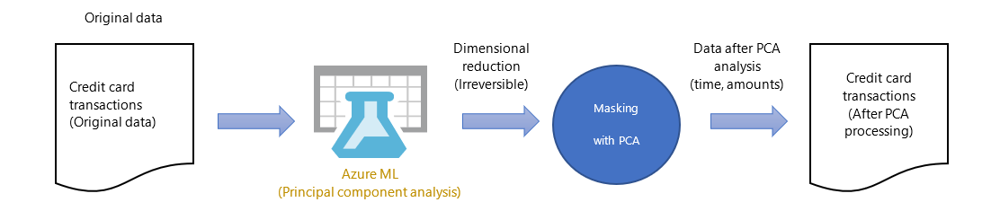
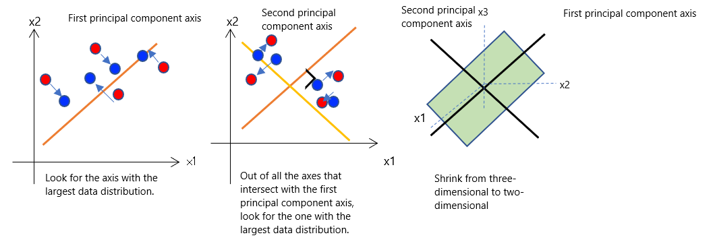
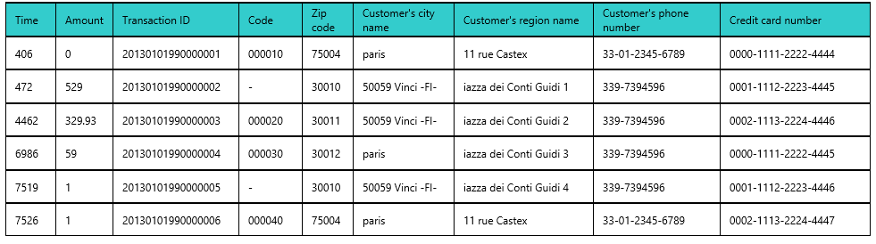

# Azure Synapse in a day demos - Fraud detection

- [Azure Synapse in a day demos - Fraud detection](#azure-synapse-in-a-day-demos---fraud-detection)
  - [Overview](#overview)
    - [Pre-Requisites](#pre-requisites)
  - [Hands-On Training Theme](#hands-on-training-theme)
    - [The Challenge for Businesses](#the-challenge-for-businesses)
    - [Objectives and Goals](#objectives-and-goals)
  - [Description of the Datasets in Use](#description-of-the-datasets-in-use)
    - [Description of the Credit Card Fraud Detection Dataset](#description-of-the-credit-card-fraud-detection-dataset)
    - [Description of the City Latitude and Longitude List Dataset](#description-of-the-city-latitude-and-longitude-list-dataset)
    - [Description of the Country Code List Dataset](#description-of-the-country-code-list-dataset)
  - [About Principal Component Analysis](#about-principal-component-analysis)
  - [Machine Learning Algorithm Used for Scoring in Exercise 1](#machine-learning-algorithm-used-for-scoring-in-exercise-1)
  - [Before the Hands-On Lab](#before-the-hands-on-lab)
    - [Listing the Resources Created During the Hands-On Training](#listing-the-resources-created-during-the-hands-on-training)
  - [Task 1: Download lab files](#task-1-download-lab-files)
    - [Task 2: Create a Resource Group](#task-2-create-a-resource-group)
    - [Task 3: Prepare a Virtual Machine to Run Power BI Desktop](#task-3-prepare-a-virtual-machine-to-run-power-bi-desktop)
    - [Task 4: Provision Azure Data Lake Storage Gen2](#task-4-provision-azure-data-lake-storage-gen2)
    - [Task 5: Provision an Azure Synapse Analytics Workspace](#task-5-provision-an-azure-synapse-analytics-workspace)
    - [Task 6: Upload Materials Required for the Hands-On Training](#task-6-upload-materials-required-for-the-hands-on-training)
    - [Task 7: Create a SQL Pool](#task-7-create-a-sql-pool)
    - [Task 8: Create a Spark Pool](#task-8-create-a-spark-pool)
    - [Task 9: Create a SQL On-Demand Database](#task-9-create-a-sql-on-demand-database)
    - [Task 10: Create a Power BI Workspace](#task-10-create-a-power-bi-workspace)
  - [Exercise 1:  Scoring predictions from T-SQL using a pre-trained model](#exercise-1-scoring-predictions-from-t-sql-using-a-pre-trained-model)
    - [Task 1:  Dataset Creation](#task-1-dataset-creation)
    - [Task 2:  Query Development](#task-2-query-development)
    - [Task 3:  Power BI Report Development](#task-3-power-bi-report-development)
  - [Exercise 2:  Perform Ad Hoc Queries from the Storage Account](#exercise-2-perform-ad-hoc-queries-from-the-storage-account)
    - [Task 1:  Create a Dataset](#task-1-create-a-dataset)
    - [Task 2:  Create a View](#task-2-create-a-view)
    - [Task 3:  Power BI Fraud Map Report Development](#task-3-power-bi-fraud-map-report-development)
  - [After the hands-on lab](#after-the-hands-on-lab)
    - [Task 1: Delete Lab Resources](#task-1-delete-lab-resources)
    - [Task 2:  Delete the Power BI Workspace](#task-2-delete-the-power-bi-workspace)

## Overview

### Pre-Requisites

To complete this lab, you must meet the following pre-requisites:

1. Microsoft Azure subscription must be pay-as-you-go or MSDN.

    a. Trial subscriptions will not work.

2. The hands-on training content contains requires sections that require basic knowledge and operations of Azure, Azure SQL, and Data Factory.

3. Prepare an environment and subscription for your intended hands-on Azure environment.

## Hands-On Training Theme

Over the past few years, there has been a significant worldwide increase in the unauthorized use of credit cards in mail order and online payments, as these are transactions in which no credit card is actually presented to the vendor. Unless some sort of countermeasures are taken, this will cause enormous damage to credit card users and credit card companies.

### The Challenge for Businesses

In order to prevent unauthorized use, it is crucial to be able to infer the possibility of unauthorized transactions and to detect fraud from transaction details. We also recognize that the prompt identification of unauthorized transactions is an urgent issue for credit card companies and financial institutions.

They need to be able to quickly understand and analyze the trends of unauthorized spending for each time period and the geographical characteristics of unauthorized use, and to learn how to take concrete preventive measures.

### Objectives and Goals

In this hands-on training, we will learn specific methods for using the SQL On-Demand feature in Azure Synapse Analytics to convert credit card fraud detection data and of geographical characteristics data that have been deployed in CSV format into Azure Data Lake Storage Gen2 into data, without any program development. You will also learn how to conduct sophisticated analysis of this data using Power BI reports.

In Exercise 1, we will explore the trends of unauthorized spending for each time period, as observed from the fraud detection results extracted by machine learning.

In Exercise 2, we will explore the geographical characteristics of unauthorized use, as observed from data that combines latitude/longitude information of the cities in which credit cards have been used.

## Description of the Datasets in Use

We will use three types of datasets in this hands-on training.

| Data Source | Dataset | File Name |
| --- | --- | --- |
| Kaggle | Credit card fraud detection | Creditcard.csv |
| Open Weather | List of city latitudes and longitudes | Citylist.csv |
| ISO3166-1 | List of country codes | Countrylist.csv |

### Description of the Credit Card Fraud Detection Dataset

The credit card fraud detection dataset uses data obtained by converting the data from transactions made by European cardholders in September 2013 that was converted by principal component analysis (PCA). It is considered inappropriate to provide the original features and more background information about the data, due to personal information protection issues associated with GDPR that came into effect in May 2017.

(Source: [https://kaggle.com/mlg-ulb/creditcardfraud](https://kaggle.com/mlg-ulb/creditcardfraud))

| No | Column ID | Column Name | Description |
| -- | --------- | ----------- | ----------- |
| 1 | Time | Time | Contains the number of seconds elapsed between each transaction and the first transaction in the dataset. |
| 2 - 29 | V1, V2, ... V28 | PCA conversion results | Data obtained by converting the data in the column that affects the detection of fraud from credit card transaction data using principal component analysis (PCA). |
| 30 | Amount | Amount | Credit card transaction amount |
| 31 | Class | Fraudulent/Non-fraudulent | A column that determines whether a transaction is fraudulent or non-fraudulent, as defined for a fraud detection machine learning model. (0=Non-fraudulent, 1=Fraudulent) |
| 32 | Id | City ID | A column which associates credit card transactions with city IDs in the city latitude and longitude list.  For this hands-on training, columns have been added and data has been processed/edited to include these city IDs. |

### Description of the City Latitude and Longitude List Dataset

Use CSV data from the city latitude and longitude list that is published in OpenWeather, a company that publishes the latitude and longitude data of cities around the world.

(Source: [https://openweathermap.org](https://openweathermap.org))

| No | Column ID | Column Name | Description |
| -- | --------- | ----------- | ----------- |
| 1 | Id | City ID | A surrogate key representing the city |
| 2 | Name | City name | The city name |
| 3 | State | State | The state name, if applicable |
| 4 | alpha2 | Two-character country code | ISO3166-1 alpha-2 (two-digit country code) |
| 5 | Lon | Longitude | Value showing the longitude of the city |
| 6 | Lat | Latitude | Value showing the latitude of the city |

### Description of the Country Code List Dataset

CSV data created from a list of international standards for codes showing ISO3166-1 country names and administrative districts and territories.

(Source: [https://jp.wikipedia.org/wiki/ISO_3166-1](https://jp.wikipedia.org/wiki/ISO_3166-1))

| No | Column ID | Column Name | Description |
| -- | --------- | ----------- | ----------- |
| 1 | companyjp | Country Name (Japanese) | Contains the Japanese-language name of the country |
| 2 | companyen | Country Name (English) | Contains the English-language name of the country |
| 3 | numeric | Numeric Code | ISO3166-1 numeric code |
| 4 | alpha3 | Three-character country code | ISO3166-1 alpha-3 (three-character country code) |
| 5 | alpha2 | Two-character country code | ISO3166-1 alpha-2 (two-character country code) |
| 6 | location | Location | Contains the Japanese-language location |
| 7 | subdivision | Subdivision Code | ISO 3166-2 subdivision code |

## About Principal Component Analysis

Principal component analysis (PCA) is by far the most commonly used dimension reduction algorithm in machine learning.



The credit card fraud detection dataset only uses data whose feature values have been extracted by principal component analysis. It is considered inappropriate to provide the original features and more background information about the raw data that contains things like the individual's name, the store name and the purchased product(s) in the credit card transaction, due to personal information protection issues associated with GDPR that came into effect in May 2017.



Following is a hypothetical image of credit card transactions prior to calculating each principal component axis.



Principal component analysis is a common algorithm that is also available in Azure ML Studio.

## Machine Learning Algorithm Used for Scoring in Exercise 1

The machine learning algorithm that we will use in Exercise 1 to do the scoring by calling the learned model from T-SQL will be the linear regression algorithm from Python's `scikit-learn` machine learning library.

Linear regression is a machine learning model that predicts response variables from the values of explanatory variables using a regression equation.

`scikit-learn` contains `sklearn.linear_model.LinearRegression` as the class for making predictions based on linear regression. We will use this as the algorithm for the machine learning model prepared for this hands-on training scenario.

To deploy a model in `scikit-learn` format in an SQL pool in Azure Synapse Analytics Studio, you must convert it to an ONNX-format model. For more details, visit [http://onnx.ai/sklearn-onnx/index.html](http://onnx.ai/sklearn-onnx/index.html).

Azure Synapse Analytics Studio also offers libraries other than scikit-learn that support conversion to the ONNX model. For more details, visit [https://github.com/onnx/tutorials#converting-to-onnx-format](https://github.com/onnx/tutorials#converting-to-onnx-format).

In this hands-on training, we'll use T-SQL to score an ONNX-format machine learning model that has been developed and trained with scikit-learn by deploying it in a SQL pool in Azure Synapse Analytics Studio.

## Before the Hands-On Lab

Duration: 90 minutes

### Listing the Resources Created During the Hands-On Training

The following are the resources you will create over the course of this hands-on training.

| No | Name | Type | Resource details |
| -- | ---- | ---- | ---------------- |
| 1 | `synapselabfraud` + your initials + `asws` (example: `synapselabfraudjdhasws`) | Synapse workspace | Create an Azure Synapse Analytics workspace. |
| 2 | `synapselabfraud` + your initials + `adls` (example: `synapselabfraudjdhadls`) | Storage account | Create a StorageV2 (general-purpose v2) storage account. |
| 3 | `sqllabfraud` | SQL pool | Create an SQL pool. |
| 4 | `sparklabfraud` | Apache Spark Pool | Create an Apache Spark pool. |
| 5 | PowerBI | Virtual machine | Prepare a virtual environment for running the Power BI Desktop app. |

> **Note**: We will create the resources throughout the hands-on training, so do not create any of these resources yet.

## Task 1: Download lab files

The lab files are located in a GitHub repo. You must unzip the file and extract it to your desktop so you can access them throughout the lab.

1. Download the ZIP file for the lab from <https://github.com/solliancenet/azure-synapse-in-a-day-demos/archive/master.zip>.

2. Extract the files to **`C:\`**. This will create a folder named `azure-synapse-in-a-day-demos-master` at the root of your C: drive.

     Folders")

3. Navigate to `C:\azure-synapse-in-a-day-demos-master\fraud-detection\Resources` to view the files.

    

4. Extract the **csv.zip** file into the current directory.  This will create a folder named `csv`.

     Folders")

5. Navigate to `C:\azure-synapse-in-a-day-demos-master\fraud-detection\Resources\csv` to view the files.

    

### Task 2: Create a Resource Group

In this task, you will use the Azure Portal to create a new Azure Resource Group for this lab.

1. Log into the [Azure Portal](https://portal.azure.com).

2. On the top-left corner of the portal, select the menu icon to display the menu.

    

3. In the left-hand menu, select **Resource Groups**.

4. At the top of the screen select the **Add** button.

   

5. Create a new resource group with the name **synapse-lab-fraud-detection**, ensuring that the proper subscription and region nearest you are selected. Once you have chosen a location, select **Review + Create**.

   

6. On the Summary blade, select **Create** to provision your resource group.

### Task 3: Prepare a Virtual Machine to Run Power BI Desktop

To proceed with the steps described in this hands-on training, you'll need to use the Power BI Desktop app for Windows 10.  In this step, you will create a virtual machine running Windows 10 and then install Power BI.

1. In the [Azure portal](https://portal.azure.com), type in "virtual machines" in the top search menu and then select **Virtual machines** from the results.

    

2. Select **+ Add** on the Virtual machines page and then select the **Virtual machine** option.

3. In the **Basics** tab, complete the following:

   | Field                          | Value                                              |
   | ------------------------------ | ------------------------------------------         |
   | Subscription                   | _select the appropriate subscription_              |
   | Resource group                 | _select `synapse-lab-fraud-detection`_             |
   | Virtual machine name           | _`powerbi`_                                        |
   | Region                         | _select the resource group's location_             |
   | Availability options           | _select `No infrastructure redundancy required`_   |
   | Image                          | _select `Windows 10 Pro, Version 1809 - Gen1`_     |
   | Azure Spot instance            | _select `No`_                                      |
   | Size                           | _select `Standard_D2s_v3`_                         |
   | Username                       | _select `powerbiuser`_                             |
   | Password                       | _enter a password you will remember_               |
   | Public inbound ports           | _select `Allow selected ports`_                    |
   | Select inbound ports           | _select `RDP (3389)`_                              |
   | Licensing                      | _select the option to confirm that you have an  eligible Windows 10 license with multi-tenant hosting rights._ |

   

4. Select **Review + create**. On the review screen, select **Create**.  After the deployment completes, select **Go to resource** to go to the virtual machine.

    

5. Select **Connect** from the actions menu and choose **RDP**.

    

6. On the **Connect** tab, select **Download RDP File**.

    

7. Open the RDP file and select **Connect** to access the virtual machine.  When prompted for credentials, enter `powerbiuser` for the username and the password you chose.

    

8. Launch the Microsoft Store from the Windows 10 taskbar.

    

9. Enter **power bi** into the search menu and select **Power BI Desktop** from the results.

    

10. Select **Get** to install Power BI Desktop on the virtual machine.

    

11. After installation completes, select **Launch** to open Power BI Desktop.

    

### Task 4: Provision Azure Data Lake Storage Gen2

Azure Data Lake Storage Gen2 will be critical for integration throughout the hands-on lab.

1. Navigate to the [Azure portal](https://portal.azure.com).

2. Select **+ Create a resource**, type in "storage account" in the search field, then select **Storage account** from the results.

   

3. Select **Create** on the Storage account details page.

4. Within the **Storage account** form, complete the following:

   | Field                          | Value                                       |
   | ------------------------------ | ------------------------------------------  |
   | Subscription                   | _select the appropriate subscription_       |
   | Resource group                 | _select `synapse-lab-fraud-detection`_      |
   | Storage account name           | _`synapselabfraud` + your initials + `adls` (example: `synapselabfraudjdhadls`)_ |
   | Location                       | _select the resource group's location_      |
   | Pricing tier                   | _select Standard_                           |
   | Account kind                   | _select StorageV2 (general purpose v2)_     |
   | Replication                    | _select Locally-redundant storage (LRS)_    |
   | Access tier                    | _select Hot_                                |

    

    Then select **Next : Networking >**.

5. Leave the networking settings at their default values: a connectivity method of **Public endpoint (all networks)** and a network routing preference of **Microsoft network routing (default)**.  Select **Next : Data protection >** and leave these settings at their default values.

6. Select **Next : Advanced >**. In the Data Lake Gen2 section, enable **Hierarchical namespace**.

    

7. Select **Review + create**. On the review screen, select **Create**.

### Task 5: Provision an Azure Synapse Analytics Workspace

1. In the [Azure portal](https://portal.azure.com), type in "azure synapse analytics" in the top search menu and then select **Azure Synapse Analytics (workspaces preview)** from the results.

    ')

2. Select **+ Add** on the Azure Synapse Analytics (workspaces preview) page.

3. Within the **Create Synapse workspace** form, complete the following:

   | Field                                                | Value                                            |
   | ---------------------------------------------------- | ------------------------------------------       |
   | Subscription                                         | _select the appropriate subscription_            |
   | Resource group                                       | _select `synapse-lab-fraud-detection`_           |
   | Workspace name                                       | _`synapselabfraud` + your initials + `asws` (example: `synapselabfraudjdhasws`)_  |
   | Region                                               | _select the resource group's location_           |
   | Select Data Lake Storage Gen2                        | _select `From subscription`_                     |
   | Account name                                         | _select the storage account you created earlier_ |
   | File system name                                     | _select `Create new` and enter `synapse`_        |
   | Assign myself the Storage Blob Data Contributor role | _ensure the box is checked_                      |

   

   > **Note**: Names of workspaces must be globally unique.

   You might see the following error after entering a workspace name:  **The Azure Synapse resource provider (Microsoft.Synapse) needs to be registered with the selected subscription.** If you see this error, select **Click here to register**, located between the Subscription and Resource group.

   

   > **Important**: Be sure to check the box which reads "Assign myself the Storage Blob Data Contributor role on the Data Lake Storage Gen2 account"!  If you do not check this box, you will be unable to complete certain exercises unless you add your account as a Storage Blob Data Contributor later.

4. Select **Next : Security + networking >** to move on to the Security and Networking page.  On the Security and Networking page, enter a valid password you will remember. Leave the other options at their default values.

    

5. Select **Review + create**. On the review screen, select **Create**.  Provisioning takes **up to 10** minutes.

### Task 6: Upload Materials Required for the Hands-On Training

1. Navigate to the **synapse-lab-fraud-detection** resource group in the [Azure portal](https://portal.azure.com).

    

    If you do not see the resource group in the Recent resources section, type in "resource groups" in the top search menu and then select **Resource groups** from the results.

    

    From there, select the **synapse-lab-fraud-detection** resource group.

2. Select the **synapselabfraud###adls** storage account which you created before the hands-on lab. Note that there may be multiple storage accounts, so be sure to choose the one you created.

    

3. In the **Data Lake Storage** section, select **Containers**. Then, select the **synapse** container you created before the hands-on lab.

    

4. Select the **Upload** option. In the Files section, select the folder icon to upload files. Navigate to `c:\azure-synapse-in-a-day-demos-master\fraud-detection\Resources\csv\` and select **CityList.csv**, as the file for upload. Then select **Upload** to finish uploading the file.  Repeat the process for **CountryList.csv**, **CreditCard.csv**, and **rf_model.onnx** files.  The **rf_model.onnx** file will be in the parent directory, `c:\azure-synapse-in-a-day-demos-master\fraud-detection\Resources\`.

    

5. In the **Settings** menu, select **Access keys**.  Then, copy the **Storage account name** and **key1 Key** values and paste them into a text editor for later use.

    

### Task 7: Create a SQL Pool

1. In the [Azure portal](https://portal.azure.com), type in "azure synapse analytics" in the top search menu and then select **Azure Synapse Analytics (workspaces preview)** from the results.

    ')

2. Select the workspace you created before the hands-on lab.

    

3. In the Synapse workspace, select **+ New SQL pool** to create a new SQL pool.

    

4. Enter a SQL pool name of `synapsesql` and select a performance level of DW100c.

    

5. Select **Review + create**. On the review screen, select **Create**.  Provisioning takes **up to 10** minutes. While this is underway, it is safe to continue to the next task.

### Task 8: Create a Spark Pool

1. In the Synapse workspace, select **+ New Apache Spark pool** to create a new Spark pool.

    

2. In the **Create Apache Spark pool** window, complete the following:

    | Field                          | Value                                              |
    | ------------------------------ | ------------------------------------------         |
    | Apache Spark pool name         | _`synapsespark`_                                   |
    | Autoscale                      | _select `disabled`_                                |
    | Node size                      | _select `Small (4 vCPU / 32 GB)`_                  |
    | Number of nodes                | _select `3`_                                       |

    

3. Select **Review + create**. On the review screen, select **Create**.  Provisioning may take several minutes.

### Task 9: Create a SQL On-Demand Database

1. Select **Launch Synapse Studio** from the Synapse workspace page.

    

2. Select the **Develop** tab from Synapse studio.

    

3. From the **+** menu, choose **SQL script** to open a new script.

    

4. Ensure that you are connected to the **SQL on-demand** option. Then, enter the following script into the script window and select **Run**.

    ```sql
    CREATE DATABASE synapse
    ```

    

5. Change the name of the script in the properties to **CreateOnDemandDB**.

    

### Task 10: Create a Power BI Workspace

1. In a new tab or window, navigate to the Power BI website, [https://powerbi.microsoft.com/](https://powerbi.microsoft.com/).  Select **Sign in** and sign in.

    

2. Select the **Workspaces** menu and then choose **Create workspace**.

    

3. In the Create a workspace menu, enter **FraudDetection** as the name and select **Save**.

    

4. Return to the Synapse studio.  Select the **Home** option.

    

5. Select the **Visualize** option.

    

6. In the **Connect to Power BI** tab, complete the following and then select **Connect** to create a new Power BI connection.

    | Field                          | Value                                              |
    | ------------------------------ | ------------------------------------------         |
    | Name                           | _`FraudDetectionWorkspace`_                        |
    | Tenant                         | _select your Power BI tenant_                      |
    | Workspace name                 | _select the `FraudDetection` workspace_            |

    

## Exercise 1:  Scoring predictions from T-SQL using a pre-trained model

Duration: 45 minutes

You will use masked data, obtained by applying principal component analysis to credit card transaction data, to evaluate which transactions are fraudulent and to analyze trends in elapsed time and fraud amounts.

### Task 1:  Dataset Creation

1. In the [Azure portal](https://portal.azure.com), type in "azure synapse analytics" in the top search menu and then select **Azure Synapse Analytics (workspaces preview)** from the results.

    ')

2. Select the workspace you created before the hands-on lab.

    

3. Select **Launch Synapse Studio** from the Synapse workspace page.

    

4. Select the **Develop** tab from Synapse studio.

    

5. From the **+** menu, choose **SQL script** to open a new script.

    

6. Choose the **synapsesql** connection option and the **synapsesql** database from the database drop-down list.

    

7. Change the name of the script to **CreateSchema**.

    

8. Enter the following code into the script window.  Then, select **Run** to execute the code.

    ```sql
    CREATE SCHEMA synapse
    ```

    

9. From the **+** menu, choose **SQL script** to open a new script.  Ensure that you are connected to the **synapsesql** SQL pool and the **synapsesql** database.

    

10. Change the name of this script to **CreateMasterKey**.  Enter the following into the script window, changing `{Password}` to a password you can remember.  Then, select **Run** to execute the code.

    ```sql
    CREATE MASTER KEY ENCRYPTION BY PASSWORD = '{Password}'
    ```

    

11. From the **+** menu, choose **SQL script** to open a new script.  Ensure that you are connected to the **synapsesql** SQL pool and the **synapsesql** database.

    

12. Change the name of this script to **CreateAzureStorageAccountKey**.  Enter the following into the script window, filling in your storage account name and access key.  Then, select **Run** to execute the code.

    ```sql
    CREATE DATABASE SCOPED CREDENTIAL AzureStorageAccountKey
    WITH IDENTITY = '<Your Storage Account>',
    SECRET = '<Your Access Key>';
    ```

    

13. From the **+** menu, choose **SQL script** to open a new script.

    

14. Change the name of this script to **CreateCSVDataSource**.  Enter the following into the script window, filling in your storage account name and access key.  Ensure that you are connected to the **synapsesql** SQL pool and the **synapsesql** database.  Then, select **Run** to execute the code.

    ```sql
    CREATE EXTERNAL DATA SOURCE CSVDataSource WITH
    (
        TYPE = HADOOP,
        LOCATION = 'wasbs://synapse@<Your Storage Account>.blob.core.windows.net',
        CREDENTIAL = AzureStorageAccountKey
    );
    ```

    

15. From the **+** menu, choose **SQL script** to open a new script.

    

16. Change the name of this script to **CreateCSVFileFormat**.  Enter the following into the script window, filling in your storage account name and access key.  Ensure that you are connected to the **synapsesql** SQL pool and the **synapsesql** database.  Then, select **Run** to execute the code.

    ```sql
    CREATE EXTERNAL FILE FORMAT CSVFileFormat
    WITH (  
        FORMAT_TYPE = DELIMITEDTEXT,
        FORMAT_OPTIONS (
            FIELD_TERMINATOR = ',',
            STRING_DELIMITER = '"',
            FIRST_ROW = 2,
            USE_TYPE_DEFAULT=TRUE
        )
    );
    ```

    

17. From the **+** menu, choose **SQL script** to open a new script.

    

18. Change the name of this script to **CreateExternalCreditCard**.  Enter the following into the script window, filling in your storage account name and access key.  Ensure that you are connected to the **synapsesql** SQL pool and the **synapsesql** database.  Then, select **Run** to execute the code.

    ```sql
    CREATE EXTERNAL TABLE synapse.exCreditCard
    (
            [Time] float,
            [V1] float,[V2] float,[V3] float,[V4] float,[V5] float,[V6] float,[V7] float,[V8] float,[V9] float,[V10] float,
            [V11] float,[V12] float,[V13] float,[V14] float,[V15] float,[V16] float,[V17] float,[V18] float,[V19] float,[V20] float,
            [V21] float,[V22] float,[V23] float,[V24] float,[V25] float,[V26] float,[V27] float,[V28] float,
            [Amount] float,[Class] bigint,[id] bigint
    )
    WITH
    (
            LOCATION = 'CreditCard.csv',
            DATA_SOURCE = [CSVDataSource],
            FILE_FORMAT = [CSVFileFormat]
    );
    ```

    

19. Select the **Data** option from the menu.  Navigate to **synapsesql** and then **External tables**.  Right-click on the **synapse.exCreditCard** table and choose **New SQL script** and then **Select TOP 100 rows**.

    

20. Select the **Properties** icon to display the menu.  Rename the name to **SelectExternalCreditCard**.  Then, select **Publish all**.

    

21. Select the **Publish** option to save these scripts.

    

### Task 2:  Query Development

1. From the **+** menu, choose **SQL script** to open a new script.

    

2. Choose the **synapsesql** connection option and the **synapsesql** database from the database drop-down list.

    

3. Change the name of the script in the properties to **SelectIntoCreditCard**.

    

4. Open the script named **SelectIntoCreditCard.sql** in your local folder, `c:\azure-synapse-in-a-day-demos-master\fraud-detection\Resources\`.  Copy and paste its contents into the script window.  The script will look like the code below, but will include a lengthy `@modelexample` binary value and will not include the `THROW` call.  Run the script and let it insert data into a new `synapse.CreditCard` table.

    ```sql
    THROW 50001, 'Please do not run this code. Open the script named SelectIntoCreditCard.sql instead.', 1;
    DECLARE @modelexample varbinary(max) = 0x08041208736B6C326F6E6E781 ...

    SELECT
        d.*, p.*
    INTO synapse.CreditCard
    FROM PREDICT(MODEL = @modelexample, DATA = synapse.exCreditCard AS d) WITH (output_label bigint) AS p;
    ```

    

5. In the **Tables** folder for **synapsesql**, select the ellipsis (...) and choose **Refresh** to see the `synapse.CreditCard` table.

    

6. In the **synapse.CreditCard** table entry, select the ellipsis (...) and choose **New SQL Script** and then **Select TOP 100 rows** to open a new script pre-populated with a SQL query.

    

### Task 3:  Power BI Report Development

1. Open the RDP file from the Before the Hands-On Lab section and select **Connect** to access the virtual machine.  When prompted for credentials, enter `powerbiuser` for the username and the password you chose.

    

2. Open a browser in the virtual machine.  In the [Azure portal](https://portal.azure.com), type in "azure synapse analytics" in the top search menu and then select **Azure Synapse Analytics (workspaces preview)** from the results.

    ')

3. Select the workspace you created before the hands-on lab.

    

4. Select **Launch Synapse Studio** from the Synapse workspace page.

    

5. Select **Visualize** from the Synapse studio front page.

    

6. Drill down into **Power BI** and then **FraudDetection**.  From there, select the ellipsis (...) and select **Open**.

    

7. Select **+ New Power BI dataset**.

    

8. Select **Start** to begin the process.

    

9. Select the **synapsesql** SQL pool to use as a data source and then select **Continue**.

    

10. Select **Download** to download the Power BI dataset file.  After download completes, select **Continue**.

    

11. Open the downloaded Power BI dataset file in Power BI Desktop.  When prompted to enter a username and password, select **Database** and enter the Synapse username and password you created before the hands-on lab.  The username will be **sqladminuser** by default.  Then select **Connect** to connect to the SQL pool.

    

12. On the Navigator page, select the **synapse.CreditCard** table and then select **Load**.

    

13. In the Connection settings modal dialog, select **Import** and then select **OK**.

    

14. Once the table is loaded, select the **Data** tab and then select the **Time** column.  In the Format section, select the drop-down list and choose **Decimal number**.

    

15. Right-click the Time column and choose **Sort ascending**.

    

16. Choose the **Report** view and then select the **Clustered column chart** option.  Select and drag the **Time** attribute into the **Axis** field to make time the X axis.  From there, select and drag the **Amount** attribute into the **Values** field to make amount the Y axis.

    

17. Expand out the **Filters** pane. Select and drag the **Class** attribute into the **Filters on this visual** menu.  Change the filter type to **Basic filtering** and select **1** to filter down to fraudulent transactions.

    

18. Save the file as **FraudDetectionReport**.

    

19. In the **File** menu, select **Publish** and then **Publish to Power BI**.

    

20. Sign into your Power BI workspace.

    

21. Select the **FraudDetection** workspace and then choose **Select**.

    

22. After the Power BI report deploys, return to Azure Synapse Analytics Studio and select **Continue** and then **Close and refresh**.  Select the **Power BI reports** menu and then the **FraudDetectionReport** to review the published report.

    

## Exercise 2:  Perform Ad Hoc Queries from the Storage Account

Duration: 50 minutes

Plot the trends of the cities where unauthorized use of credit cards occurred and the amounts on a map, so that you can ascertain the geographical factors associated with frequent unauthorized use and the cities where large losses frequently occur.

### Task 1:  Create a Dataset

This first task will export credit card predictions from the prior exercise into CSV format.

1. In the [Azure portal](https://portal.azure.com), type in "azure synapse analytics" in the top search menu and then select **Azure Synapse Analytics (workspaces preview)** from the results.

    ')

2. Select the workspace you created before the hands-on lab.

    

3. Select **Launch Synapse Studio** from the Synapse workspace page.

    

4. Select the **Manage** tab from Synapse studio.

    

5. Select the **Linked services** option from the External connections section.  Then select **+ New** to add a new linked service.

    

6. Enter **synapse** into the search menu and select the **Azure Synapse Analytics (formerly SQL DW)** option.  Then, select **Continue**.

    

7. In the **New linked service** tab, complete the following and then select **Create** to create a new linked service connection.

    | Field                           | Value                                              |
    | ------------------------------  | ------------------------------------------         |
    | Name                            | _`FraudDetectionSynapse`_                          |
    | Connect via integration runtime | _select `AutoResolveIntegrationRuntime`_           |
    | Account selection method        | _select `From Azure subscription`_                 |
    | Azure subscription              | _select your Azure subscription_                   |
    | Server name                     | _`synapselabfraud` + your initials + `adls` (example: `synapselabfraudjdhadls`)_ |
    | Database name                   | _select `synapsesql`_                              |
    | Authentication type             | _select `SQL authentication`_                      |
    | User name                       | _enter `sqladminuser`_                             |
    | Password                        | _enter the password you created earlier_           |

    

8. Select the **Data** tab from Synapse studio.

    

9. Drill down the SQL pool tables and then select the ellipsis (...) next to the **synapse.CreditCard** table.  From there, select **Data flow** to open a new data flow.

    

10. Name the data flow **DataflowCreditCard** and the Dataset **DatasetSqlPoolCreditCard**.  Then, select **Create** to create the data flow.

    

11. Name the source **sourceCreditCard**.  Then select the **Open** option next to the Dataset.

    

12. In the Linked service menu, select **FraudDetectionSynapse**.  Then, in the Table menu, select **synapse.CreditCard**.

    

13. Select the **DataflowCreditCard** tab to return to the data flow.  Then, select the **+** option next to the source and choose **Select** from the Schema modifier list.

    

14. Change the name of the new output stream to **SelectCreditCard**.

    

15. Select the **+** option next to the source and choose **Sink** from the Destination list.

    

16. Change the name of the new output stream to **SinkCreditCard**.  Then select the **+ New** option to create a new Dataset.

    

17. From the New dataset menu, select **Azure Data Lake Storage Gen2** and then select **Continue**.

    

18. On the Select format menu, choose **DelimitedText** for the output type and then select **Continue**.

    

19. Enter **outputCreditCardCSV** as the file name.  Then, from the Linked service menu, choose **+ New**.

    

20. In the **New linked service** menu, complete the following and then select **Create** to create a new Azure Data Lake Storage Gen2 linked service.

    | Field                          | Value                                              |
    | ------------------------------ | ------------------------------------------         |
    | Name                           | _`synapselabfraud` + your initials + `adls` (example: `synapselabfraudjdhadls`)_ |
    | Authentication method          | _select `Account key`_                             |
    | Account selection method       | _select `From Azure subscription`_                 |
    | Azure subscription             | _select your Azure subscription_                   |
    | Storage account name           | _`synapselabfraud` + your initials + `adls` (example: `synapselabfraudjdhadls`)_ |

    

21. In the Set properties menu, in the File path section, enter **synapse** into the **File System** box.  Then, select the **First row as header** option and select **OK**.

    

22. Enable data flow debugging by toggling the **Data flow debug** option.

    

23. Choose the **AutoResolveIntegrationRuntime** and select **OK**.  It may take several minutes for setup to complete.

    

24. After the debugging check completes, select **Publish all**.

    

25. Select the **Publish** option to save your changes.

    

26. Select the **Orchestrate** tab from Synapse studio.

    

27. Select **+** and then choose **Pipeline** to create a new pipeline.

    

28. Set the name of the pipeline to **PipelineCreditCard**.

    

29. Drill down into the **Move & transform** menu and bring a **Data flow** onto the canvas.

    

30. In the Adding data flow tab, select **DataflowCreditCard** from the Existing data flow drop-down list.  Then, select **OK** to continue.

    

31. Select the data flow and then navigate to the **Settings** menu.  In the PolyBase sub-menu, change the Staging linked service to **synapselabfraud###adls**, the staging storage folder's container to **synapse** and folder to **creditcard**.

    

32. Select **Debug** to run the pipeline.

    

33. Wait until the Output tab has a **Succeeded** status message.

    

34. Select the **Data** tab from Synapse studio.

    

35. Navigate to the **synapselabfraud###asws** option and navigate to **synapse (Primary)**.  In the root directory, there will be two files which start with **part-00001-**.  Right-click on the file which is 101.2 MB and choose **Rename**.

    

36. Change the file name to **CreditCardScored.csv** and select **Apply**.

    

37. Right-click on the **CreditCardScored.csv** file and select **Preview**.

    

38. Ensure that the **CreditCardScored.csv** file has the correct shape.

    

### Task 2:  Create a View

1. Select the **Develop** tab from Synapse studio.

    

2. From the **+** menu, choose **SQL script** to open a new script.

    

3. Ensure that you are connected to the **SQL on-demand** option.  Then, in the Use database drop-down, select **synapse**.

    

4. Change the name of the script to **CreateViewCreditCardLonLat**.

    

5. Copy and paste the following into the script window.  Change the `synapselabfraud###adls` references to the storage account you created.  Then select **Run** to execute the script.

    ```sql
    CREATE VIEW dbo.CreditCardLonLat AS
    SELECT
            credit.Time,
            city.name,
            city.lon,
            city.lat,
            city.alpha2,
            country.companyen,
            credit.V1,
            credit.V2,
            credit.V3,
            credit.V4,
            credit.V5,
            credit.V6,
            credit.V7,
            credit.V8,
            credit.V9,
            credit.V10,
            credit.V11,
            credit.V12,
            credit.V13,
            credit.V14,
            credit.V15,
            credit.V16,
            credit.V17,
            credit.V18,
            credit.V19,
            credit.V20,
            credit.V21,
            credit.V22,
            credit.V23,
            credit.V24,
            credit.V25,
            credit.V26,
            credit.V27,
            credit.V28,
            credit.Amount,
            credit.Class,
            credit.id
    FROM
    OPENROWSET(
            BULK 'https://synapselabfraud###adls.blob.core.windows.net/synapse/CreditCardScored.csv',
            FORMAT = 'CSV',
            FIELDTERMINATOR =',',
            FIRSTROW = 2,
            ESCAPECHAR = '\\'
        )
        WITH (
            [Time] float,
            [V1] float,[V2] float,[V3] float,[V4] float,[V5] float,[V6] float,[V7] float,[V8] float,[V9] float,[V10] float,
            [V11] float,[V12] float,[V13] float,[V14] float,[V15] float,[V16] float,[V17] float,[V18] float,[V19] float,[V20] float,
            [V21] float,[V22] float,[V23] float,[V24] float,[V25] float,[V26] float,[V27] float,[V28] float,
            [Amount] float,[Class] int,[id] varchar(20)
        ) AS [credit]
    LEFT JOIN
    OPENROWSET(
            BULK 'https://synapselabfraud###adls.dfs.core.windows.net/synapse/CityList.csv',
            FORMAT = 'CSV',
            FIELDTERMINATOR =',',
            FIRSTROW = 2,
            ESCAPECHAR = '\\'
        )
        WITH (
            [id] VARCHAR (20) ,
            [name] VARCHAR (100) COLLATE Latin1_General_100_CI_AI_SC_UTF8,
            [state] VARCHAR (10) ,
            [alpha2] VARCHAR (2) ,
            [lon] float,
            [lat] float
        ) AS [city] ON
        credit.id = city.id
    LEFT JOIN
    OPENROWSET(
            BULK 'https://synapselabfraud###adls.dfs.core.windows.net/synapse/CountryList.csv',
            FORMAT = 'CSV',
            FIELDTERMINATOR =',',
            FIRSTROW = 2,
            ESCAPECHAR = '\\'
        )
        WITH (
            [companyjp] VARCHAR (20) COLLATE Latin1_General_100_CI_AI_SC_UTF8,
            [companyen] VARCHAR (100) COLLATE Latin1_General_100_CI_AI_SC_UTF8,
            [numeric] decimal,
            [alpha3] VARCHAR (3) ,
            [alpha2] VARCHAR (2) ,
            [location] VARCHAR (100) COLLATE Latin1_General_100_CI_AI_SC_UTF8,
            [subvivision] VARCHAR (15) COLLATE Latin1_General_100_CI_AI_SC_UTF8
        ) AS [country] ON
        city.alpha2 = country.alpha2
    ```

### Task 3:  Power BI Fraud Map Report Development

1. Open the RDP file from the Before the Hands-On Lab section and select **Connect** to access the virtual machine.  When prompted for credentials, enter `powerbiuser` for the username and the password you chose.

    

2. Open a browser in the virtual machine.  In the [Azure portal](https://portal.azure.com), type in "azure synapse analytics" in the top search menu and then select **Azure Synapse Analytics (workspaces preview)** from the results.

    ')

3. Select the workspace you created before the hands-on lab.

    

4. Select **Launch Synapse Studio** from the Synapse workspace page.

    

5. Select the **Develop** tab from Synapse studio.

    

6. Drill down into the **Power BI** menu and then the **FraudDetection** menu, followed by **Power BI datasets**.  Choose the **+ New Power BI dataset** option.

    

7. Choose **FraudDetectionReport** and then select **Create**.

    

8. Hover over the **synapsesql** on-demand database and then select **Download .pbids file**.

    

9. Open the downloaded Power BI dataset file in Power BI Desktop. On the Navigator page, select the **CreditCardLonLat** view and then select **Load**.

    

10. In the Connection settings modal dialog, select **Import** and then select **OK**.

    

11. Select the **lat** column. In the **Column tools** tab, select the drop-down for Data category and choose **Latitude**.  Repeat this for the **lon** column, setting the Data category to **Longitude**.

    

12. Select the **Map** visual and drag it onto the canvas.  Expand it to fill the canvas.

    

13. Drag the **Amount** data field into the Legend, the **lat** data field into Latitude, and the **lon** data field into Longitude.  Select the drop-down for the latitude and longitude columns and change the value to **Don't summarize**.

    

14. Drag the **Class** data field into the **Filters on this visual** section.  In the Filter type drop-down, select **Basic filtering**.

    

15. Change the filter on **Class** to include only fraudulent transactions.

    

16. Save the Power BI report as **FraudDetectionMap**.

17. In the **File** menu, select **Publish** and then **Publish to Power BI**.

    

18. Select the **FraudDetection** workspace and then choose **Select**.

    

19. After the Power BI report deploys, return to Azure Synapse Analytics Studio and select **Close and refresh**.  Select the ellipsis (...) in the **Power BI reports** menu and then select **Refresh**.

    

20. Select the **FraudDetectionMap** report.  This report allows you to understand the geographical features of the unauthorized use of credit cards and to implement concrete measures to temporarily restrict the use of credit cards in cities that show the beginnings of a concentration of unauthorized uses of credit cards for large amounts.

    

## After the hands-on lab

Duration: 10 minutes

### Task 1: Delete Lab Resources

1. Log into the [Azure Portal](https://portal.azure.com).

2. On the top-left corner of the portal, select the menu icon to display the menu.

    

3. In the left-hand menu, select **Resource Groups**.

4. Navigate to and select the `synapse-lab-fraud-detection` resource group.

5. Select **Delete resource group**.

    

6. Type in the resource group name (`synapse-lab-fraud-detection`) and then select **Delete**.

    

### Task 2:  Delete the Power BI Workspace

1. Navigate to [Power BI](https://app.powerbi.com) and log in if prompted.

2. In the Workspaces menu, select the **...** menu option for the **FraudDetection** workspace and then choose **Workspace settings**.

    

3. In the Settings panel, select **Delete workspace** to delete the workspace.

    

You should follow all steps provided *after* attending the Hands-on lab.
