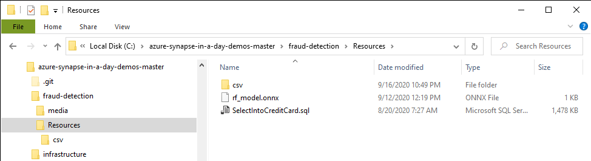
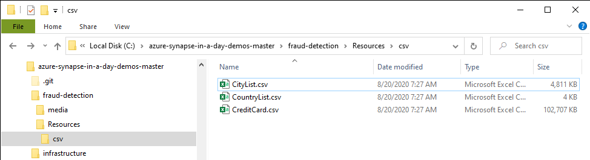
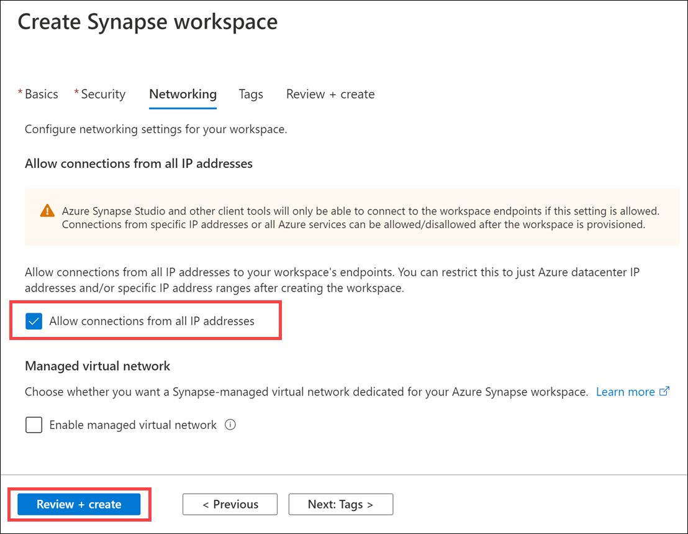

# Azure Synapse in a day demos - Fraud detection

- [Azure Synapse in a day demos - Fraud detection](#azure-synapse-in-a-day-demos---fraud-detection)
  - [Overview](#overview)
    - [Pre-Requisites](#pre-requisites)
  - [Before the Hands-On Lab](#before-the-hands-on-lab)
    - [Listing the Resources Created During the Hands-On Training](#listing-the-resources-created-during-the-hands-on-training)
    - [Task 1: Download lab files](#task-1-download-lab-files)
    - [Task 2: Create a Resource Group](#task-2-create-a-resource-group)
    - [Task 3: Prepare a Virtual Machine to Run Power BI Desktop](#task-3-prepare-a-virtual-machine-to-run-power-bi-desktop)
    - [Task 4: Provision Azure Data Lake Storage Gen2](#task-4-provision-azure-data-lake-storage-gen2)
    - [Task 5: Provision an Azure Synapse Analytics Workspace](#task-5-provision-an-azure-synapse-analytics-workspace)
    - [Task 6: Upload Materials Required for the Hands-On Training](#task-6-upload-materials-required-for-the-hands-on-training)
    - [Task 7: Create a Synapse dedicated SQL Pool](#task-7-create-a-synapse-dedicated-sql-pool)
    - [Task 8: Create a Spark Pool](#task-8-create-a-spark-pool)
  - [Lab guide](#lab-guide)

## Overview

### Pre-Requisites

To complete this lab, you must meet the following pre-requisites:

1. Microsoft Azure subscription must be pay-as-you-go or MSDN.

    a. Trial subscriptions will not work.

2. The hands-on training content contains requires sections that require basic knowledge and operations of Azure, Azure SQL, and Data Factory.

3. Prepare an environment and subscription for your intended hands-on Azure environment.

## Before the Hands-On Lab

Duration: 90 minutes

### Listing the Resources Created During the Hands-On Training

The following are the resources you will create over the course of this hands-on training.

| No | Name | Type | Resource details |
| -- | ---- | ---- | ---------------- |
| 1 | `synapselabfraud` + your initials + `asws` (example: `synapselabfraudjdhasws`) | Synapse workspace | Create an Azure Synapse Analytics workspace. |
| 2 | `synapselabfraud` + your initials + `adls` (example: `synapselabfraudjdhadls`) | Storage account | Create a StorageV2 (general-purpose v2) storage account. |
| 3 | `sqllabfraud` | Dedicated SQL pool | Create a Synapse dedicated SQL pool. |
| 4 | `sparklabfraud` | Apache Spark Pool | Create an Apache Spark pool. |
| 5 | PowerBI | Virtual machine | Prepare a virtual environment for running the Power BI Desktop app. |

> **Note**: We will create the resources throughout the hands-on training, so do not create any of these resources yet.

### Task 1: Download lab files

The lab files are located in a GitHub repo. You must unzip the file and extract it to your desktop so you can access them throughout the lab.

1. Download the ZIP file for the lab from <https://github.com/solliancenet/azure-synapse-in-a-day-demos/archive/master.zip>.

2. Extract the files to **`C:\`**. This will create a folder named `azure-synapse-in-a-day-demos-master` at the root of your C: drive.

     Folders")

3. Navigate to `C:\azure-synapse-in-a-day-demos-master\fraud-detection\Resources` to view the files.

    

4. Extract the **csv.zip** file into the current directory.  This will create a folder named `csv`.

     Folders")

5. Navigate to `C:\azure-synapse-in-a-day-demos-master\fraud-detection\Resources\csv` to view the files.

    

### Task 2: Create a Resource Group

In this task, you will use the Azure Portal to create a new Azure Resource Group for this lab.

1. Log into the [Azure Portal](https://portal.azure.com).

2. On the top-left corner of the portal, select the menu icon to display the menu.

    

3. In the left-hand menu, select **Resource Groups**.

4. At the top of the screen select the **Add** button.

   

5. Create a new resource group with the name **synapse-lab-fraud-detection**, ensuring that the proper subscription and region nearest you are selected. Once you have chosen a location, select **Review + Create**.

   

6. On the Summary blade, select **Create** to provision your resource group.

### Task 3: Prepare a Virtual Machine to Run Power BI Desktop

To proceed with the steps described in this hands-on training, you'll need to use the Power BI Desktop app for Windows 10.  In this step, you will create a virtual machine running Windows 10 and then install Power BI.

1. In the [Azure portal](https://portal.azure.com), type in "virtual machines" in the top search menu and then select **Virtual machines** from the results.

    

2. Select **+ Add** on the Virtual machines page and then select the **Virtual machine** option.

3. In the **Basics** tab, complete the following:

   | Field                          | Value                                              |
   | ------------------------------ | ------------------------------------------         |
   | Subscription                   | _select the appropriate subscription_              |
   | Resource group                 | _select `synapse-lab-fraud-detection`_             |
   | Virtual machine name           | _`powerbi`_                                        |
   | Region                         | _select the resource group's location_             |
   | Availability options           | _select `No infrastructure redundancy required`_   |
   | Image                          | _select `Windows 10 Pro, Version 1809 - Gen1`_     |
   | Azure Spot instance            | _select `No`_                                      |
   | Size                           | _select `Standard_D2s_v3`_                         |
   | Username                       | _select `powerbiuser`_                             |
   | Password                       | _enter a password you will remember_               |
   | Public inbound ports           | _select `Allow selected ports`_                    |
   | Select inbound ports           | _select `RDP (3389)`_                              |
   | Licensing                      | _select the option to confirm that you have an  eligible Windows 10 license with multi-tenant hosting rights._ |

   

4. Select **Review + create**. On the review screen, select **Create**.  After the deployment completes, select **Go to resource** to go to the virtual machine.

    

5. Select **Connect** from the actions menu and choose **RDP**.

    

6. On the **Connect** tab, select **Download RDP File**.

    

7. Open the RDP file and select **Connect** to access the virtual machine.  When prompted for credentials, enter `powerbiuser` for the username and the password you chose.

    

8. Launch the Microsoft Store from the Windows 10 taskbar.

    

9. Enter **power bi** into the search menu and select **Power BI Desktop** from the results.

    

10. Select **Get** to install Power BI Desktop on the virtual machine.

    

11. After installation completes, select **Launch** to open Power BI Desktop.

    

### Task 4: Provision Azure Data Lake Storage Gen2

Azure Data Lake Storage Gen2 will be critical for integration throughout the hands-on lab.

1. Navigate to the [Azure portal](https://portal.azure.com).

2. Select **+ Create a resource**, type in "storage account" in the search field, then select **Storage account** from the results.

   

3. Select **Create** on the Storage account details page.

4. Within the **Storage account** form, complete the following:

   | Field                          | Value                                       |
   | ------------------------------ | ------------------------------------------  |
   | Subscription                   | _select the appropriate subscription_       |
   | Resource group                 | _select `synapse-lab-fraud-detection`_      |
   | Storage account name           | _`synapselabfraud` + your initials + `adls` (example: `synapselabfraudjdhadls`)_ |
   | Location                       | _select the resource group's location_      |
   | Pricing tier                   | _select Standard_                           |
   | Account kind                   | _select StorageV2 (general purpose v2)_     |
   | Replication                    | _select Locally-redundant storage (LRS)_    |
   | Access tier                    | _select Hot_                                |

    

    Then select **Next : Networking >**.

5. Leave the networking settings at their default values: a connectivity method of **Public endpoint (all networks)** and a network routing preference of **Microsoft network routing (default)**.  Select **Next : Data protection >** and leave these settings at their default values.

6. Select **Next : Advanced >**. In the Data Lake Gen2 section, enable **Hierarchical namespace**.

    

7. Select **Review + create**. On the review screen, select **Create**.

### Task 5: Provision an Azure Synapse Analytics Workspace

1. In the [Azure portal](https://portal.azure.com), type in "azure synapse analytics" in the top search menu and then select **Azure Synapse Analytics** from the results.

    ')

2. Select **+ Add** on the Azure Synapse Analytics (workspaces preview) page.

3. Within the **Create Synapse workspace** form, complete the following:

   | Field                                                | Value                                            |
   | ---------------------------------------------------- | ------------------------------------------       |
   | Subscription                                         | _select the appropriate subscription_            |
   | Resource group                                       | _select `synapse-lab-fraud-detection`_           |
   | Workspace name                                       | _`synapselabfraud` + your initials + `asws` (example: `synapselabfraudjdhasws`)_  |
   | Region                                               | _select the resource group's location_           |
   | Select Data Lake Storage Gen2                        | _select `From subscription`_                     |
   | Account name                                         | _select the storage account you created earlier_ |
   | File system name                                     | _select `Create new` and enter `synapse`_        |
   | Assign myself the Storage Blob Data Contributor role | _ensure the box is checked_                      |

   

   > **Note**: Names of workspaces must be globally unique.

   You might see the following error after entering a workspace name:  **The Azure Synapse resource provider (Microsoft.Synapse) needs to be registered with the selected subscription.** If you see this error, select **Click here to register**, located between the Subscription and Resource group.

   

   > **Important**: Be sure to check the box which reads "Assign myself the Storage Blob Data Contributor role on the Data Lake Storage Gen2 account"!  If you do not check this box, you will be unable to complete certain exercises unless you add your account as a Storage Blob Data Contributor later.

4. Select **Next : Security >** to move on to the Security page. On the Security and Networking page, enter **asa.sql.admin** for the Admin username and a valid password you will remember. Leave the other options at their default values.

    

5. Select **Next: Networking >** to move to the Networking page. Make sure **Allow connections from all IP addresses** is checked.

    

6. Select **Review + create**. On the review screen, select **Create**.  Provisioning takes **up to 10** minutes.

### Task 6: Upload Materials Required for the Hands-On Training

1. Navigate to the **synapse-lab-fraud-detection** resource group in the [Azure portal](https://portal.azure.com).

    

    If you do not see the resource group in the Recent resources section, type in "resource groups" in the top search menu and then select **Resource groups** from the results.

    

    From there, select the **synapse-lab-fraud-detection** resource group.

2. Select the **synapselabfraud###adls** storage account which you created before the hands-on lab. Note that there may be multiple storage accounts, so be sure to choose the one you created.

    

3. In the **Data Lake Storage** section, select **Containers**. Then, select the **synapse** container you created before the hands-on lab.

    

4. Select the **Upload** option. In the Files section, select the folder icon to upload files. Navigate to `c:\azure-synapse-in-a-day-demos-master\fraud-detection\Resources\csv\` and select **CityList.csv**, as the file for upload. Then select **Upload** to finish uploading the file.  Repeat the process for **CountryList.csv**, **CreditCard.csv**, **credit_card_model.onnx.hex**, and **rf_model.onnx** files. The **credit_card_model.onnx.hex** and **rf_model.onnx** files will be in the parent directory, `c:\azure-synapse-in-a-day-demos-master\fraud-detection\Resources\`.

    

5. In the **Settings** menu, select **Access keys**.  Then, copy the **Storage account name** and **key1 Key** values and paste them into a text editor for later use.

    

### Task 7: Create a Synapse dedicated SQL Pool

1. In the [Azure portal](https://portal.azure.com), type in "azure synapse analytics" in the top search menu and then select **Azure Synapse Analytics (workspaces preview)** from the results.

    ')

2. Select the workspace you created before the hands-on lab.

    

3. In the Synapse workspace, select **+ New dedicated SQL pool** to create a new dedicated SQL pool.

    

4. Enter a SQL pool name of `synapsesql` and select a performance level of DW100c.

    

5. Select **Review + create**. On the review screen, select **Create**.  Provisioning takes **up to 10** minutes. While this is underway, it is safe to continue to the next task.

### Task 8: Create a Spark Pool

1. In the Synapse workspace, select **+ New Apache Spark pool** to create a new Spark pool.

    

2. In the **Create Apache Spark pool** window, complete the following:

    | Field                          | Value                                              |
    | ------------------------------ | ------------------------------------------         |
    | Apache Spark pool name         | _`synapsespark`_                                   |
    | Autoscale                      | _select `disabled`_                                |
    | Node size                      | _select `Small (4 vCPU / 32 GB)`_                  |
    | Number of nodes                | _select `3`_                                       |

    

3. Select **Review + create**. On the review screen, select **Create**.  Provisioning may take several minutes.

## Lab guide

Now that you have completed the lab setup, continue to the [step-by-step lab guide](README.md).
