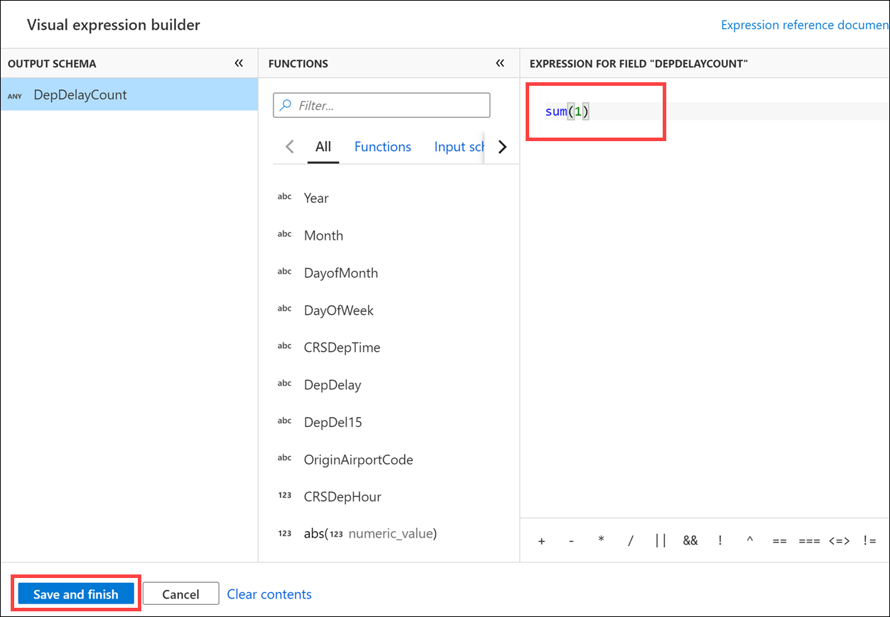
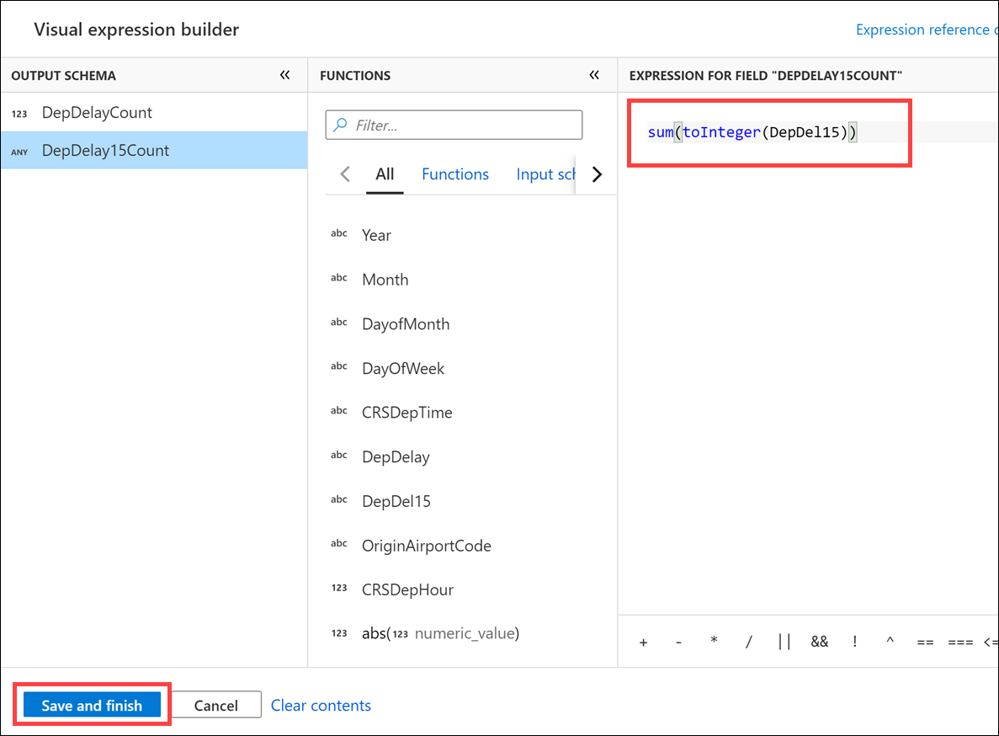
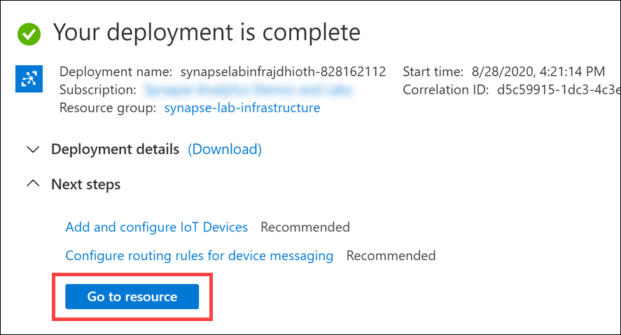
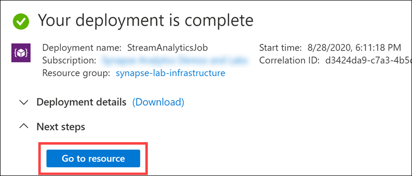

# Azure Synapse in a day demos - Infrastructure

- [Azure Synapse in a day demos - Infrastructure](#azure-synapse-in-a-day-demos---infrastructure)
  - [Overview](#overview)
    - [Pre-requisites](#pre-requisites)
  - [Building analytic solutions with Azure Synapse Analytics (Basic)](#building-analytic-solutions-with-azure-synapse-analytics-basic)
    - [About the latest data analysis infrastructure](#about-the-latest-data-analysis-infrastructure)
    - [Scenario](#scenario)
    - [Hands-on architecture](#hands-on-architecture)
  - [Exercise 0: Download lab files](#exercise-0-download-lab-files)
  - [Exercise 1: Deploy Azure Synapse Analytics](#exercise-1-deploy-azure-synapse-analytics)
    - [Task 1: Create Azure Synapse Analytics workspace](#task-1-create-azure-synapse-analytics-workspace)
    - [Task 2: Set up blob data owner](#task-2-set-up-blob-data-owner)
    - [Task 3: Set up user access administrator](#task-3-set-up-user-access-administrator)
    - [Task 4: Log in to Synapse Studio](#task-4-log-in-to-synapse-studio)
  - [Exercise 2: Moving data to the data lake using Copy activity](#exercise-2-moving-data-to-the-data-lake-using-copy-activity)
    - [About Synapse Pipeline](#about-synapse-pipeline)
    - [Task 1: Create a Linked Service](#task-1-create-a-linked-service)
    - [Task 2: Create a Copy pipeline](#task-2-create-a-copy-pipeline)
  - [Exercise 3: Create a SQL Pool and table](#exercise-3-create-a-sql-pool-and-table)
    - [Task 1: Create a SQL Pool](#task-1-create-a-sql-pool)
    - [Task 2: Create table](#task-2-create-table)
  - [Exercise 4: Implement Spark ETL with the GUI](#exercise-4-implement-spark-etl-with-the-gui)
    - [Task 1: Create ADLS Gen2 Linked Service](#task-1-create-adls-gen2-linked-service)
    - [Task 2: Create mapping data flow sources](#task-2-create-mapping-data-flow-sources)
    - [Task 3: Create a filter](#task-3-create-a-filter)
    - [Task 4: Add calculated columns](#task-4-add-calculated-columns)
    - [Task 5: Select columns](#task-5-select-columns)
    - [Task 6: Aggregation process](#task-6-aggregation-process)
    - [Task 7: Data join process](#task-7-data-join-process)
    - [Task 8: Data output](#task-8-data-output)
    - [Task 9: Create and run Pipeline](#task-9-create-and-run-pipeline)
    - [Task 10: View the transformed data](#task-10-view-the-transformed-data)
  - [Exercise 5: Visualize with Power BI](#exercise-5-visualize-with-power-bi)
    - [Task 1: Connect Power BI Desktop](#task-1-connect-power-bi-desktop)
    - [Task 2: Create a report](#task-2-create-a-report)
    - [Task 3: Save Power BI Desktop report](#task-3-save-power-bi-desktop-report)
    - [Task 4: Create a Power BI workspace (optional)](#task-4-create-a-power-bi-workspace-optional)
    - [Task 5: Create a Power BI Linked Service (optional)](#task-5-create-a-power-bi-linked-service-optional)
    - [Task 6: Create a Power BI dataset (optional)](#task-6-create-a-power-bi-dataset-optional)
  - [Build a predictive maintenance solutions with Azure Synapse Analytics (Advanced)](#build-a-predictive-maintenance-solutions-with-azure-synapse-analytics-advanced)
    - [About Lambda Architecture](#about-lambda-architecture)
    - [Scenario](#scenario-1)
    - [Hands-on architecture](#hands-on-architecture-1)
  - [Exercise 6: Create stream processing](#exercise-6-create-stream-processing)
    - [Task 1: IoT Hub resource creation](#task-1-iot-hub-resource-creation)
    - [Task 2: Event source settings](#task-2-event-source-settings)
    - [Task 3: Create and configure Stream Analytics resources](#task-3-create-and-configure-stream-analytics-resources)

## Overview

This is a hands-on lab for infrastructure, telecommunications, transportation, and manufacturing using Azure Synapse Analytics. It provides step-by-step procedures for basic analysis platform construction, IoT sensor data visualization, and predictive maintenance features.

### Pre-requisites

To complete this lab, you must meet the following pre-requisites:

1. Microsoft Azure subscription must be pay-as-you-go or MSDN.

    a. Trial subscriptions will not work.

2. Install [Power BI Desktop](https://aka.ms/pbidesktopstore).

3. Windows desktop machine (or Azure VM with a Windows 10 image) for the IoT Device emulator.

4. [Power BI Pro license](https://powerbi.microsoft.com/power-bi-pro/) (can start a trial version of Pro).

    > If you have permission to publish reports to your Workspace (≠My Workspace), you can create Power BI Reports on Synapse. (Required: Power BI Pro license). If not, you can create a Report solely with Power BI Desktop.

## Building analytic solutions with Azure Synapse Analytics (Basic)

### About the latest data analysis infrastructure

The modern data analytics infrastructure, called the Modern Data Warehouse pattern, is based on the following points to address big data:

- Scalability

    By focusing on a managed infrastructure of PaaS, scalability that is difficult to get on-premises can be achieved. By incorporating a distributed processing infrastructure such as Spark, data processing in petabytes can be performed quickly.

- Use of data lakes

    The data lake accumulates unstructured data, such as JSON and image data. By implementing structured processing by distributed processing, visualization of data that has been difficult to use in the past and the use of AI will be promoted.

In traditional Azure data analytic infrastructures, the solution was for architects to combine PaaS such as Azure Data Factory, Azure Databricks, Azure SQL Data Warehouse, and Azure Data Lake Storage to accommodate a variety of workloads.

Traditional Azure analytic infrastructure configuration

> TODO: Update image

With Azure Synapse Analytics, enjoy advantages of traditional scalable cloud data analytic infrastructures while:

- Building analytical infrastructures more quickly
- Reducing infrastructure complexity
- Reducing costs and improving development efficiency with integrated workspace and management screen

Azure Synapse Analytics

> TODO: Update image

### Scenario

Build a flight delay visualization solution. With Azure Synapse Analytics, an analytic infrastructure can be built in a short time frame.

This lab will guide you through the basic deployment of Azure Synapse Analytics and creating DWH, and practicing GUI-based distributed ETL processing and reporting.

### Hands-on architecture

You will configure an architecture such as the following:

> TODO: Update image

To build the architecture, complete the following tasks:

1. Deploy Azure Synapse Analytics
2. Create a link between flight delay data in the data lake
3. Create a SQL Pool
4. Create distributed ETL processing in the GUI with Mapping Data Flow
5. Visualize flight delay

## Exercise 0: Download lab files

Time required: 5 minutes

The lab files are located in a GitHub repo. You must unzip the file and extract it to your desktop so you can access them throughout the lab.

1. Download the ZIP file for the lab from <https://github.com/solliancenet/azure-synapse-in-a-day-demos/archive/master.zip>.

2. Extract the files to **`C:\`**. This will create a folder named `azure-synapse-in-a-day-demos-master` at the root of your C: drive.

     Folders")

3. Navigate to `C:\azure-synapse-in-a-day-demos-master\infrastructure\source` to view the files.

    

## Exercise 1: Deploy Azure Synapse Analytics

Time required: 15 minutes

The first step is to deploy and configure the resources. It's easy to do from the Azure Portal.

> TODO: Update image

### Task 1: Create Azure Synapse Analytics workspace

1. Navigate to the Azure portal (<https://portal.azure.com>) to create the Azure Synapse Analytics workspace.

2. In the search menu, type **Synapse**, then select **Azure Synapse Analytics (workspaces preview)**.

    

3. Select **Add**.

    

4. In the `Create Synapse workspace` form, enter the values shown in the table below. For the Azure Data Lake Storage Gen2 account name, select **Create new**, enter the account name, then select **OK**.

    

    | Parameters | Settings | Remarks |
    | --- | --- | --- |
    | Subscription | Any | Select the Azure subscription used for this lab. |
    | Resource group | `synapse-lab-infrastructure` | Select **Create new**, then enter the name. |
    | Workspace name | `synapselabinfra` + your initials + `asws` (example: `synapselabinfrajdhasws`) | Lowercase alphanumeric characters only |
    | Region | Select the region closest to you, such as `West US`. | |
    | Select Data Lake Storage Gen2 | From subscription | Default settings |
    | Account name | `synapselabinfra` + your initials + `adls` (example: `synapselabinfrajdhadls`) | Select **Create new** (lowercase alphanumeric characters only) |

5. Select **Create new** for `File system name`, type **datalake** in the name field, then select **OK**.

    

6. Check the `Assign myself the Storage Blob Data Contributor role` checkbox, then select **Next: Security and networking**.

    

7. Review the settings, then select **Review + create**.

    

8. Review the settings, then select **Create**. It takes around five minutes to create the workspace.

    

### Task 2: Set up blob data owner

Data access permissions on the data lake must be set separately from the resource's permissions.

1. When the Azure Synapse Analytics workspace deployment completes, navigate to the `synapse-lab-infrastructure` resource group. In the Azure portal, use the top search bar to search for `synapse-lab-infrastructure`, then select the **synapse-lab-infrastructure** resource group in the search results under **Resource Groups**.

    

2. Within the resource group, select the storage account you created when you deployed the Azure Synapse Analytics workspace.

    

3. Within the storage account, select **Access control (IAM)**. Select **+ Add**, then **Add role assignment**.

    

4. Select the **Storage Blob Data Owner** role. Select **Azure AD user, group, or service principal** under assign access to. Search for and select your Azure account, then select **Save**.

    

### Task 3: Set up user access administrator

1. Return to the `synapse-lab-infrastructure` resource group and select the Azure Synapse Analytics workspace within.

    

2. Within the Synapse workspace, select **Access control (IAM)**. Select **+ Add**, then **Add role assignment**.

    

3. Select the **User Access Administrator** role. Select **Azure AD user, group, or service principal** under assign access to. Search for and select your Azure account, then select **Save**.

    

### Task 4: Log in to Synapse Studio

1. Return to the `synapse-lab-infrastructure` resource group and select the Azure Synapse Analytics workspace within.

    

2. In the **Overview** blade, select the **Workspace web URL** to navigate to Synapse Studio for this workspace.

    

    After authenticating your account, you should see the Synapse Studio home page for your workspace.

    

3. If you see the Getting started dialog, select **Close**.

    

## Exercise 2: Moving data to the data lake using Copy activity

Time required: 30 minutes

In this exercise, you will import a large amount of data into the primary data lake account.

> TODO: Update image

### About Synapse Pipeline

The data integration feature, Synapse Pipeline, is designed with the following concepts:

* **Linked Service**: Contains definitions about the connection, such as the database and server information.
* **Dataset**: Browses the Linked Service and defines table information, for example.
* **Activity**: Browses, for example, a Dataset to define processing such as data movement.
* **Pipeline**: Defines the order and conditions in which Activities are run.
* **Integration Runtime**: Defines the processing infrastructure used by Linked Services and Activities.
* **Trigger**: Defines when and how the Pipeline will run.

### Task 1: Create a Linked Service

1. Select the **Manage** hub, **Linked services**, then select **+ New**.

    

2. Select **Azure Blob Storage**, then select **Continue**.

    

3. Enter each setting described below, then select **Test connection**. When the connection is successful, select **Create**.

    

    | Parameters | Settings | Remarks |
    | --- | --- | --- |
    | Name | `HOLSource` | |
    | Description | No entry required | Default settings |
    | Connect via integration runtime | AutoResolveIntegrationRuntime | Default settings |
    | Authentication method | SAS URL | |
    | SAS URL | `https://solliancepublicdata.blob.core.windows.net` | |
    | SAS token| '' | Enter two single quotes |
    | Test connection | To linked service | Default settings |

### Task 2: Create a Copy pipeline

1. Select the **Orchestrate** hub, select **+**, then select **Pipeline**.

    

2. For **Name**, enter `ImportData`, then select **Properties** to close the dialog.

    

3. Expand **Move & transform** under the Activities menu. Drag and drop the **Copy data** activity onto the canvas area to the right.

    

4. Select the **Source** tab, then select **+ New** next to the source dataset.

    

5. Select **Azure Blob Storage**, then select **Continue**.

    

6. Select the **Binary** format, then select **Continue**.

    

7. Enter each setting as displayed in the table below, and then select **OK**.

    

    | Parameters | Settings | Remarks |
    | --- | --- | --- |
    | Name | `holsource` | Be careful not to include extra spaces when copying |
    | Linked service | HOLSource | Select the linked service you created earlier |
    | File path | `synapse-in-a-day/infrastructure` | Enter `synapse-in-a-day` in the first field, and `infrastructure` in the second field. *Note*: you may see an error if you try to browse, due to the lack of list permissions on the entire public data source. To review the contents, select the drop down arrow and select "From specified path" |

8. Select the **Sink** tab, then select **+ New** next to the sink dataset.

    

9. Select **Azure Data Lake Storage Gen2**, then select **Continue**.

    

10. Select the **Binary** format, then select **Continue**.

    

11. Enter each setting as displayed in the table below, and then select **OK**.

    

    | Parameters | Settings | Remarks |
    | --- | --- | --- |
    | Name | `holdist` | Be careful not to include extra spaces when copying |
    | Linked service | Select the default storage for your workspace (`<Synapse workspace name>-WorkspaceDefaultStorage`) | |
    | File path | `datalake` | Enter `datalake` in the first field |

12. Select **Publish all**, then select **Publish** in the dialog.

    

    > ※	For the remainder of the lab, select **Publish** as appropriate to save your work.

13. Select **Add trigger**, then select **Trigger now**.

    

14. Select **OK** to run the trigger.

    

15. Select the **Monitor** hub, then **Pipeline runs**. If the pipeline run status is `Succeeded` after a few minutes, then the pipeline run successfully completed.

    

16. Select the **Data** hub, select the **Linked** tab, expand storage accounts, then select **datalake** underneath the primary storage account. You will see the imported data on the right-hand side.

    

## Exercise 3: Create a SQL Pool and table

Time required: 20 minutes

> TODO: Update image

SQL Pool is one of the analytic runtimes in Azure Synapse Analytics that help you ingest, transform, model, and analyze your data.

A SQL pool offers T-SQL based compute and storage capabilities. After creating a SQL pool in your Synapse workspace, data can be loaded, modeled, processed, and delivered for faster analytic insight.

### Task 1: Create a SQL Pool

1. Select the **Manage** hub.

    

2. Select **SQL pools**, then select **+ New**.

    

3. Enter **aiaddw** for the SQL pool name, select the **DW100c** performance level, then select **Review + create**.

    

4. Select **Create** in the review blade.

5. Wait for the SQL pool deployment to complete. You may need to periodically select **Refresh** to update the status.

    

### Task 2: Create table

1. Select the **Develop** hub.

    

2. Select **+**, then select **SQL script**.

    

3. Enter **Create DelaySummary** in the Name value within the Properties blade. Select the **aiaddw** SQL pool you created in the previous task. Paste the script below into the script area, then select **Run**.

    ```sql
    --Set up Polybase
    CREATE MASTER KEY

    --Create destination table
    CREATE TABLE [dbo].[DelaySummary]
    ( 
        [Year] int NULL,
        [Month] int NULL,
        [DayofMonth] int NULL,
        [DayOfWeek] int NULL,
        [OriginAirportCode] [nvarchar](10)  NULL,
        [DepDelayCount] [bigint] NULL,
        [DepDelay15Count] [bigint] NULL,
        [AIRPORT_ID] [nvarchar](20) NULL,
        [AIRPORT] [nvarchar](100)  NULL,
        [DISPLAY_AIRPORT_NAME] [nvarchar](100) NULL,
        [LATITUDE] [nvarchar](20)  NULL,
        [LONGITUDE] [nvarchar](20)  NULL
    ) WITH
    (
        DISTRIBUTION = ROUND_ROBIN,
        CLUSTERED COLUMNSTORE INDEX
    )
    GO
    ```

    

4. After you run the script, you should see a status that the script executed successfully.

    

5. Select **Publish all**, then select **Publish** in the dialog.

    

    > ※	For the remainder of the lab, select **Publish** as appropriate to save your work.

6. Select the **Data** hub.

    

7. Select the **Workspace** tab, expand **Databases**, expand the **aiaddw** SQL pool, and expand **Tables**. You will see the `DelaySummary` table. If it does not appear, select **Refresh**.

    

## Exercise 4: Implement Spark ETL with the GUI

Time required: 45 minutes

> TODO: Update image

Mapping data flows are visually designed data transformations in Azure Data Factory. Data flows allow data engineers to develop data transformation logic without writing code. The resulting data flows are executed as activities within Azure Data Factory pipelines that use scaled-out Apache Spark clusters. Data flow activities can be operationalized using existing Azure Data Factory scheduling, control, flow, and monitoring capabilities.

Mapping data flows provide an entirely visual experience with the Synapse Studio GUI, with no coding required. Your data flows run on ADF-managed execution clusters for scaled-out data processing. Azure Data Factory handles all the code translation, path optimization, and execution of your data flow jobs.

### Task 1: Create ADLS Gen2 Linked Service

1. Select the **Manage** hub, **Linked services**, then select **+ New**.

    

2. Select **Azure Data Lake Storage Gen2**, then select **Continue**.

    

3. Enter each setting described below, then select **Test connection**. When the connection is successful, select **Create**.

    

    | Parameters | Settings | Remarks |
    | --- | --- | --- |
    | Name | `key_adls` | |
    | Description | No entry required | Default settings |
    | Connect via integration runtime | AutoResolveIntegrationRuntime | Default settings |
    | Authentication method | Account Key | Default settings |
    | Account selection method | From Azure subscription | Default settings |
    | Azure subscription | Any | Select the Azure subscription for this lab |
    | Storage account name | Any | Select the storage account you created when deploying the workspace |

### Task 2: Create mapping data flow sources

Create datasets to extract "Flight delay" and "Airport master data".

1. Select the **Develop** hub.

    

2. Select **+**, then select **Data flow**.

    

3. Select the **Data flow debug** switch.

    

4. Select **OK** in the `Turn on data flow debug` dialog.

    

5. Set **FlightDelayETL** for the Name in the Properties blade. Select **Properties** to close the blade, then select **Add Source** on the canvas.

    

6. For **Output stream name**, enter **AirportCodeLocationLookupClean**, and select **+ New** next to **Source dataset**.

    

7. Select **Azure Data Lake Storage Gen2**, then select **Continue**.

    

8. Select the **DelimitedText** format, then select **Continue**.

    

9. Enter each setting as displayed in the table below, and then select **OK**.

    

    | Parameters | Settings | Remarks |
    | --- | --- | --- |
    | Name | `csv_AirportCodeLocationLookupClean` | Be careful not to include extra spaces when copying |
    | Linked service | Select the default storage for your workspace (`<Synapse workspace name>-WorkspaceDefaultStorage`) | |
    | File path | `datalake` | Select file from "From specified path" in the next step |

10. Select the **TravelDatasets** folder, then select **AirportCodeLocationLookupClean.csv** and select **OK**.

    

11. Check **First row as header**, ensure the **From connection / store** import schema option is selected, then select **OK**.

    

12. Select **Add Source** on the canvas below the source you just added.

    

13. For **Output stream name**, enter **FlightDelaysWithAirportCodes**, and select **+ New** next to **Source dataset**.

    

14. Select **Azure Data Lake Storage Gen2**, then select **Continue**.

    

15. Select the **DelimitedText** format, then select **Continue**.

    

16. Enter each setting as displayed in the table below, and then select **OK**.

    

    | Parameters | Settings | Remarks |
    | --- | --- | --- |
    | Name | `csv_FlightDelaysWithAirportCodes` | Be careful not to include extra spaces when copying |
    | Linked service | Select the default storage for your workspace (`<Synapse workspace name>-WorkspaceDefaultStorage`) | |
    | File path | `datalake` | Select file from "From specified path" in the next step |

17. Select the **TravelDatasets** folder, then select **FlightDelaysWithAirportCodes.csv** and select **OK**.

    

18. Check **First row as header**, ensure the **From connection / store** import schema option is selected, then select **OK**.

    

### Task 3: Create a filter

Create a filter for the records.

1. Under the `FlightDelaysWithAirportCodes` source, select **+** in the lower-right corner, and then select **Filter**.

    

2. Under "Filter on", select **Enter filter...**.

    

3. Copy and paste the following query into the query area to the right of FUNCTIONS. Select **Refresh** to review the data preview, then select **Save and finish**.

    ```javascript
    toInteger(DepDelay) > 0
    ```

    

### Task 4: Add calculated columns

In this data, a delay of `1:30` is represented as `130`. Create a delay time column with the name "CRSDepHour" so that it can be represented as a `1.3` hour delay.

1. Under the `FlightDelaysWithAirportCodes` source, select **+** in the lower-right corner of the stream (from the new filter you just created), and then select **Derived Column**.

    

2. Under Columns, type **CRSDepHour**, and then select **Expression**.

    

3. Copy and paste the following query into EXPRESSION FOR FIELD "CRSDEPHOUR". Select **Refresh** to review the Data rpeview, and then select **Save and finish**.

    ```javascript
    floor(toInteger(CRSDepTime)/100)
    ```

    

### Task 5: Select columns

Add an action to eliminate unnecessary columns so that only the required columns remain.

1. Under the `FlightDelaysWithAirportCodes` source, select **+** in the lower-right corner of the stream (from the new derived column action you just created), and then select **Select**.

    

2. Check **DerivedColumn1's column** to check all columns. Then remove checks from the following nine items: Make sure that **all other items** besides the following nine are checked, and then select **Delete**.

    - Year
    - Month
    - DayofMonth
    - DayOfWeek
    - CRSDepTime
    - DepDelay
    - DepDel15
    - OriginAirportCode
    - CRSDepHour


### Task 6: Aggregation process

Add aggregation processing so that delays are aggregated at the granularity of the year, month, day, and airport.

1. Under the `FlightDelaysWithAirportCodes` source, select **+** in the lower-right corner of the stream (from the new select action you just created), and then select **Aggregate**.

    

2. Select the drop-down arrow on the right of Columns to add the following five columns. Click **+** to add an item:

    - Year
    - Month
    - DayofMonth
    - DayOfWeek
    - OriginAirportCode

    

3. Verify that all five columns have been added, then select **Aggregates**.

    

4. In Columns, type **DepDelayCount**, and then select **Expression**.

    

5. Paste the following expression into EXPRESSION FOR FIELD "DEPDELAYCOUNT" and select **Save and finish**:

    ```javascript
    sum(1)
    ```

    

6. Select **+** to the right of the column you just added, then select **Add column**.

    

7. In Columns, type **DepDelay15Count**, and then select **Expression**.

    

8. Paste the following expression into EXPRESSION FOR FIELD "DEPDELAY15COUNT" and select **Save and finish**:

    ```javascript
    sum(toInteger(DepDel15))
    ```

    

### Task 7: Data join process

Combine data sources.

1. Under the `FlightDelaysWithAirportCodes` source, select **+** in the lower-right corner of the stream (from the new aggregate action you just created), and then select **Join**.

    

2. Within the Join settings form, enter each setting as described in the table below.

    

    | Parameters | Settings | Remarks |
    | --- | --- | --- |
    | Output stream name | `Join1` | Default settings |
    | Left stream | `Aggregate1` | |
    | Right stream | `AirportCodeLocationLookupClean` | This is the first data source you added |
    | Join type | `Inner` | Default settings |
    | Left: Aggregate1's column | `OriginAirportCode` | |
    | Right: AirportCodeLocationLookupClean's column | `AIRPORT` | |

### Task 8: Data output

Add a sink process to output to the SQL Pool and create a dataset that defines the destination table information.

1. Under the `FlightDelaysWithAirportCodes` source, select **+** in the lower-right corner of the stream (from the new join action you just created), and then select **Sink**.

    

2. Select **+ New** next to the Sink dataset.

    

3. Select **Azure Synapse Analytics (formerly SQL DW)**, then select **Continue**.

    

4. Enter each setting as displayed in the table below, and then select **OK**.

    

    | Parameters | Settings | Remarks |
    | --- | --- | --- |
    | Name | `dw_DelaySummary` | Be careful not to include extra spaces when copying |
    | Linked service | Select the default SQL server for your workspace (`<Synapse workspace name>-WorkspaceDefaultSqlServer`) | |
    | Table name | None | Default settings, set in subsequent steps |
    | Import schema | None | Default settings |

5. Select **Open** next to the Sink dataset.

    

6. Under the **Connection** tab of the dataset properties, enter **aiaddw** SQL pool name for the **DBName** value. Select **Refresh** next to the table list, then select **dbo.DelaySummary** from the list.

    

7. Select the **FlightDelayETL** tab to switch back to the mapping data flow. Select **Sink1**, select the **Settings** tab, then select **Truncate table** in the Table action options list. Make sure **Enable staging** is also checked.

    

8. Select **Publish all**, then select **Publish** in the dialog.

    

### Task 9: Create and run Pipeline

1. Select the **Orchestrate** hub, select **+**, then select **Pipeline**.

    

2. For **Name**, enter `FlightDelay`, then select **Properties** to close the dialog.

    

3. Expand **Move & transform** under the Activities menu. Drag and drop the **Data flow** activity onto the canvas area to the right.

    

4. In the Adding data flow dialog, select **Use existing data flow**, select **FlightDelayETL** from the existing data flow list, then select **Finish**.

    

5. Select the **Settings** tab, select **key_adls** from the **Staging linked service** list, then enter **datalake** in the container field and **polybase** in the folder field of the **Staging storage folder** setting.

    

6. Select **Publish all**, then select **Publish** in the dialog.

    

7. Select **Add trigger**, then select **Trigger now**.

    

8. Select **OK** to run the trigger.

    

9. Select the **Monitor** hub, then **Pipeline runs**. If the pipeline run status is `Succeeded` after a few minutes, then the pipeline run successfully completed.

    

> **Note**: Mapping Data Flow runs with a minimum overhead of at least five to six minutes. This is because you are creating a Spark processing environment each time you run it. If you are using an ETL pipeline using Mapping Data Flow, plan your batch schedule with time in mind for creating a processing environment.

> **Note**: Some of the imported data has a prepared dataset that has been amplified to 100 million items under the name "FlightDelaysWithAirportCodes100M.csv". With this csv data, you can see the scalability of Mapping Data Flow for 100 million data processes.

### Task 10: View the transformed data

When the data flow pipeline has successfully completed, view the data it wrote to the `dbo.DelaySummary` SQL pool table.

1. Select the **Data** hub.

    

2. Select the **Workspace** tab, expand **Databases**, expand the **aiaddw** SQL pool, and expand **Tables**. Right-click on the `DelaySummary` table, select  **New SQL script**, then select **Select TOP 100 rows**.

    

3. View the results of the executed script. Notice that the derived columns, joined columns, and aggregates you added to the Mapping Data Flow appear in the result set.

    

## Exercise 5: Visualize with Power BI

Time required: 15 minutes

> TODO: Update image

Power BI reports can be created, edited, and viewed from within Synapse Studio. This level of integration allows you to easily get data into your Power BI workspace. It also minimizes your need to switch tabs and navigate between services in the browser.

### Task 1: Connect Power BI Desktop

1. Return to the `synapse-lab-infrastructure` resource group and select the Azure Synapse Analytics workspace within.

    

2. In the **Overview** blade, copy the **SQL endpoint** value.

    

3. Open Power BI Desktop. Close the sign-in window with the **X** on the upper-right corner.

    

4. Select **Get Data**, then select **Azure** in the left-hand menu of the dialog that appears. Select **Azure Synapse Analytics (SQL DW)**, then select **Connect**.

    

5. Set the **Server** value to your copied SQL endpoint, and enter **aiaddw** for the **Database** name. Select the **DirectQuery** data connectivity mode, then click **OK**.

    

6. Select **Microsoft account** on the left-hand menu. **Sign in**, then click **Connect**.

    

7. Click the box to the left of **DelaySummary**, which will load the data in the preview to the right. Click **Load**.

    

### Task 2: Create a report

1. Click **Map** under Visualizations, then drag and drop **OriginAirportCode** into the **Legend** field. Refer to the table below for setting the other fields.

    | Parameters | Settings | Remarks |
    | --- | --- | --- |
    | Legend | `OriginAirportCode` | |
    | Latitude | `LATITUDE` | Select **Don't summarize** |
    | Longitude | `LONGITUDE` | Select **Don't summarize** |
    | Size | `DepDelayCount` | |

    

    > **Note**: By default, latitude and longitude are treated as aggregate values. Click the drop-down arrow and select **Don't summarize**.

    

2. Click an empty location on the report area. Under Visualizations, click **Stacked Column Chart**, then use the table below to set the field values.

    | Parameters | Settings | Remarks |
    | --- | --- | --- |
    | Axis | `DayofMonth` | |
    | Values | `DepDelayCount` | |

    

3. Click an empty location on the report area. Under Visualizations, click **Treemap**, then use the table below to set the field values.

    | Parameters | Settings | Remarks |
    | --- | --- | --- |
    | Group | `OriginAirportCode` | |
    | Values | `DepDelayCount` | |

    

4. Clicking on a visual narrows down the data for the other visuals. (It may take a few seconds to load the data.)

    

### Task 3: Save Power BI Desktop report

1. Click the **Save** icon on the top-left of Power BI Desktop. Enter a file name, such as **FlightDelays**, then click **Save** to save the report file.

    

### Task 4: Create a Power BI workspace (optional)

If you have a Power BI Pro license and have create permissions, perform the following to create a new Power BI workspace for this lab. If not, you may skip the rest of the tasks in this exercise.

1. Sign in to Power BI service (https://powerbi.microsoft.com/landing/signin/)

2. Select **Workspaces**, then select **Create a workspace**.

    

3. Type **AIAD_SynapseWorkspace** for the workspace name, then select **Save**.

    

### Task 5: Create a Power BI Linked Service (optional)

If you were able to create a Power BI workspace, you can continue with this task. Otherwise, skip ahead to the next exercise.

1. Select the **Manage** hub, **Linked services**, then select **+ New**.

    

2. Select **Power BI**, then select **Continue**.

    

3. Make sure the correct Tenant is selected, then select the **AIAD_SynapseWorkspace** option from the **Workspace name** list. Select **Create** to continue.

    ")

    > If the new Power BI workspace is not displayed, the tenant to which the AD account belongs and the tenant where the Power BI workspace is created may be different.

### Task 6: Create a Power BI dataset (optional)

If you were able to create a Power BI workspace, you can continue with this task. Otherwise, skip ahead to the next exercise.

1. Select the **Develop** hub.

    

2. Expand the **Power BI** group, then expand the **AIAD_SynapseWorkspace** Linked Service. Select **Power BI datasets**, then select **+ New Power BI dataset** in the blade to the right.

    

3. Select **Start**.

    

4. Select the **aiaddw** SQL pool that you created, then select **Continue**.

    

5. Select **Download**. Open the downloaded Power BI Desktop data source (`.pbids`) file.

    

6. Power BI Desktop launches when you open the `.pbids` file. When the navigator pops up, click the check box next to **DelaySummary**, then click **Load**.

    

7. Click **DirectQuery**, then click **OK**.

    

8. Click **File**, then **Publish**. Click **Publish to Power BI**.

    

9. Click **Save**.

    

10. Enter a file name, such as **FlightDelaysDS**, then click **Save**.

    

11. Sign in to your Power BI account.

    

12. Select the **AIAD_SynapseWorkspace** workspace, then click **Select**.

    

13. When Power BI Desktop finishes publishing, sign in to the Power BI service (<https://powerbi.microsoft.com/landing/signin/>). Select the **AIAD_SynapseWorkspace** workspace on the left, then select the **Datasets** tab. Select **...(More options)** under the Actions column of the `FlightDelaysDS` dataset, then select **Settings**.

    

14. Select **Edit credentials**.

    

15. Select the **OAuth2** authentication method and set the privacy level for this data source to **Public**. **Check the box** to have report viewers use their own Power BI identities in DirectQuery mode, then select **Sign in**.

    

16. Return to Synapse Studio, then select **Continue**.

    

17. Select **Close and refresh**.

    

18. Select **Power BI datasets**, then select the **New Power BI report** icon on the `FlightDelaysDS` dataset.

    

19. When the screen for the new report opens, run the report.

    

## Build a predictive maintenance solutions with Azure Synapse Analytics (Advanced)

### About Lambda Architecture

The Lambda architecture is a common pattern in Big Data infrastructures.


(https://docs.microsoft.com/azure/architecture/data-guide/big-data/#lambda-architecture)

- **Batch layer, service layer**

    Distributed processing has made it possible to process large amounts of data within business hours. Perform accumulation and distribution processing on the batch layer. By deploying the results of calculations on the service layer, you can analyze large amounts of data while ensuring separation of calculated results and raw data.
    Periodic data processing flows sourced from pre-accumulated data are defined as cold paths.

- **Speed layer**

    Processing at the batch layer usually causes latency. The speed layer complements the weakness of latency during batch processing and enables real-time analysis of stream data arriving within batch processing schedule intervals. Continuous data processing flows sourced from stream data are defined as hot paths.

### Scenario

Build solutions for analysis and predictive maintenance of sensor data in aircraft engines. In predictive maintenance, it is possible to improve maintenance efficiency by predicting how long maintenance will be required (remaining service time: RUL) by using a model trained with machine learning.

The lambda architecture can be constructed on Azure with Azure Synapse Analytics and PaaS for IoT data.

This section of the lab demonstrates near-real-time visualization of engine sensor data defined in JSON, distributed and machine learning processing for accumulated large amounts of data, and DWH loading and visualization.

### Hands-on architecture

> TODO: Update image

To build the architecture, complete the following tasks:

- Create real-time aggregation of sensor data and raw data storage processing in the data lake
- Create SQL query view to processed sensor data in data lake
- Run sensor data near-real-time visualization report
- Perform structured processing with Spark
- Process scoring and create load processing to DWH
- Run sensor data analysis report

## Exercise 6: Create stream processing

Time required: 30 minutes

> TODO: Update image

Create IoT Hub, Stream Analytics, receive sensor data, and implement real-time processing.

Stream Analytics coordinates sensor data received in JSON format with the data lake, and outputs the results of the average value at 30-second intervals in parallel as a parquet file.

**Note:**

The ability to output from Azure Stream Analytics to Synapse SQL Pool with high throughput of 200 MB/s has been announced.

Using Azure Stream Analytics with Azure Synapse Analytics: (https://docs.microsoft.com/azure/synapse-analytics/sql-data-warehouse/sql-data-warehouse-integrate-azure-stream-analytics)

**Note:**

Synapse Link with Cosmos DB can now be converted to column-oriented format with No-ETL to take advantage of data in column-oriented formats, such as Parquet file conversion.

Azure Synapse Link for Azure Cosmos DB: (https://docs.microsoft.com/azure/cosmos-db/synapse-link)

### Task 1: IoT Hub resource creation

1. Navigate to the Azure portal (<https://portal.azure.com>) to create the IoT Hub resource.

2. In the search menu, type **IoT Hub**, then select **IoT Hub**.

    

3. Select **Add**.

    

4. In the `Create Synapse workspace` form, enter the values shown in the table below. Select **Review + create**.

    

    | Parameters | Settings | Remarks |
    | --- | --- | --- |
    | Subscription | Any | Select the Azure subscription used for this lab. |
    | Resource group | `synapse-lab-infrastructure` | Select existing resource group you have been using for this lab |
    | Region | Select the region closest to you, such as `West US`. | |
    | Workspace name | `synapselabinfra` + your initials + `ioth` (example: `synapselabinfrajdhioth`) | Lowercase alphanumeric characters only |

5. Review the settings, then select **Create**. It takes a few minutes to create the resource.

    

6. When the deployment completes, navigate to the IoT Hub resource by selecting **Go to resource**. Alternately, you may navigate to the `synapse-lab-infrastructure` resource group and select the IoT Hub resource there.

    

7. Select **IoT devices** in the left-hand menu, then select **+ New** in the IoT devices blade.

    

8. Enter **vdev01** as the Device ID, select the **Symmetric key** authentication type, **Check** auto-generate key, and **Enable** the option to connect this device to an IoT Hub. Select **Save**.

    

9. Select the device ID of the new device you created.

    

10. Copy the **Primary Key** and save it to Notepad or similar text editor for later.

    

11. Navigate back to the IoT Hub resource and select **Built-in endpoints** on the left-hand menu. Scroll down to **Consumer Groups**. In the **Create a new consumer group** box, enter **streamanalytics**. Select **Save** to apply your changes.

    

### Task 2: Event source settings

In this task, we configure the `IoTVirtualDevices` virtual device simulator that simulates and sends sensor data to Azure.

1. Select **Overview** in the left-hand menu of your IoT Hub. Copy the **Hostname** value and save it to Notebook or similar text editor for later.

    

2. Navigate to the location on your computer or Windows VM where you extracted the ZIP file for this lab. If you extracted it to `C:\`, navigate to `C:\azure-synapse-in-a-day-demos-master\infrastructure\source\IoTVirtualDevices\Release`. Open **IoTVirtualDevices.exe.config**.

    

3. Enter the **IoT Hub hostname** that you copied previously and save the configuration file, overwriting the previous value.

    

    ```xml
    <setting name="IOT_HUB_NAME" serializeAs="String">
        <value> YOUR_IOT_HUB_HOSTNAME_HERE </value>
    </setting>
    ```

4. Close the file and, in the same directory, open **device_info.csv**. Enter the **Primary key** for the IoT device that you copied earlier, then save the file.

    

    ```text
    DEVICE_ID,DEVICE_TYPE,SIGNING_KEY,DESCRIPTION
    vdev01,1,YOUR_PRIMARY_KEY_HERE,AIAD
    ```

5. Close the file and, in the same directory, right-click **IoTVirtualDevices.exe** and select **Run as administrator**.

    

6. If you receive a prompt asking you if you want to allow this app from an unknown publisher to make changes to your device, click **Yes**.

    

7. When the Virtual Devices application starts, click **File**, and then click **Normal Telemetry Data File Load**.

    

8. Select **data_sample.csv** in the `IoTVirtualDevices\Release\` folder, then select **Open**.

    

9. Click **OK** in the dialog that appears after loading.

    

10. Click the **Virtual Device Stopped** button to get started.

    

11. **Virtual Device Processing** is displayed.

    

12. Navigate to IoT Hub in the portal and, in the **Overview** blade, view the **IoT Hub Usage** chart. You should see the **Messages used today** count increase each time you **Refresh**.

    

### Task 3: Create and configure Stream Analytics resources

1. Navigate to the Azure portal (<https://portal.azure.com>) to create the IoT Hub resource.

2. In the search menu, type **stream**, then select **Stream Analytics jobs**.

    

3. Select **Add**.

    

4. In the `New Stream Analytics job` form, enter the values shown in the table below. Select **Create**.

    

    | Parameters | Settings | Remarks |
    | --- | --- | --- |
    | Job name | `synapselabinfra` + your initials + `asa` (example: `synapselabinfrajdhasa`) | Lowercase alphanumeric characters only |
    | Subscription | Any | Select the Azure subscription used for this lab. |
    | Resource group | `synapse-lab-infrastructure` | Select existing resource group you have been using for this lab |
    | Region | Select the region closest to you, such as `West US`. | |
    | Hosting environment | Cloud | |
    | Streaming units | 1 | |

5. The resource should be ready in a few seconds. After it deploys, select **Go to resource**.

    

6. Select **Inputs** on the left-hand menu, select **+ Add stream input**, then **IoT Hub** in the drop-down menu.

    

7. In the `IoT Hub` form, enter the values shown in the table below. Select **Save**.

    

    | Parameters | Settings | Remarks |
    | --- | --- | --- |
    | Input alias | `ioth` | |
    | Subscription | Any | Select the Azure subscription used for this lab. |
    | IoT Hub | Any | Select the IoT Hub service you created for this lab |
    | Endpoint | Messaging | Default settings |
    | Shared access policy name | `iothubowner` | Default settings |
    | Consumer group | `streamanalytics` | Select the consumer group you created earlier |
    | Event serialization format | JSON | Default settings |
    | Encoding | UTF-8 | Default settings |
    | Event compression type | None | Default settings |

8. Select **Outputs** on the left-hand menu, select **+ Add**, then **Blob Storage/Data Lake Storage Gen2** in the drop-down menu.

    

9. In the `Blob Storage/Data Lake Storage Gen2` form, enter the values shown in the table below. Select **Save**.

    

    | Parameters | Settings | Remarks |
    | --- | --- | --- |
    | Output alias | `datalake-raw` | |
    | Subscription | Any | Select the Azure subscription used for this lab. |
    | Storage account | Any | Select the data lake storage account you created when you deployed Synapse Analytics |
    | Container | `datalake` (choose use existing) | |
    | Path pattern | `sensor-stream/{date}` | |
    | Date format | `YYY/MM/DD` | Default settings |
    | Time format | HH | Default settings |
    | Event serialization format | JSON | Default settings |
    | Encoding | UTF-8 | Default settings |
    | Format | Line separated | Default settings |
    | Minimum rows | `2000` | |
    | Hours/minutes | `0` hours, `1` minute | |
    | Authentication mode | Connection string | Default settings |

10. Select **Outputs** on the left-hand menu, select **+ Add**, then **Blob Storage/Data Lake Storage Gen2** in the drop-down menu to add another output.

    

11. In the `Blob Storage/Data Lake Storage Gen2` form, enter the values shown in the table below. Select **Save**.

    

    | Parameters | Settings | Remarks |
    | --- | --- | --- |
    | Output alias | `datalake-curated` | |
    | Subscription | Any | Select the Azure subscription used for this lab. |
    | Storage account | Any | Select the data lake storage account you created when you deployed Synapse Analytics |
    | Container | `datalake` (choose use existing) | |
    | Path pattern | `curated/sensor_asa/{date}` | |
    | Date format | `YYY/MM/DD` | Default settings |
    | Time format | HH | Default settings |
    | Event serialization format | Parquet | Default settings |
    | Encoding | UTF-8 | Default settings |
    | Format | Line separated | Default settings |
    | Minimum rows | `2000` | Default settings |
    | Hours/minutes | `0` hours, `1` minute | Default settings |
    | Authentication mode | Connection string | Default settings |

12. Select **Query** in the left-hand menu. Copy and paste the following query into the query area on the right, then select **Save query**.

    ```sql
    --Use 30 second average
    SELECT
        DeviceId,
        Period,
        Cycle,
        dateadd(hour,9,system.timestamp) as JSTTime,
        AVG(Sensor11) as Sensor11,
        AVG(Sensor14) as Sensor14,
        AVG(Sensor15) as Sensor15,
        AVG(Sensor9) as Sensor9
    INTO [datalake-curated]
    FROM ioth TIMESTAMP BY EventEnqueuedUtcTime
    GROUP BY
        DeviceId,
        Period,
        Cycle,
        TUMBLINGWINDOW(ss,30);

    -- Use raw data as-is
    SELECT
        *
    INTO [datalake-raw]
    FROM ioth TIMESTAMP BY EventEnqueuedUtcTime
    ```

    

13. Select **Overview** in the left-hand menu, then select **Start**.

    

14. In the Start job dialog, select **Start** to begin the job.

    