# Azure Synapse in a day demos - Infrastructure

- [Azure Synapse in a day demos - Infrastructure](#azure-synapse-in-a-day-demos---infrastructure)
  - [Pre-requisites](#pre-requisites)
    - [Hosted lab environment](#hosted-lab-environment)
  - [Overview](#overview)
  - [Building analytic solutions with Azure Synapse Analytics (Basic)](#building-analytic-solutions-with-azure-synapse-analytics-basic)
    - [About the latest data analysis infrastructure](#about-the-latest-data-analysis-infrastructure)
    - [Scenario](#scenario)
    - [Hands-on architecture](#hands-on-architecture)
  - [Exercise 1: Set up SQL pool access and create table](#exercise-1-set-up-sql-pool-access-and-create-table)
    - [Task 1: Allow pipelines to access SQL pools](#task-1-allow-pipelines-to-access-sql-pools)
    - [Task 2: Create table](#task-2-create-table)
  - [Exercise 2: Implement Spark ETL with the GUI](#exercise-2-implement-spark-etl-with-the-gui)
    - [Task 1: Create ADLS Gen2 Linked Service](#task-1-create-adls-gen2-linked-service)
    - [Task 2: Create mapping data flow sources](#task-2-create-mapping-data-flow-sources)
    - [Task 3: Create a filter](#task-3-create-a-filter)
    - [Task 4: Add calculated columns](#task-4-add-calculated-columns)
    - [Task 5: Select columns](#task-5-select-columns)
    - [Task 6: Aggregation process](#task-6-aggregation-process)
    - [Task 7: Data join process](#task-7-data-join-process)
    - [Task 8: Data output](#task-8-data-output)
    - [Task 9: Create and run Pipeline](#task-9-create-and-run-pipeline)
    - [Task 10: View the transformed data](#task-10-view-the-transformed-data)
  - [Exercise 3: Visualize with Power BI](#exercise-3-visualize-with-power-bi)
    - [Task 1: Connect Power BI Desktop](#task-1-connect-power-bi-desktop)
    - [Task 2: Create a report](#task-2-create-a-report)
    - [Task 3: Save Power BI Desktop report](#task-3-save-power-bi-desktop-report)
    - [Task 4: Create a Power BI workspace (optional)](#task-4-create-a-power-bi-workspace-optional)
    - [Task 5: Create a Power BI Linked Service (optional)](#task-5-create-a-power-bi-linked-service-optional)
    - [Task 6: Create a Power BI dataset (optional)](#task-6-create-a-power-bi-dataset-optional)
  - [Build a predictive maintenance solutions with Azure Synapse Analytics (Advanced)](#build-a-predictive-maintenance-solutions-with-azure-synapse-analytics-advanced)
    - [About Lambda Architecture](#about-lambda-architecture)
    - [Scenario](#scenario-1)
    - [Hands-on architecture](#hands-on-architecture-1)
  - [Exercise 4: Create stream processing](#exercise-4-create-stream-processing)
    - [Task 1: Configure IoT Hub resource](#task-1-configure-iot-hub-resource)
    - [Task 2: Event source settings](#task-2-event-source-settings)
    - [Task 3: Configure Stream Analytics resources](#task-3-configure-stream-analytics-resources)
  - [Exercise 5: Explore Data with Query-as-a-Service](#exercise-5-explore-data-with-query-as-a-service)
    - [Task 1: Query for Parquet files](#task-1-query-for-parquet-files)
    - [Task 2: Create a view](#task-2-create-a-view)
    - [Task 3: Create near-real-time dashboards](#task-3-create-near-real-time-dashboards)
  - [Exercise 6: Create a structured process for large amounts of data with Spark](#exercise-6-create-a-structured-process-for-large-amounts-of-data-with-spark)
    - [Task 1: Create a Spark pool](#task-1-create-a-spark-pool)
    - [Task 2: Develop Spark ETL](#task-2-develop-spark-etl)
  - [Exercise 7: Spark ML learning/inference and SQL pool load](#exercise-7-spark-ml-learninginference-and-sql-pool-load)
    - [Task 1: Import and execute notebook](#task-1-import-and-execute-notebook)
  - [Exercise 8: Visualize with Power BI](#exercise-8-visualize-with-power-bi)
    - [Task 1: Create connections and relationships](#task-1-create-connections-and-relationships)
  - [Exercise 9: End processing](#exercise-9-end-processing)
    - [Task 1: Pause the SQL pool](#task-1-pause-the-sql-pool)
    - [Task 2: Stop Stream Analytics](#task-2-stop-stream-analytics)
    - [Task 3: Stop Virtual Devices application](#task-3-stop-virtual-devices-application)

## Pre-requisites

**Please note**: If you are not running this lab in a hosted environment, complete the [lab setup instructions](Setup.md) before continuing.

- [Power BI Pro license](https://powerbi.microsoft.com/power-bi-pro/) (can start a trial version of Pro).

    > If you have permission to publish reports to your Workspace (≠My Workspace), you can create Power BI Reports on Synapse. (Required: Power BI Pro license). If not, you can create a Report solely with Power BI Desktop.

### Hosted lab environment

If you are using a hosted CloudLabs lab environment, you will find your environment details in the email address you provided during registration. You can also find the information by selecting the **Environment Details** tab **(1)** on the landing page for the `Azure Synapse in A Day - Infrastructure` lab.

Use the buttons **(2)** to copy your username and password when prompted to log in to the Azure portal and Power BI account. The **UniqueId (3)** is referenced throughout the lab guide and is used as part of resource naming for the Azure artifacts. When you need to sign in to the lab VM, use the provided **VM username and password (4)** after connecting to the **VM DNS name (5)** with your remote connection application, such as RDP.


When you need to log in to the lab VM, select the **Virtual Machines** tab **(1)** and check the VM status **(2)**. If the VM is **deallocated**, you must start it by selecting the **Start** button **(3)** under Actions.

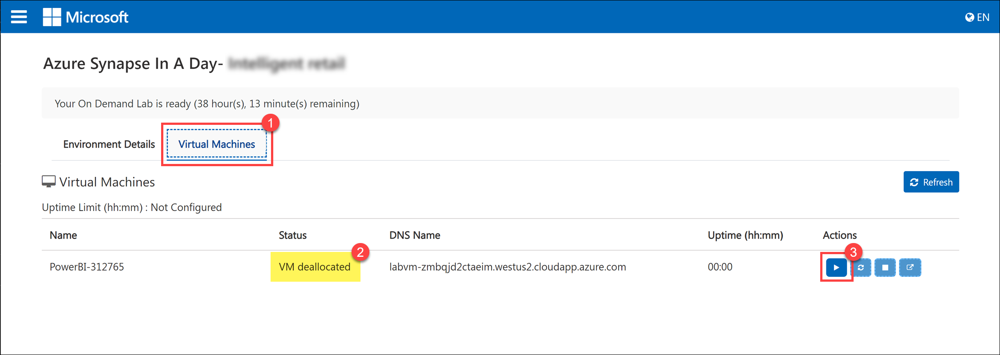

## Overview

This is a hands-on lab for infrastructure, telecommunications, transportation, and manufacturing using Azure Synapse Analytics. It provides step-by-step procedures for basic analysis platform construction, IoT sensor data visualization, and predictive maintenance features.

## Building analytic solutions with Azure Synapse Analytics (Basic)

### About the latest data analysis infrastructure

The modern data analytics infrastructure, called the Modern Data Warehouse pattern, is based on the following points to address big data:

- Scalability

    By focusing on a managed infrastructure of PaaS, scalability that is difficult to get on-premises can be achieved. By incorporating a distributed processing infrastructure such as Spark, data processing in petabytes can be performed quickly.

- Use of data lakes

    The data lake accumulates unstructured data, such as JSON and image data. By implementing structured processing by distributed processing, visualization of data that has been difficult to use in the past and the use of AI will be promoted.

In traditional Azure data analytic infrastructures, the solution was for architects to combine PaaS such as Azure Data Factory, Azure Databricks, Azure SQL Data Warehouse, and Azure Data Lake Storage to accommodate a variety of workloads.

**Traditional Azure analytic infrastructure configuration**

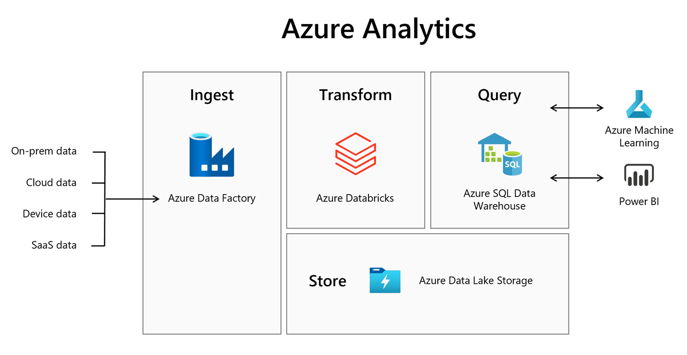

With Azure Synapse Analytics, enjoy advantages of traditional scalable cloud data analytic infrastructures while:

- Building analytical infrastructures more quickly
- Reducing infrastructure complexity
- Reducing costs and improving development efficiency with integrated workspace and management screen

**Azure Synapse Analytics**

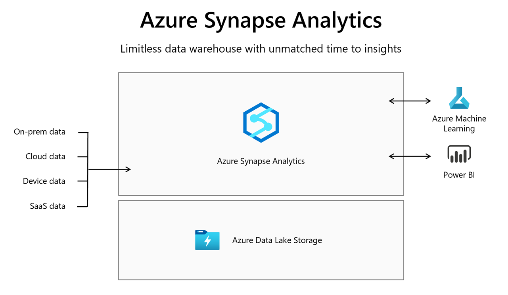

### Scenario

Build a flight delay visualization solution. With Azure Synapse Analytics, an analytic infrastructure can be built in a short time frame.

This lab will guide you through the basic deployment of Azure Synapse Analytics and creating DWH, and practicing GUI-based distributed ETL processing and reporting.

### Hands-on architecture

You will configure an architecture such as the following:

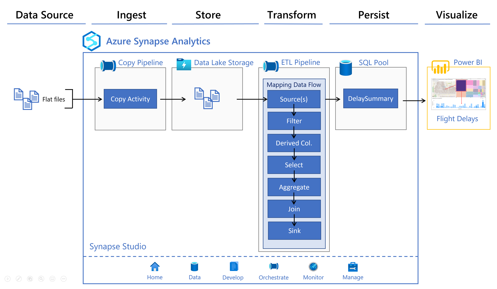

To build the architecture, complete the following tasks:

1. Deploy Azure Synapse Analytics
2. Create a link between flight delay data in the data lake
3. Create a SQL Pool
4. Create distributed ETL processing in the GUI with Mapping Data Flow
5. Visualize flight delay

## Exercise 1: Set up SQL pool access and create table

Time required: 10 minutes


A dedicated SQL Pool is one of the analytic runtimes in Azure Synapse Analytics that help you ingest, transform, model, and analyze your data. It offers T-SQL based compute and storage capabilities. With a dedicated SQL pool in your Synapse workspace, data can be loaded, modeled, processed, and delivered for faster analytic insight.

### Task 1: Allow pipelines to access SQL pools

Later in this lab, you will use the Automated Integration Runtime (IR) to copy data to the dedicated SQL pool within a data flow. But first, you must adjust the system assigned managed identity settings for your Synapse workspace to allow pipelines to access the pool.

1. Navigate to the Azure portal (<https://portal.azure.com>).

2. In the search menu, type **Synapse**, then select **Azure Synapse Analytics**.

    

3. Select the Synapse Workspace that you created for this lab, or that was provided for you in the lab environment.

4. Select **Managed identities** in the left-hand menu, check the box to **Allow pipelines (running as workspace's system assigned identity) to access SQL pools**, then select **Save**.

    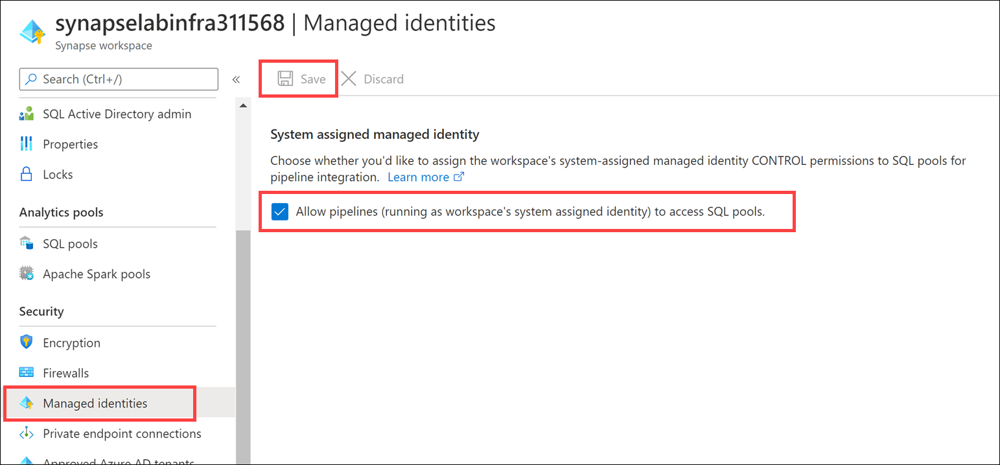

### Task 2: Create table

1. Select **Overview** in the left-hand menu of the Synapse workspace, then select **Open** underneath **Open Synapse Studio** from the Synapse workspace page.

    

    After authenticating your account, you should see the Synapse Studio home page for your workspace.

    

2. If you see the Getting started dialog, select **Close**.

    

3. Select the **Develop** hub.

    

4. Select **+**, then select **SQL script**.

    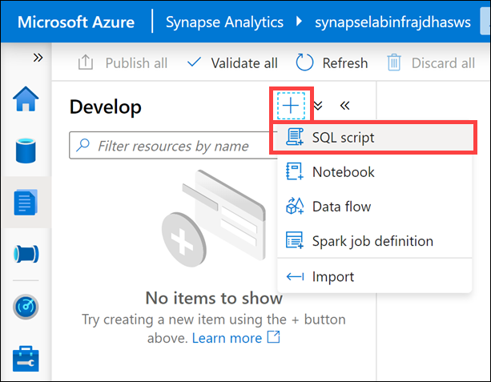

5. Enter **Create DelaySummary** in the Name value within the Properties blade. Select the **aiaddw** dedicated SQL pool. Paste the script below into the script area, then select **Run**.

    ```sql
    --Set up Polybase
    CREATE MASTER KEY

    --Create destination table
    CREATE TABLE [dbo].[DelaySummary]
    ( 
        [Year] int NULL,
        [Month] int NULL,
        [DayofMonth] int NULL,
        [DayOfWeek] int NULL,
        [OriginAirportCode] [nvarchar](10)  NULL,
        [DepDelayCount] [bigint] NULL,
        [DepDelay15Count] [bigint] NULL,
        [AIRPORT_ID] [nvarchar](20) NULL,
        [AIRPORT] [nvarchar](100)  NULL,
        [DISPLAY_AIRPORT_NAME] [nvarchar](100) NULL,
        [LATITUDE] [nvarchar](20)  NULL,
        [LONGITUDE] [nvarchar](20)  NULL
    ) WITH
    (
        DISTRIBUTION = ROUND_ROBIN,
        CLUSTERED COLUMNSTORE INDEX
    )
    GO
    ```

    

6. After you run the script, you should see a status that the script executed successfully.

    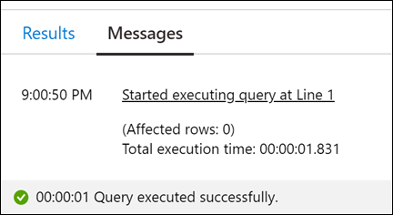

7. Select **Publish all**, then select **Publish** in the dialog.

    

    > ※	For the remainder of the lab, select **Publish** as appropriate to save your work.

8. Select the **Data** hub.

    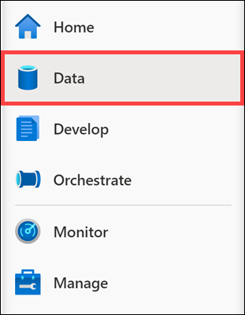

9. Select the **Workspace** tab, expand **Databases**, expand the **aiaddw** SQL pool, and expand **Tables**. You will see the `DelaySummary` table. If it does not appear, select **Refresh**.

    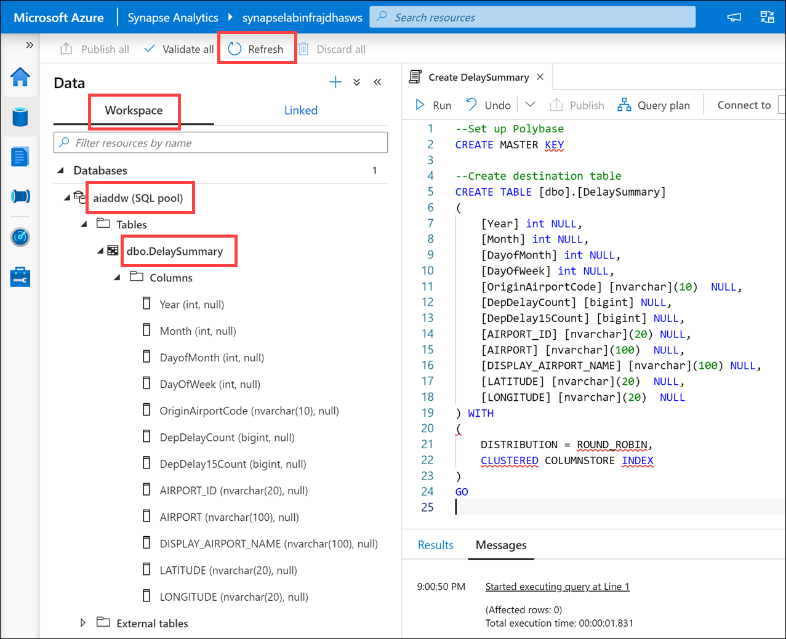

## Exercise 2: Implement Spark ETL with the GUI

Time required: 45 minutes

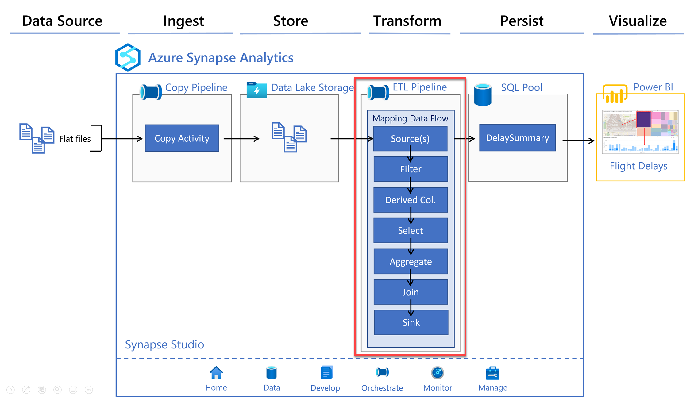

Mapping data flows are visually designed data transformations in Azure Data Factory. Data flows allow data engineers to develop data transformation logic without writing code. The resulting data flows are executed as activities within Azure Data Factory pipelines that use scaled-out Apache Spark clusters. Data flow activities can be operationalized using existing Azure Data Factory scheduling, control, flow, and monitoring capabilities.

Mapping data flows provide an entirely visual experience with the Synapse Studio GUI, with no coding required. Your data flows run on ADF-managed execution clusters for scaled-out data processing. Azure Data Factory handles all the code translation, path optimization, and execution of your data flow jobs.

### Task 1: Create ADLS Gen2 Linked Service

1. Select the **Manage** hub, **Linked services**, then select **+ New**.

    

2. Select **Azure Data Lake Storage Gen2**, then select **Continue**.

    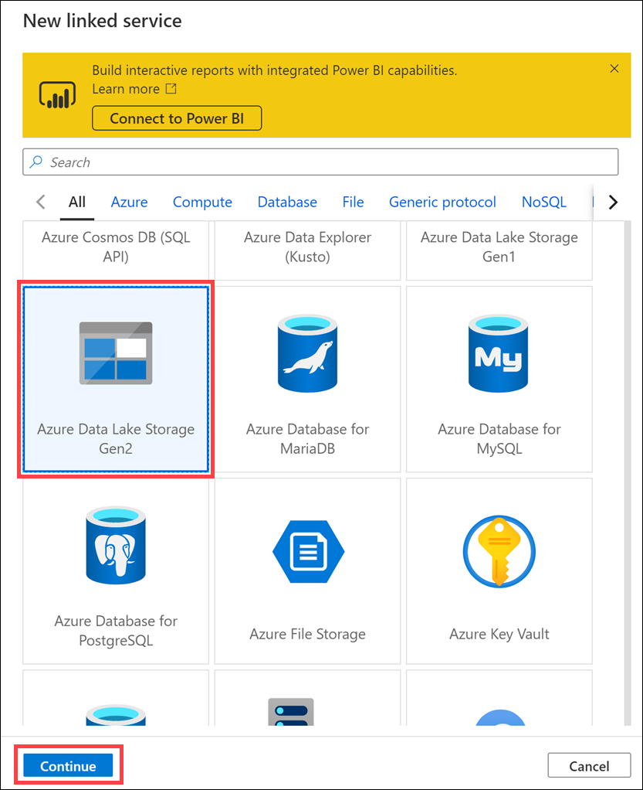

3. Enter each setting described below, then select **Test connection**. When the connection is successful, select **Create**.

    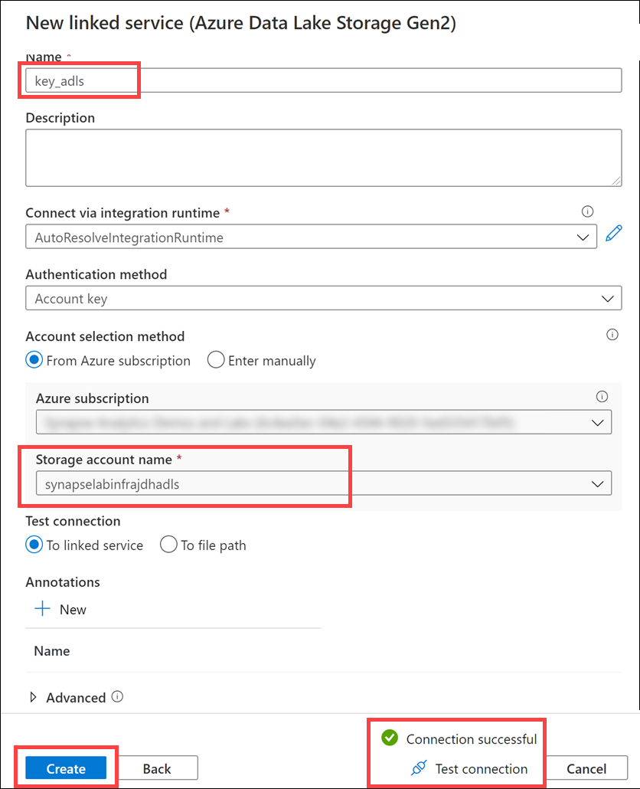

    | Parameters | Settings | Remarks |
    | --- | --- | --- |
    | Name | `key_adls` | |
    | Description | No entry required | Default settings |
    | Connect via integration runtime | AutoResolveIntegrationRuntime | Default settings |
    | Authentication method | Account Key | Default settings |
    | Account selection method | From Azure subscription | Default settings |
    | Azure subscription | Any | Select the Azure subscription for this lab |
    | Storage account name | Any | Select the primary storage account for your Synapse workspace |

### Task 2: Create mapping data flow sources

Create datasets to extract "Flight delay" and "Airport master data".

1. Select the **Develop** hub.

    

2. Select **+**, then select **Data flow**.

    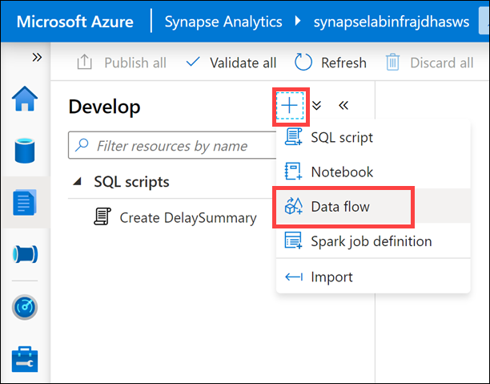

3. Select the **Data flow debug** switch.

    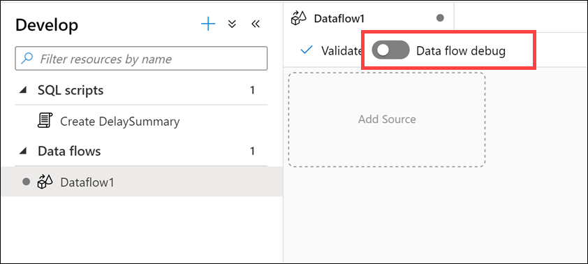

4. Select **OK** in the `Turn on data flow debug` dialog.

    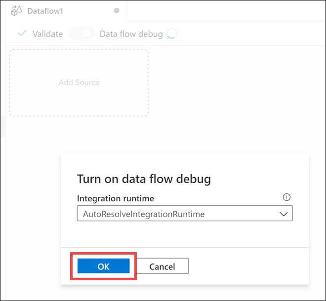

5. Set **FlightDelayETL** for the Name in the Properties blade. Select **Properties** to close the blade, then select **Add Source** on the canvas.

    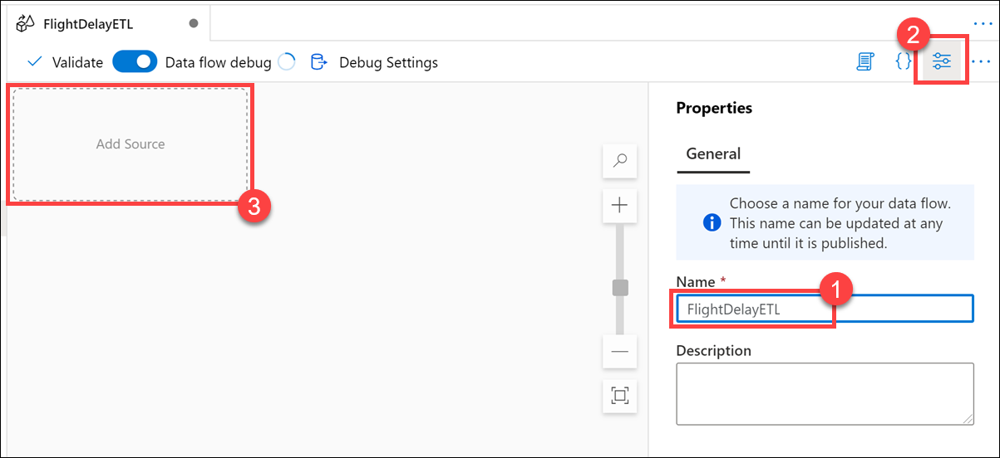

6. For **Output stream name**, enter **AirportCodeLocationLookupClean**, and select **+ New** next to **Source dataset**.

    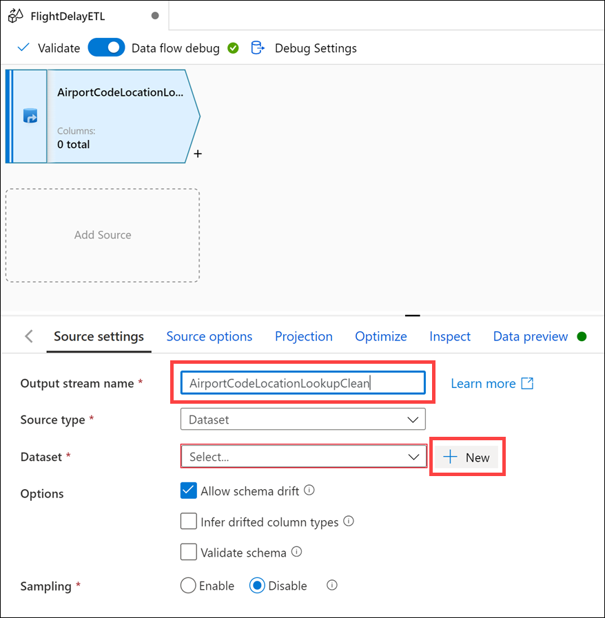

7. Select **Azure Data Lake Storage Gen2**, then select **Continue**.

    

8. Select the **DelimitedText** format, then select **Continue**.

    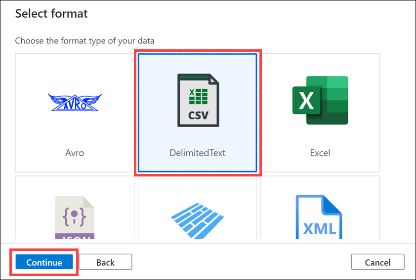

9. Enter each setting as displayed in the table below, and then select **OK**.

    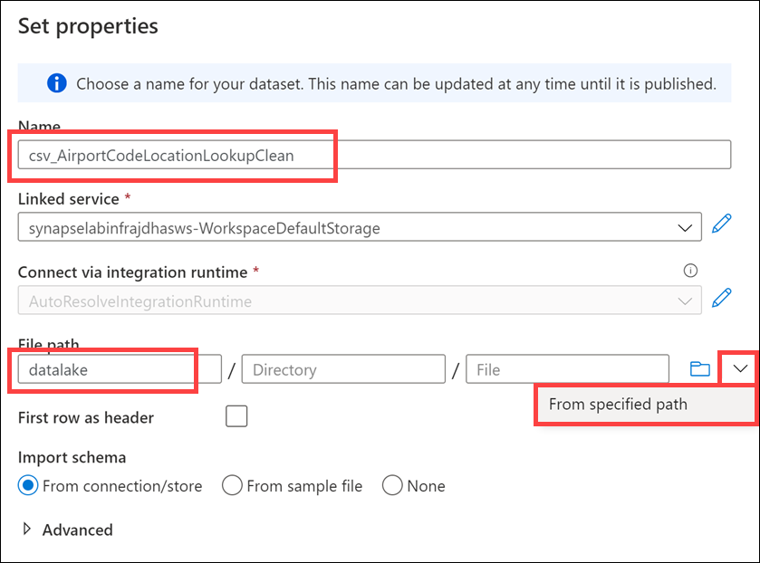

    | Parameters | Settings | Remarks |
    | --- | --- | --- |
    | Name | `csv_AirportCodeLocationLookupClean` | Be careful not to include extra spaces when copying |
    | Linked service | Select the default storage for your workspace (`<Synapse workspace name>-WorkspaceDefaultStorage`) | |
    | File path | `datalake` | Select file from "From specified path" in the next step |

10. Select the **TravelDatasets** folder, then select **AirportCodeLocationLookupClean.csv** and select **OK**.

    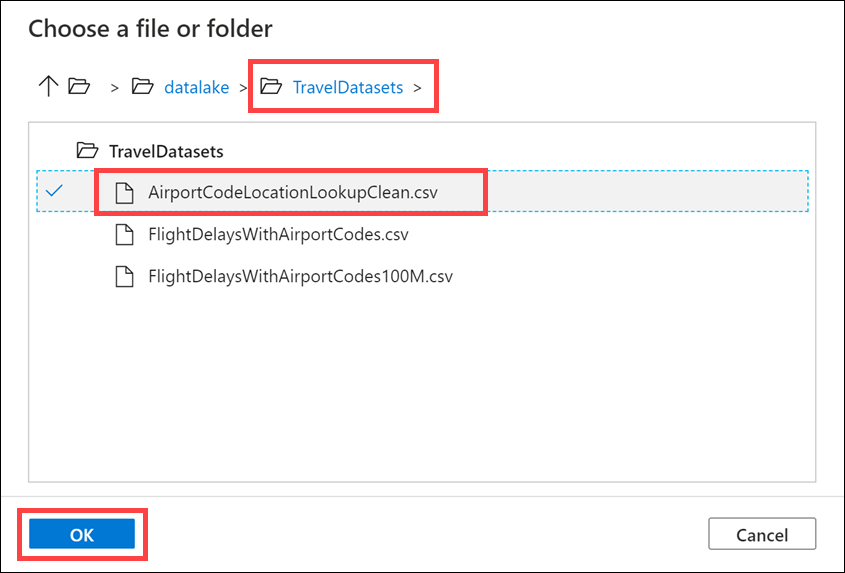

11. Check **First row as header**, ensure the **From connection / store** import schema option is selected, then select **OK**.

    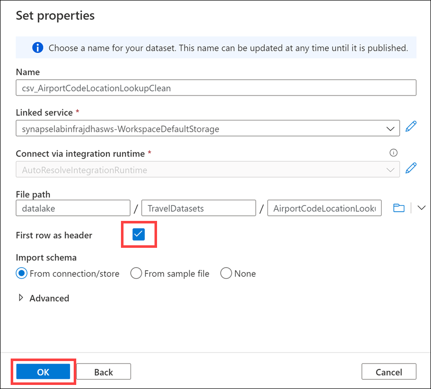

12. Select **Add Source** on the canvas below the source you just added.

    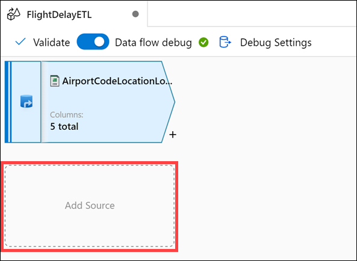

13. For **Output stream name**, enter **FlightDelaysWithAirportCodes**, and select **+ New** next to **Source dataset**.

    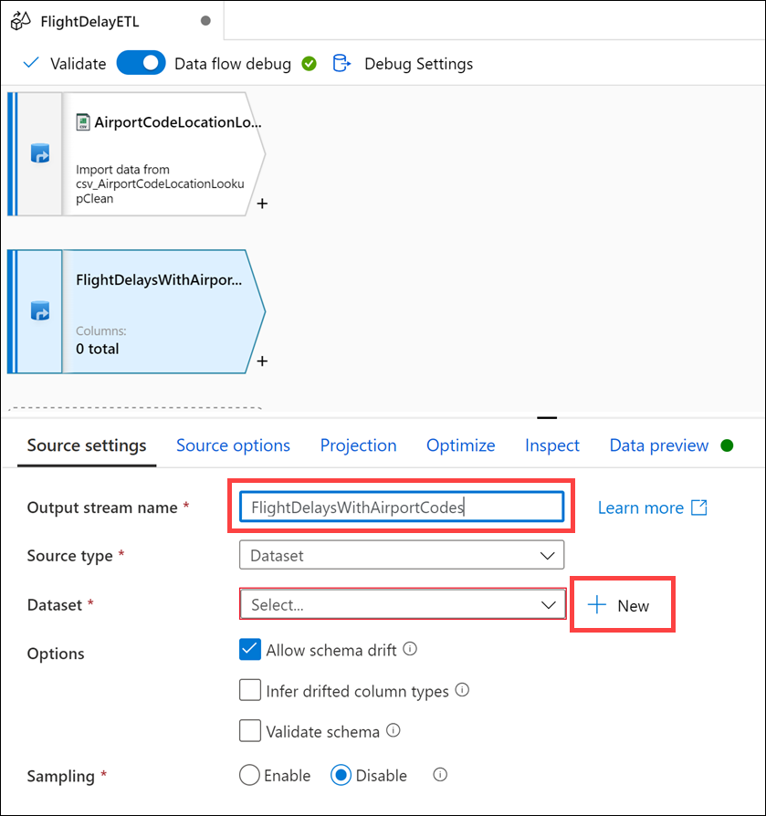

14. Select **Azure Data Lake Storage Gen2**, then select **Continue**.

    

15. Select the **DelimitedText** format, then select **Continue**.

    

16. Enter each setting as displayed in the table below, and then select **OK**.

    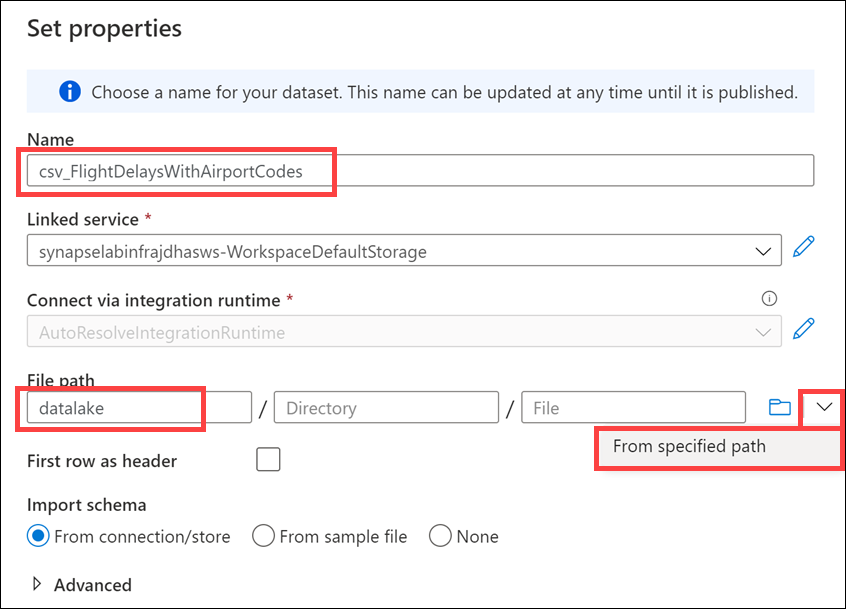

    | Parameters | Settings | Remarks |
    | --- | --- | --- |
    | Name | `csv_FlightDelaysWithAirportCodes` | Be careful not to include extra spaces when copying |
    | Linked service | Select the default storage for your workspace (`<Synapse workspace name>-WorkspaceDefaultStorage`) | |
    | File path | `datalake` | Select file from "From specified path" in the next step |

17. Select the **TravelDatasets** folder, then select **FlightDelaysWithAirportCodes.csv** and select **OK**.

    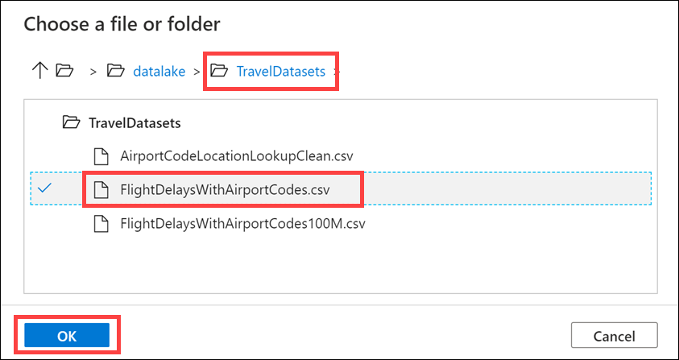

18. Check **First row as header**, ensure the **From connection / store** import schema option is selected, then select **OK**.

    

### Task 3: Create a filter

Create a filter for the records.

1. Under the `FlightDelaysWithAirportCodes` source, select **+** in the lower-right corner, and then select **Filter**.

    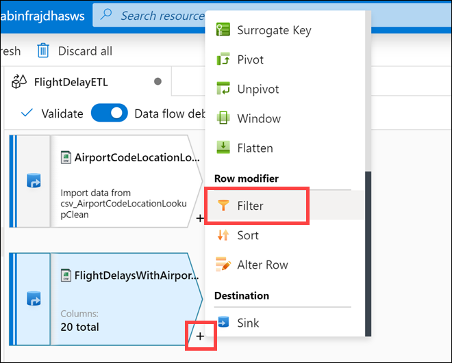

2. Under "Filter on", select **Enter filter...**.

    

3. Copy and paste the following query into the Expression box. Select **Refresh** to review the data preview, then select **Save and finish**.

    ```javascript
    toInteger(DepDelay) > 0
    ```

    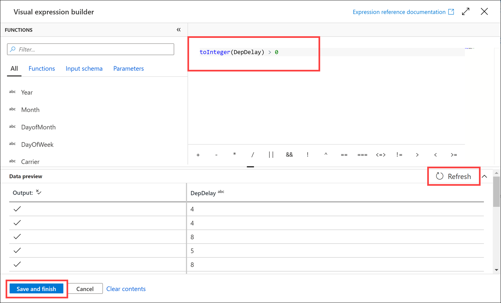

### Task 4: Add calculated columns

In this data, a delay of `1:30` is represented as `130`. Create a delay time column with the name "CRSDepHour" so that it can be represented as a `1.3` hour delay.

1. Under the `FlightDelaysWithAirportCodes` source, select **+** in the lower-right corner of the stream (from the new filter you just created), and then select **Derived Column**.

    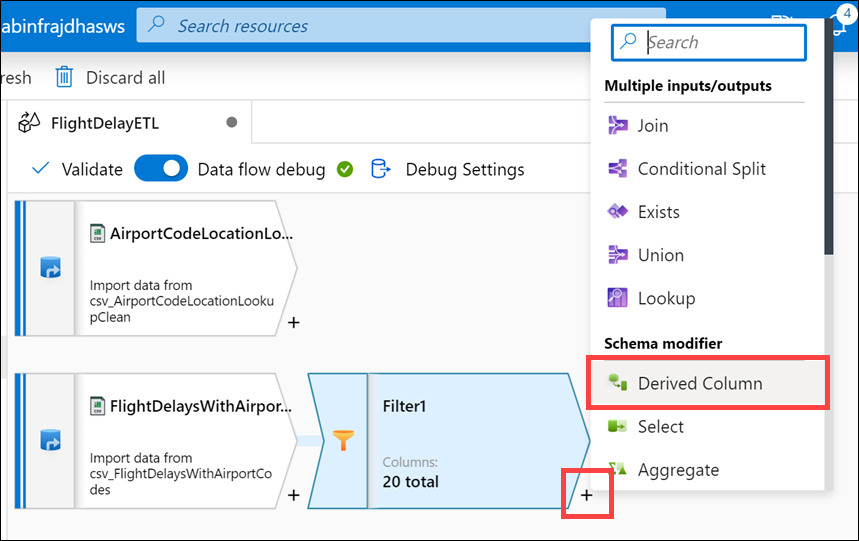

2. Under Columns, type **CRSDepHour**, select **Expression**, then select **Open expression builder**.

    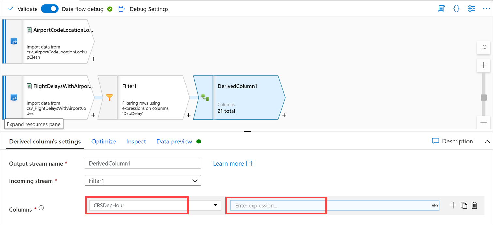

3. Copy and paste the following query into the Expression box. Select **Refresh** to review the Data preview, and then select **Save and finish**.

    ```javascript
    floor(toInteger(CRSDepTime)/100)
    ```

    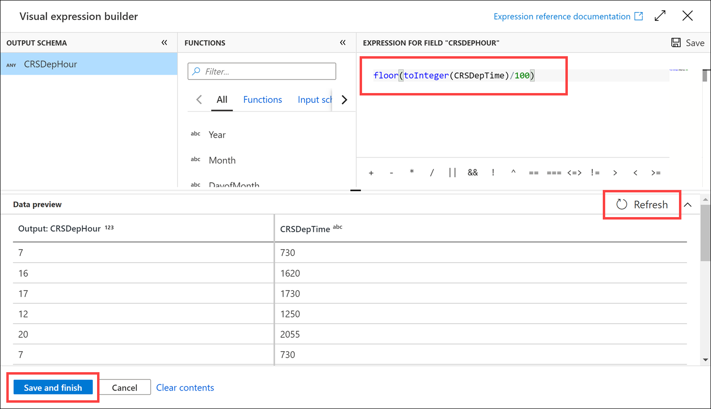

### Task 5: Select columns

Add an action to eliminate unnecessary columns so that only the required columns remain.

1. Under the `FlightDelaysWithAirportCodes` source, select **+** in the lower-right corner of the stream (from the new derived column action you just created), and then select **Select**.

    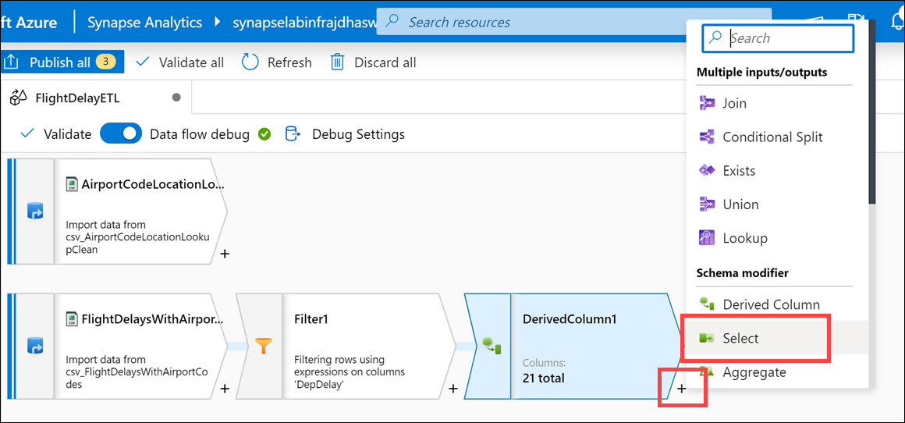

2. Check **DerivedColumn1's column** to check all columns. Then remove checks from the following nine items: Make sure that **all other items** besides the following nine are checked, and then select **Delete**.

    - Year
    - Month
    - DayofMonth
    - DayOfWeek
    - CRSDepTime
    - DepDelay
    - DepDel15
    - OriginAirportCode
    - CRSDepHour

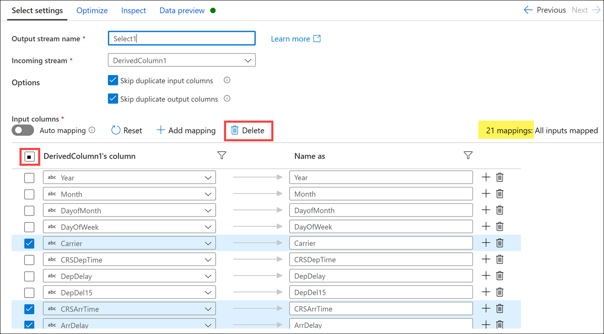

### Task 6: Aggregation process

Add aggregation processing so that delays are aggregated at the granularity of the year, month, day, and airport.

1. Under the `FlightDelaysWithAirportCodes` source, select **+** in the lower-right corner of the stream (from the new select action you just created), and then select **Aggregate**.

    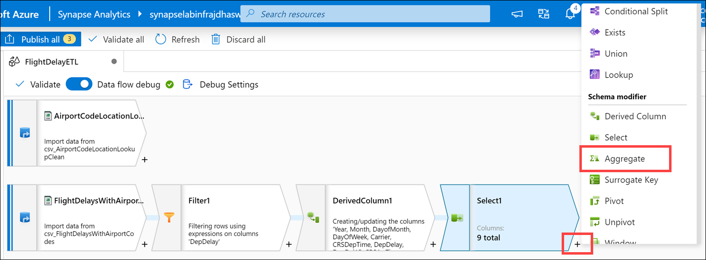

2. Select the drop-down arrow on the right of Columns to add the following five columns. Click **+** to add an item:

    - Year
    - Month
    - DayofMonth
    - DayOfWeek
    - OriginAirportCode

    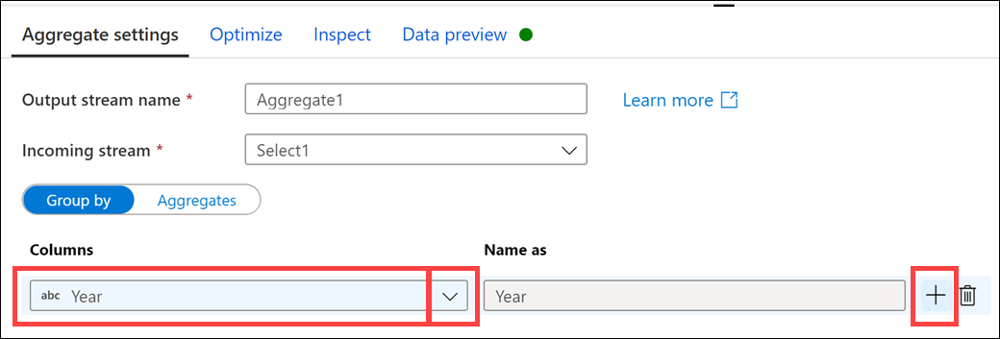

3. Verify that all five columns have been added, then select **Aggregates**.

    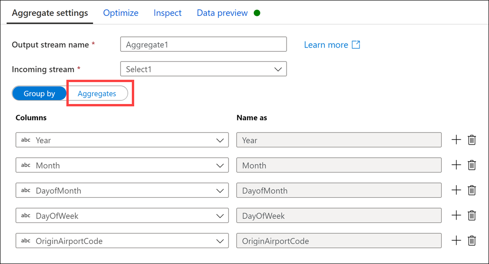

4. In Columns, type **DepDelayCount**, select **Expression**, then paste `sum(1)`.

    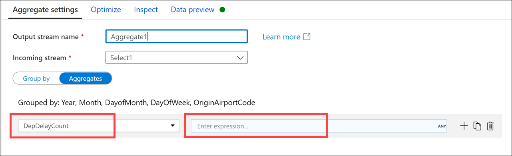

5. Select **+** to the right of the column you just added, then select **Add column**.

    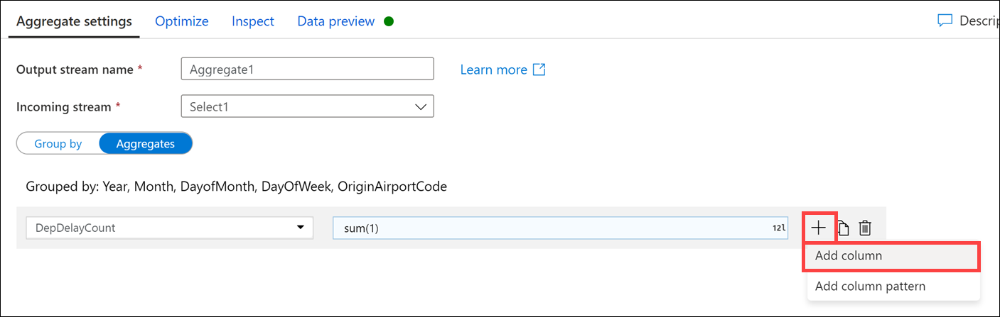

6. In Columns, type **DepDelay15Count**, select **Expression**, then paste `sum(toInteger(DepDel15))`.

    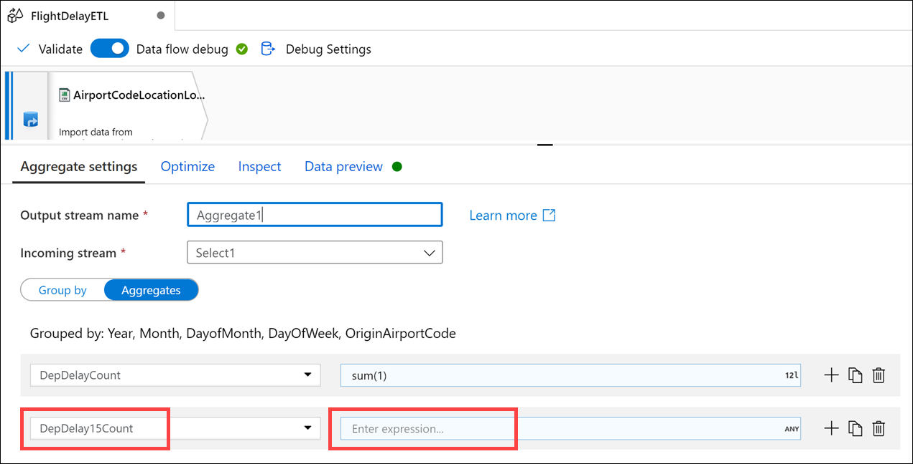

### Task 7: Data join process

Combine data sources.

1. Under the `FlightDelaysWithAirportCodes` source, select **+** in the lower-right corner of the stream (from the new aggregate action you just created), and then select **Join**.

    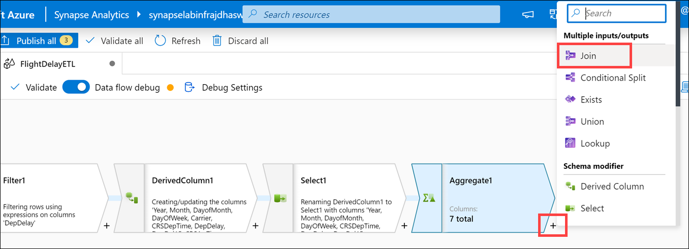

2. Within the Join settings form, enter each setting as described in the table below.

    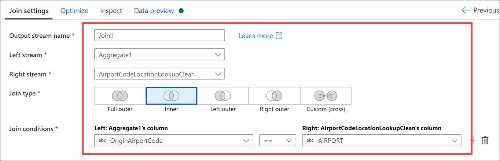

    | Parameters | Settings | Remarks |
    | --- | --- | --- |
    | Output stream name | `Join1` | Default settings |
    | Left stream | `Aggregate1` | |
    | Right stream | `AirportCodeLocationLookupClean` | This is the first data source you added |
    | Join type | `Inner` | Default settings |
    | Left: Aggregate1's column | `OriginAirportCode` | |
    | Right: AirportCodeLocationLookupClean's column | `AIRPORT` | |

### Task 8: Data output

Add a sink process to output to the SQL Pool and create a dataset that defines the destination table information.

1. Under the `FlightDelaysWithAirportCodes` source, select **+** in the lower-right corner of the stream (from the new join action you just created), and then select **Sink**.

    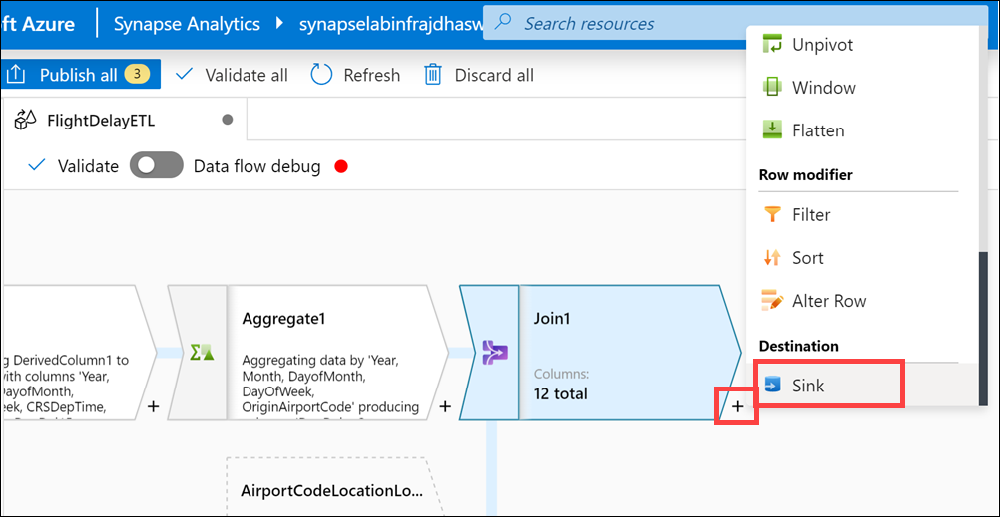

2. Select **+ New** next to the Sink dataset.

    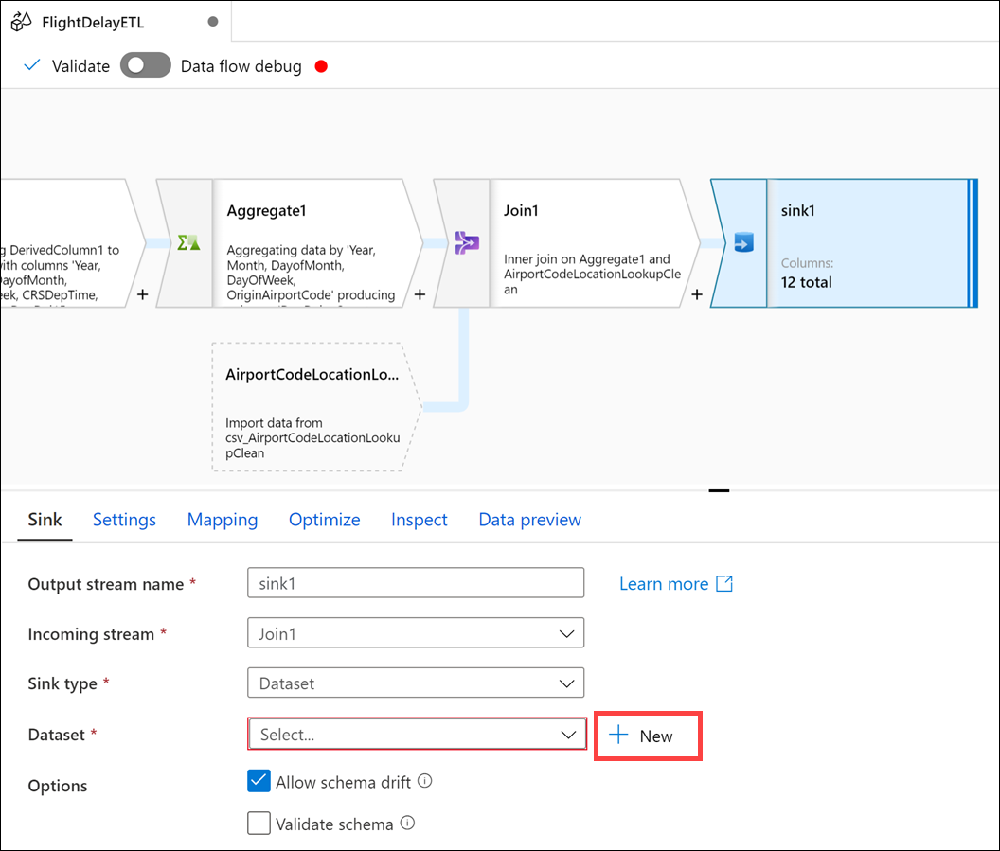

3. Select **Azure Synapse Analytics**, then select **Continue**.

    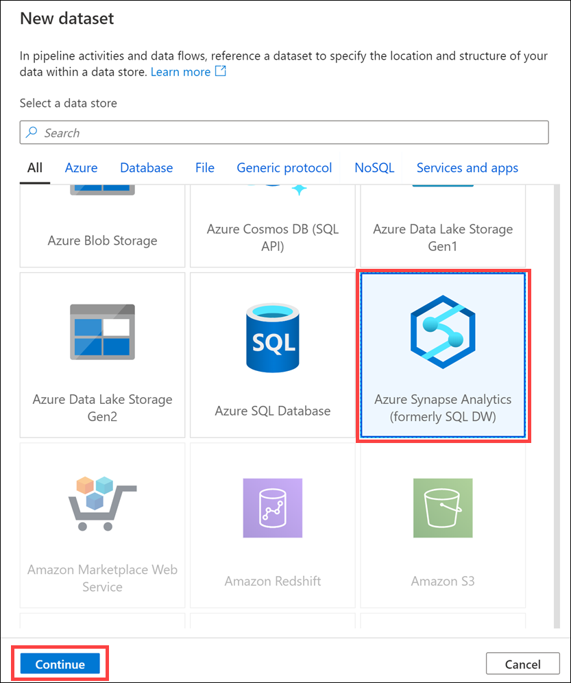

4. Enter each setting as displayed in the table below, and then select **OK**.

    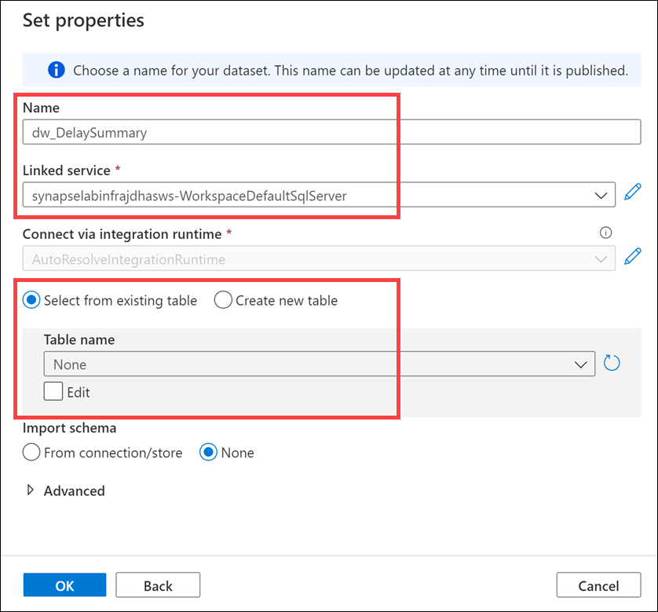

    | Parameters | Settings | Remarks |
    | --- | --- | --- |
    | Name | `dw_DelaySummary` | Be careful not to include extra spaces when copying |
    | Linked service | Select the default SQL server for your workspace (`<Synapse workspace name>-WorkspaceDefaultSqlServer`) | |
    | Table name | None | Default settings, set in subsequent steps |
    | Import schema | None | Default settings |

5. Select **Open** next to the Sink dataset.

    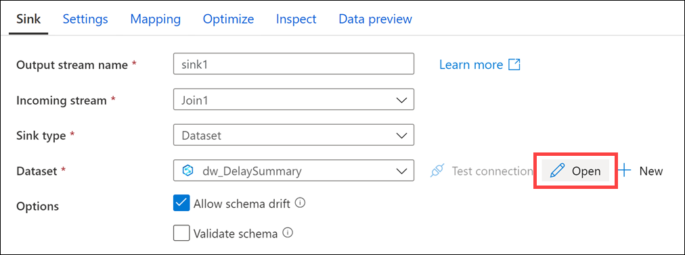

    > **Note**: If you receive an error message reading "Cannot connect to SQL Database" and "Check the linked service configuration is correct, and make sure the SQL Database firewall allows the integration runtime to access" the solution is to select the Synapse workspace from the Azure portal, navigate to **Managed identities** under the **Security** menu, and select the option **Allow pipelines (running as workspace's system assigned identity) to access SQL pools.**

    

6. Under the **Connection** tab of the dataset properties, enter **aiaddw** SQL pool name for the **DBName** value. Select **Refresh** next to the table list, then select **dbo.DelaySummary** from the list.

    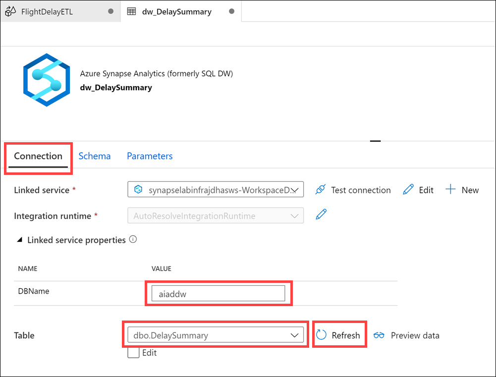

7. Select the **FlightDelayETL** tab to switch back to the mapping data flow. Select **Sink1**, select the **Settings** tab, then select **Truncate table** in the Table action options list. Make sure **Enable staging** is also checked.

    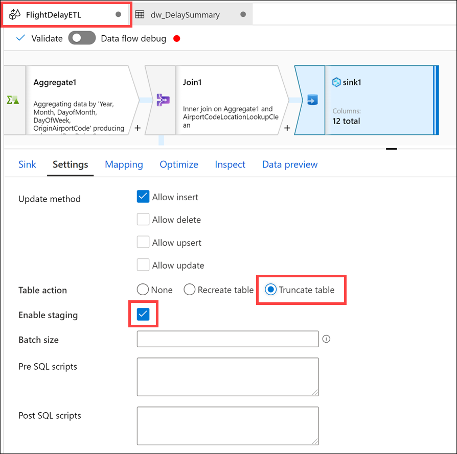

8. Select **Publish all**, then select **Publish** in the dialog.

    

### Task 9: Create and run Pipeline

1. Select the **Integrate** hub, select **+**, then select **Pipeline**.

    

2. For **Name**, enter `FlightDelay`, then select **Properties** to close the dialog.

    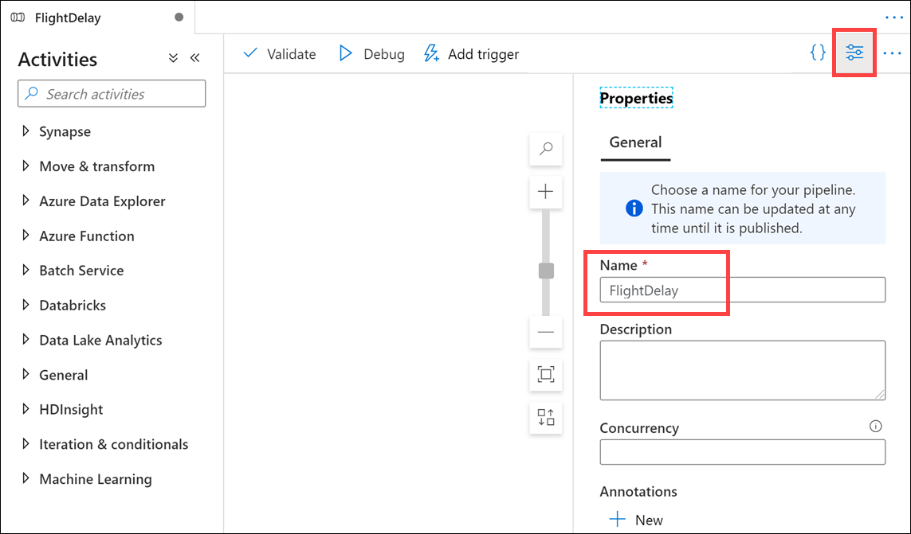

3. Expand **Move & transform** under the Activities menu. Drag and drop the **Data flow** activity onto the canvas area to the right.

    

4. In the Adding data flow dialog, select **Use existing data flow**, select **FlightDelayETL** from the existing data flow list, then select **Finish**.

    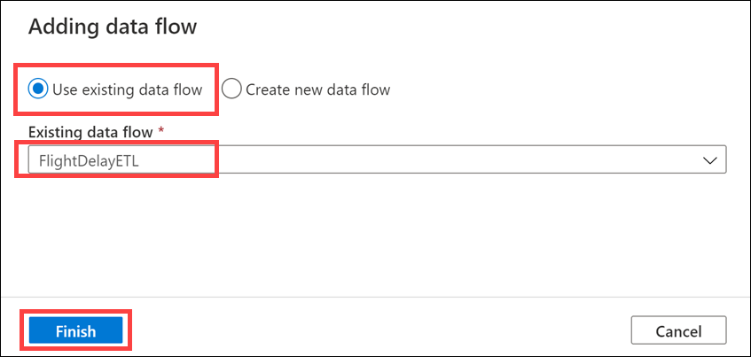

5. Select the **Settings** tab, select **key_adls** from the **Staging linked service** list, then enter **datalake** in the container field and **polybase** in the folder field of the **Staging storage folder** setting.

    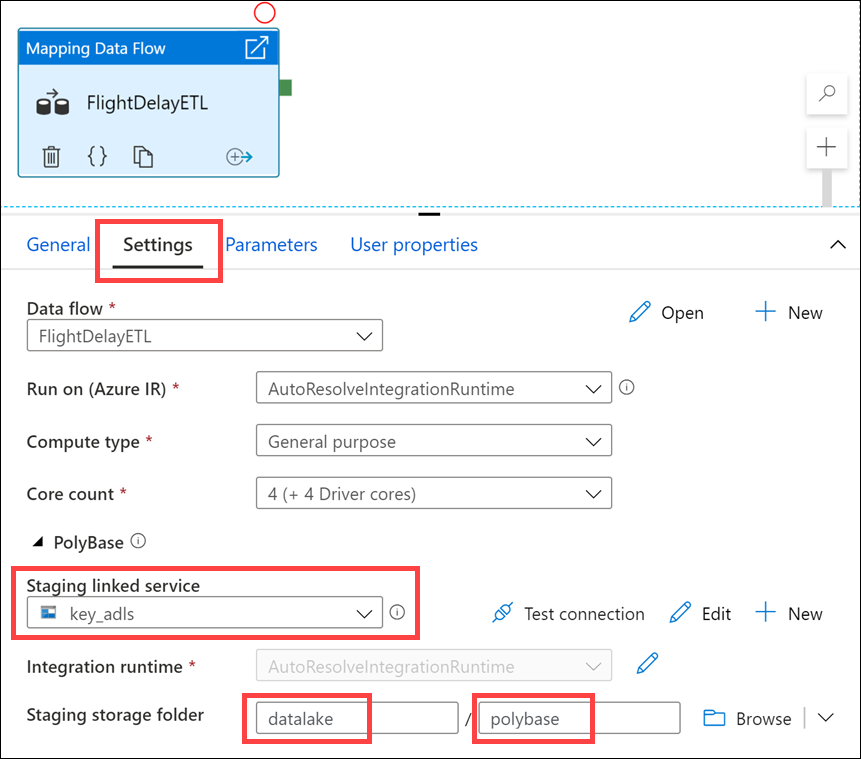

6. Select **Publish all**, then select **Publish** in the dialog.

    

7. Select **Add trigger**, then select **Trigger now**.

    

8. Select **OK** to run the trigger.

    

9. Select the **Monitor** hub, then **Pipeline runs**. If the pipeline run status is `Succeeded` after a few minutes, then the pipeline run successfully completed.

    

> **Note**: Mapping Data Flow runs with a minimum overhead of at least five to six minutes. This is because you are creating a Spark processing environment each time you run it. If you are using an ETL pipeline using Mapping Data Flow, plan your batch schedule with time in mind for creating a processing environment.

> **Note**: Some of the imported data has a prepared dataset that has been amplified to 100 million items under the name "FlightDelaysWithAirportCodes100M.csv". With this csv data, you can see the scalability of Mapping Data Flow for 100 million data processes.

### Task 10: View the transformed data

When the data flow pipeline has successfully completed, view the data it wrote to the `dbo.DelaySummary` SQL pool table.

1. Select the **Data** hub.

    

2. Select the **Workspace** tab, expand **Databases**, expand the **aiaddw** SQL pool, and expand **Tables**. Right-click on the `DelaySummary` table, select  **New SQL script**, then select **Select TOP 100 rows**.

    

3. View the results of the executed script. Notice that the derived columns, joined columns, and aggregates you added to the Mapping Data Flow appear in the result set.

    

## Exercise 3: Visualize with Power BI

Time required: 15 minutes


Power BI reports can be created, edited, and viewed from within Synapse Studio. This level of integration allows you to easily get data into your Power BI workspace. It also minimizes your need to switch tabs and navigate between services in the browser.

### Task 1: Connect Power BI Desktop

1. Return to the `synapse-lab-infrastructure` resource group and select the Azure Synapse Analytics workspace within.

    

2. In the **Overview** blade, copy the **Dedicated SQL endpoint** value.

    

3. Open Power BI Desktop. Close the sign-in window with the **X** on the upper-right corner.

    

4. Select **Get Data**, then select **Azure** in the left-hand menu of the dialog that appears. Select **Azure Synapse Analytics (SQL DW)**, then select **Connect**.

    

5. Set the **Server** value to your copied SQL endpoint, and enter **aiaddw** for the **Database** name. Select the **DirectQuery** data connectivity mode, then click **OK**.

    

6. Select **Microsoft account** on the left-hand menu. **Sign in**, then click **Connect**.

    

7. Click the box to the left of **DelaySummary**, which will load the data in the preview to the right. Click **Load**.

    

### Task 2: Create a report

1. Click **Map** under Visualizations, then drag and drop **OriginAirportCode** into the **Legend** field. Refer to the table below for setting the other fields.

    | Parameters | Settings | Remarks |
    | --- | --- | --- |
    | Legend | `OriginAirportCode` | |
    | Latitude | `LATITUDE` | Select **Don't summarize** |
    | Longitude | `LONGITUDE` | Select **Don't summarize** |
    | Size | `DepDelayCount` | |

    

    > **Note**: By default, latitude and longitude are treated as aggregate values. Click the drop-down arrow and select **Don't summarize**.

    

2. Click an empty location on the report area. Under Visualizations, click **Stacked Column Chart**, then use the table below to set the field values.

    | Parameters | Settings | Remarks |
    | --- | --- | --- |
    | Axis | `DayofMonth` | |
    | Values | `DepDelayCount` | |

    

3. Click an empty location on the report area. Under Visualizations, click **Treemap**, then use the table below to set the field values.

    | Parameters | Settings | Remarks |
    | --- | --- | --- |
    | Group | `OriginAirportCode` | |
    | Values | `DepDelayCount` | |

    

4. Clicking on a visual narrows down the data for the other visuals. (It may take a few seconds to load the data.)

    

### Task 3: Save Power BI Desktop report

1. Click the **Save** icon on the top-left of Power BI Desktop. Enter a file name, such as **FlightDelays**, then click **Save** to save the report file.

    

### Task 4: Create a Power BI workspace (optional)

If you have a Power BI Pro license and have create permissions, perform the following to create a new Power BI workspace for this lab. If not, you may skip the rest of the tasks in this exercise.

1. Sign in to Power BI service (https://powerbi.microsoft.com/landing/signin/)

2. Select **Workspaces**, then select **Create a workspace**.

    

3. Type **AIAD_SynapseWorkspace** + `<unique id>` (where `<unique id>` is the unique id provided for your hosted lab environment, your initials, or any other value that ensures a unique name) for the workspace name, then select **Save**.

    

### Task 5: Create a Power BI Linked Service (optional)

If you were able to create a Power BI workspace, you can continue with this task. Otherwise, skip ahead to the next exercise.

1. Select the **Manage** hub, **Linked services**, then select **+ New**.

    

2. Select **Power BI**, then select **Continue**.

    

3. Make sure the correct Tenant is selected, then select the **AIAD_SynapseWorkspace** option from the **Workspace name** list. Select **Create** to continue.

    ")

    > If the new Power BI workspace is not displayed, the tenant to which the AD account belongs and the tenant where the Power BI workspace is created may be different.

### Task 6: Create a Power BI dataset (optional)

If you were able to create a Power BI workspace, you can continue with this task. Otherwise, skip ahead to the next exercise.

1. Select the **Develop** hub.

    

2. Expand the **Power BI** group, then expand the **AIAD_SynapseWorkspace** Linked Service. Select **Power BI datasets**, then select **+ New Power BI dataset** in the blade to the right.

    

3. Select **Start**.

    

4. Select the **aiaddw** SQL pool that you created, then select **Continue**.

    

5. Select **Download**. Open the downloaded Power BI Desktop data source (`.pbids`) file.

    

6. Power BI Desktop launches when you open the `.pbids` file. When the navigator pops up, click the check box next to **DelaySummary**, then click **Load**.

    

7. Click **DirectQuery**, then click **OK**.

    

8. Click **File**, then **Publish**. Click **Publish to Power BI**.

    

9. Click **Save**.

    

10. Enter a file name, such as **FlightDelaysDS**, then click **Save**.

    

11. Sign in to your Power BI account.

    

12. Select the **AIAD_SynapseWorkspace** workspace, then click **Select**.

    

13. When Power BI Desktop finishes publishing, sign in to the Power BI service (<https://powerbi.microsoft.com/landing/signin/>). Select the **AIAD_SynapseWorkspace** workspace on the left, then select the **Datasets + dataflows** tab. Select **...(More options)** under the Actions column of the `FlightDelaysDS` dataset, then select **Settings**.

    

14. Select **Edit credentials**.

    

15. Select the **OAuth2** authentication method, then select **Sign in**.

    

16. Return to Synapse Studio, then select **Continue**.

    

17. Select **Close and refresh**.

    

18. Select **Power BI datasets**, then select the **New Power BI report** icon on the `FlightDelaysDS` dataset.

    

19. When the screen for the new report opens, modify the report as you wish.

    

## Build a predictive maintenance solutions with Azure Synapse Analytics (Advanced)

### About Lambda Architecture

The Lambda architecture is a common pattern in Big Data infrastructures.


(https://docs.microsoft.com/azure/architecture/data-guide/big-data/#lambda-architecture)

- **Batch layer, service layer**

    Distributed processing has made it possible to process large amounts of data within business hours. Perform accumulation and distribution processing on the batch layer. By deploying the results of calculations on the service layer, you can analyze large amounts of data while ensuring separation of calculated results and raw data.
    Periodic data processing flows sourced from pre-accumulated data are defined as cold paths.

- **Speed layer**

    Processing at the batch layer usually causes latency. The speed layer complements the weakness of latency during batch processing and enables real-time analysis of stream data arriving within batch processing schedule intervals. Continuous data processing flows sourced from stream data are defined as hot paths.

### Scenario

Build solutions for analysis and predictive maintenance of sensor data in aircraft engines. In predictive maintenance, it is possible to improve maintenance efficiency by predicting how long maintenance will be required (remaining service time: RUL) by using a model trained with machine learning.

The lambda architecture can be constructed on Azure with Azure Synapse Analytics and PaaS for IoT data.

This section of the lab demonstrates near-real-time visualization of engine sensor data defined in JSON, distributed and machine learning processing for accumulated large amounts of data, and DWH loading and visualization.

### Hands-on architecture


To build the architecture, complete the following tasks:

- Create real-time aggregation of sensor data and raw data storage processing in the data lake
- Create SQL query view to processed sensor data in data lake
- Run sensor data near-real-time visualization report
- Perform structured processing with Spark
- Process scoring and create load processing to DWH
- Run sensor data analysis report

## Exercise 4: Create stream processing

Time required: 30 minutes


Create IoT Hub, Stream Analytics, receive sensor data, and implement real-time processing.

Stream Analytics coordinates sensor data received in JSON format with the data lake, and outputs the results of the average value at 30-second intervals in parallel as a parquet file.

**Note:**

The ability to output from Azure Stream Analytics to Synapse SQL Pool with high throughput of 200 MB/s has been announced.

Using Azure Stream Analytics with Azure Synapse Analytics: (https://docs.microsoft.com/azure/synapse-analytics/sql-data-warehouse/sql-data-warehouse-integrate-azure-stream-analytics)

**Note:**

Synapse Link with Cosmos DB can now be converted to column-oriented format with No-ETL to take advantage of data in column-oriented formats, such as Parquet file conversion.

Azure Synapse Link for Azure Cosmos DB: (https://docs.microsoft.com/azure/cosmos-db/synapse-link)

### Task 1: Configure IoT Hub resource

1. Navigate to the Azure portal (<https://portal.azure.com>).

2. In the search bar, type **IoT**, then select **IoT Hub** from the search results.

    

3. Select the IoT Hub resource you created for this lab, or that was provided to you in your lab environment.

    

4. Select **IoT devices** in the left-hand menu, then select **+ New** in the IoT devices blade.

    

5. Enter **vdev01** as the Device ID, select the **Symmetric key** authentication type, **Check** auto-generate key, and **Enable** the option to connect this device to an IoT Hub. Select **Save**.

    

6. Select the device ID of the new device you created.

    

7. Copy the **Primary Key** and save it to Notepad or similar text editor for later.

    

8. Navigate back to the IoT Hub resource and select **Built-in endpoints** on the left-hand menu. Scroll down to **Consumer Groups**. In the **Create a new consumer group** box, enter **streamanalytics**.

    

### Task 2: Event source settings

In this task, we configure the `IoTVirtualDevices` virtual device simulator that simulates and sends sensor data to Azure.

1. Select **Overview** in the left-hand menu of your IoT Hub. Copy the **Hostname** value and save it to Notebook or similar text editor for later.

    

2. Navigate to the location on your computer or Windows VM where you extracted the ZIP file for this lab. If you extracted it to `C:\`, navigate to `C:\azure-synapse-in-a-day-demos-master\infrastructure\source\IoTVirtualDevices\Release`. Open **IoTVirtualDevices.exe.config**.

    

3. Enter the **IoT Hub hostname** that you copied previously and save the configuration file, overwriting the previous value.

    

    ```xml
    <setting name="IOT_HUB_NAME" serializeAs="String">
        <value> YOUR_IOT_HUB_HOSTNAME_HERE </value>
    </setting>
    ```

4. Close the file and, in the same directory, open **device_info.csv**. Enter the **Primary key** for the IoT device that you copied earlier, then save the file.

    

    ```text
    DEVICE_ID,DEVICE_TYPE,SIGNING_KEY,DESCRIPTION
    vdev01,1,YOUR_PRIMARY_KEY_HERE,AIAD
    ```

5. Close the file and, in the same directory, right-click **IoTVirtualDevices.exe** and select **Run as administrator**.

    

6. If you receive a prompt asking you if you want to allow this app from an unknown publisher to make changes to your device, click **Yes**.

    

7. When the Virtual Devices application starts, click **File**, and then click **Normal Telemetry Data File Load**.

    

8. Select **data_sample.csv** in the `IoTVirtualDevices\Release\` folder, then select **Open**.

    

9. Click **OK** in the dialog that appears after loading.

    

10. Click the **Virtual Device Stopped** button to get started.

    

11. **Virtual Device Processing** is displayed.

    

12. Navigate to IoT Hub in the portal and, in the **Overview** blade, view the **IoT Hub Usage** chart. You should see the **Messages used today** count increase each time you **Refresh**.

    

### Task 3: Configure Stream Analytics resources

1. Navigate to the Azure portal (<https://portal.azure.com>).

2. In the search menu, type **stream**, then select **Stream Analytics jobs**.

    

3. Select the Stream Analytics job you created for this lab, or that was provided to you in your lab environment.

    

4. Select **Inputs** on the left-hand menu, select **+ Add stream input**, then **IoT Hub** in the drop-down menu.

    

5. In the `IoT Hub` form, enter the values shown in the table below. Select **Save**.

    

    | Parameters | Settings | Remarks |
    | --- | --- | --- |
    | Input alias | `ioth` | |
    | Subscription | Any | Select the Azure subscription used for this lab. |
    | IoT Hub | Any | Select the IoT Hub service you created for this lab |
    | Endpoint | Messaging | Default settings |
    | Shared access policy name | `iothubowner` | Default settings |
    | Consumer group | `streamanalytics` | Select the consumer group you created earlier |
    | Event serialization format | JSON | Default settings |
    | Encoding | UTF-8 | Default settings |
    | Event compression type | None | Default settings |

6. Select **Outputs** on the left-hand menu, select **+ Add**, then **Blob storage/ADLS Gen2** in the drop-down menu.

    

7. In the `Blob Storage/Data Lake Storage Gen2` form, enter the values shown in the table below. Select **Save**.

    

    | Parameters | Settings | Remarks |
    | --- | --- | --- |
    | Output alias | `datalake-raw` | |
    | Subscription | Any | Select the Azure subscription used for this lab. |
    | Storage account | Any | Select the data lake storage account you created when you deployed Synapse Analytics |
    | Container | `datalake` (choose use existing) | |
    | Path pattern | `sensor-stream/{date}` | |
    | Date format | `YYYY/MM/DD` | Default settings |
    | Time format | HH | Default settings |
    | Event serialization format | JSON | Default settings |
    | Encoding | UTF-8 | Default settings |
    | Format | Line separated | Default settings |
    | Minimum rows | `2000` | |
    | Hours/minutes | `0` hours, `1` minute | |
    | Authentication mode | Connection string | Default settings |

8. Select **Outputs** on the left-hand menu, select **+ Add**, then **Blob Storage/Data Lake Storage Gen2** in the drop-down menu to add another output.

    

9. In the `Blob storage/ADLS Gen2` form, enter the values shown in the table below. Select **Save**.

    

    | Parameters | Settings | Remarks |
    | --- | --- | --- |
    | Output alias | `datalake-curated` | |
    | Subscription | Any | Select the Azure subscription used for this lab. |
    | Storage account | Any | Select the data lake storage account you created when you deployed Synapse Analytics |
    | Container | `datalake` (choose use existing) | |
    | Path pattern | `curated/sensor_asa/{date}` | |
    | Date format | `YYYY/MM/DD` | Default settings |
    | Time format | HH | Default settings |
    | Event serialization format | Parquet | Default settings |
    | Encoding | UTF-8 | Default settings |
    | Minimum rows | `2000` | Default settings |
    | Hours/minutes | `0` hours, `1` minute | Default settings |
    | Authentication mode | Connection string | Default settings |

10. Select **Query** in the left-hand menu. Copy and paste the following query into the query area on the right, then select **Save query**.

    ```sql
    --Use 30 second average
    SELECT
        DeviceId,
        Period,
        Cycle,
        dateadd(hour,9,system.timestamp) as JSTTime,
        AVG(Sensor11) as Sensor11,
        AVG(Sensor14) as Sensor14,
        AVG(Sensor15) as Sensor15,
        AVG(Sensor9) as Sensor9
    INTO [datalake-curated]
    FROM ioth TIMESTAMP BY EventEnqueuedUtcTime
    GROUP BY
        DeviceId,
        Period,
        Cycle,
        TUMBLINGWINDOW(ss,30);

    -- Use raw data as-is
    SELECT
        *
    INTO [datalake-raw]
    FROM ioth TIMESTAMP BY EventEnqueuedUtcTime
    ```

    

11. Select **Overview** in the left-hand menu, then select **Start**.

    

12. In the Start job dialog, select **Start** to begin the job.

    

## Exercise 5: Explore Data with Query-as-a-Service

Time required: 15 minutes


In addition to the traditional SQL data warehouse functionality, Azure Synapse Analytics has added serverless SQL pools as a way to execute SQL queries directly against the data lake. Serverless SQL pools do not have persistent tables, but are billed based on query run time, enabling rapid data search and cost optimization.

### Task 1: Query for Parquet files

1. Return to Synapse Studio (<https://web.azuresynapse.net/>) and select the **Data** hub.

    

2. Select the **Linked** tab, expand the primary storage (data lake) account, and open the **datalake** container. Select the **curated** folder. If this folder is not visible, refresh the view after the Stream Analytics query runs for a few minutes.

    

3. Open the **sensor_asa** folder.

    

4. Navigate through the sub-folders until you get to the list of Parquet files. Right-click the Parquet file stored at the bottom of the list and select **New SQL script**, then **Select TOP 100 rows**.

    

    > **Note**: You will not see the same folder structure since they are automatically generated based on the current date.

5. Select **Run** to execute the query. You should see the file contents listed in the results below after the query execution completes.

    

### Task 2: Create a view

1. Clear the query and replace it with the following, then select **Run** to execute.

    ```sql
    --Create user database for SQL on-demand
    CREATE DATABASE [AIAD]
    ```

2. Select AIAD in the **Use database** list. You may need to select the **Refresh** button to find it in the list. If this doesn't work, change the **Connect to** to `aiaddw`, then back to `SQL on-demand`.

    

3. Clear the query and replace it with the query below. **Replace YOUR_STORAGE_ACCOUNT_NAME with your storage account name**, using the primary data lake storage account as a reference.

    

    ```sql
    --Create a View for Datalake
    CREATE VIEW v_sensor_ondemand AS
    SELECT
        *,
        convert(date,left(JSTTIME,10)) as JSTDate
    FROM
        OPENROWSET(
            BULK 'https://YOUR_STORAGE_ACCOUNT_NAME.dfs.core.windows.net/datalake/curated/sensor_asa/*/*/*/*.parquet',
            FORMAT='PARQUET'
        ) AS [r]
    --Condition clauses can be stated for the partition structure of the folder
    WHERE 
        r.filepath(1) = YEAR(getdate())
    AND r.filepath(2) = MONTH(getdate())
    ```

4. Select **Run** to execute the query.

5. Clear the query and replace it with the query below, then select **Run**.

    

    ```sql
    -- Verify number of Views
    SELECT
        COUNT(1)
    FROM
        v_sensor_ondemand
    ```

### Task 3: Create near-real-time dashboards

1. Return to the `synapse-lab-infrastructure` resource group and select the Azure Synapse Analytics workspace within.

    

2. In the **Overview** blade, copy the **Serverless SQL endpoint** value.

    

3. Open Power BI Desktop. Close the sign-in window with the **X** on the upper-right corner.

    

4. Select **Get Data**, then select **Azure** in the left-hand menu of the dialog that appears. Select **Azure Synapse Analytics (SQL DW)**, then select **Connect**.

    

5. Set the **Server** value to your copied serverless SQL endpoint, and enter **AIAD** for the **Database** name. Select the **DirectQuery** data connectivity mode, then click **OK**.

    

6. Select **Microsoft account** on the left-hand menu. **Sign in**, then click **Connect**.

    

7. Click the box to the left of **v_sensor_ondemand**, which will load the data in the preview to the right. Click **Load**.

    

8. Under Visualizations, select **Line chart**, then use the table below to set the field values.

    | Parameters | Settings | Remarks |
    | --- | --- | --- |
    | Axis | `JSTTime` | |
    | Legend | `DeviceId` | |
    | Values | `Sensor9` | |

    

9. Click an empty location in the report area. Under Visualizations, select **Slicer**, then use the table below to set the field values.

    | Parameters | Settings | Remarks |
    | --- | --- | --- |
    | Field | `DeviceId` | |

    

    > When you select a Device Id in the slicer, it filters all other visualizations by that value.

10. Click an empty location in the report area. Under Visualizations, select **Card**, then use the table below to set the field values.

    | Parameters | Settings | Remarks |
    | --- | --- | --- |
    | Field | `JSTTime` | Select the dropdown next to JSTTime and select **Earliest**. |

    

11. Click an empty location in the report area. Click **Format** (Paint Roller), and then click **Page refresh off** to turn it on. Set the duration to **1 minute**.

    

12. Click the **Save** icon on the top-left. Enter **SensorOnDemand** for the file name and click **Save**. You will use this file in a later exercise.

    

## Exercise 6: Create a structured process for large amounts of data with Spark

Time required: 10 minutes


In addition to SQL analysis, Synapse Analytics enables analysis and development with Spark, a distributed processing framework for OSS. By using Spark, you can select a development language (Python, Scala, .Net) tailored to your skill set and develop a structure to process large-scale data at high speed.

### Task 1: Create a Spark pool

Spark pools are configured as an environment running Spark and are automatically stopped/scaled according to usage, resulting in cost-optimized, on-demand ETL processing.

1. Return to Synapse Studio (<https://web.azuresynapse.net/>) and select the **Manage** hub, **Apache Spark pools**, then select **+ New**.

    

2. Enter each setting as shown in the table below, then select **Review + create**.

    

    | Parameters | Settings | Remarks |
    | --- | --- | --- |
    | Apache Spark pool name | `aiadspark` | |
    | Node size | Small | |
    | Autocale | Enabled | Default settings |
    | Number of nodes | 3-40 | Default settings |

3. Review the settings, then select **Create**.

    

### Task 2: Develop Spark ETL

Synapse Studio's Notebook UI is provided as an interface for developing Spark. Using your notebook, you can interact with Spark ETL and create simple charts.

In this task, you will use the `SensorPrep.ipynb` notebook in the `source/ETLandPREDICT` folder.

1. Select the **Develop** hub.

    

2. Select **+**, then select **Import** from the drop-down menu.

    

3. Navigate to the folder where you extracted the ZIP file for this lab. If you extracted the files to `C:\`, navigate to `C:\azure-synapse-in-a-day-demos-master\infrastructure\source\ETLandPREDICT` and select **SensorPrep.ipynb**.

    

4. With the `SensorPrep` notebook open, edit the storage `account_name` value in **Cell 2**. Enter just the account name (eg. `synapselabinfra311568`) and not the fully-qualified name.

    

5. With **Cell 2** selected, press **Shift+Enter**. The contents of **Cell 2** will run and the cursor moves to **Cell 3**. Similarly, press **Ctrl+Enter** to run the selected cell and remain there without moving on to the next cell.

    

6. When you execute **Cell 10**, change the view to **Chart** in the cell results. Select **View options** and configure the settings as displayed below, then select **Apply**.

    

    | Parameters | Settings |
    | --- | --- |
    | Chart type | Line chart |
    | Key | `timestamp_PST` |
    | Values | `Period`, `Sensor11` |
    | Series Group | |
    | Aggregation | MAX |
    | Aggregation over all results | Unchecked |

7. When you are finished running all of the cells in the notebook, select the **Stop session** button on the top-right corner of the notebook, then select **Stop now** when prompted. This ends the Spark session so that the compute resources are free to execute the next notebook.

    

## Exercise 7: Spark ML learning/inference and SQL pool load

Time required: 10 minutes


In addition to ETL processing, you can run machine learning workloads using Spark ML within a Spark Notebook. You can also use the Azure Machine Learning Python SDK from within a Spark Notebook in Synapse to perform automatic machine learning, a feature of Azure Machine Learning.

### Task 1: Import and execute notebook

Train and run machine learning models in a Spark pool and load the predicted results into a SQL pool.

1. Select the **Develop** hub.

    

2. Select **+**, then select **Import** from the drop-down menu.

    

3. Navigate to the folder where you extracted the ZIP file for this lab. If you extracted the files to `C:\`, navigate to `C:\azure-synapse-in-a-day-demos-master\infrastructure\source\ETLandPREDICT` and select **TrainAndScoreRULModel.ipynb**.

    

4. Run the notebook to run SparkML and load the data into your SQL pool.

## Exercise 8: Visualize with Power BI

Time required: 10 minutes


Create a sensor summary report in Power BI.

### Task 1: Create connections and relationships

1. Return to the `synapse-lab-infrastructure` resource group and select the Azure Synapse Analytics workspace within.

    

2. In the **Overview** blade, copy the **SQL endpoint** value.

    

3. Open Power BI Desktop and open the **SensorOnDemand.pbix** report if it is not already open. Click **Get Data**, choose **Azure** from the left-hand menu, select **Azure Synapse Analytics (SQL DW)**, then click **Connect**.

    

4. Set the **Server** value to your copied SQL endpoint, and enter **aiaddw** for the **Database** name. Select the **DirectQuery** data connectivity mode, then click **OK**.

    

5. **Optional**: If you are prompted to sign in, select **Microsoft account** on the left-hand menu. **Sign in**, then click **Connect**.

    

6. Check the check boxes next to **PREDICT_SensorRUL** and **Sensor**, then click **Load**.

    

7. If you get prompted by Power BI Desktop that adding new data sources presents a potential security risk, click **OK** to build the model.

    

8. Select the **Modeling** tab, then click **Manage relationships** in the menu.

    

9. Click **New**.

    

10. Select the **PREDICT_SensorRUL** table in the first drop-down list, then select **Sensor** in the second drop-down list. Click **OK** to apply the table relationship. Notice that it automatically selected `DeviceId` as the relationship key and set the cardinality to `1:*`.

    

11. Click **New** to create a new relationship.

    

12. Select the **PREDICT_SensorRUL** table in the first drop-down list, then select **v_sensor_ondemand** in the second drop-down list. Click **OK to apply the table relationship. This adds a relationship to the SQL serverless (On-demand) view you created earlier.

    

13. Click **Close**.

    

14. On the Report tab, click **+** to add a new report.

    

15. Click an empty location in the report area. Under Visualizations, select **Table**, then use the table below to set the field values.

    | Parameters | Settings | Remarks |
    | --- | --- | --- |
    | Field | `DeviceId` | `PREDICT_SensorRUL` table |
    | Field | `RUL` | `PREDICT_SensorRUL` table |
    | Field | `avgSensor9` | `PREDICT_SensorRUL` table |
    | Field | `avgSensor11` | `PREDICT_SensorRUL` table |
    | Field | `avgSensor14` | `PREDICT_SensorRUL` table |
    | Field | `avgSensor15` | `PREDICT_SensorRUL` table |

    

16. Click an empty location in the report area. Under Visualizations, select **Clustered column chart**, then use the table below to set the field values.

    | Parameters | Settings | Remarks |
    | --- | --- | --- |
    | Axis | `DeviceId` | `PREDICT_SensorRUL` table |
    | Legend | | |
    | Values | `Cycle` | `Sensor` table |

    

17. Click **Cycle** and select **Maximum**. This lets us verify how many cycles were sustained before required maintenance for each Device.

    

18. Click an empty location in the report area. Under Visualizations, select **Line chart**, then use the table below to set the field values.

    | Parameters | Settings | Remarks |
    | --- | --- | --- |
    | Axis | `Cycle` | `Sensor` table |
    | Legend | `DeviceId` | `PREDICT_SensorRUL` table|
    | Values | `Sensor11` | `Sensor` table |

    

19. Click **Sensor11** to and select **Average** to make sure that the sensor blur is growing in the second half of the cycle prior to maintenance.

    

20. **Save** the report.

## Exercise 9: End processing

Time required: 5 minutes

You have reached the end of the lab. Follow the steps below to end processing and pause the SQL pool to save costs if you need to keep the lab environment available for additional labs.

> **Note**: If you no longer need the lab environment, delete the `synapse-lab-infrastructure` resource group to remove all lab resources.

### Task 1: Pause the SQL pool

1. Return to Synapse Studio (<https://web.azuresynapse.net/>) and select the **Manage** hub.

    

2. Select **SQL pools** then select the Pause button (**||**) on the `aiaddw` SQL pool.

    

### Task 2: Stop Stream Analytics

1. Navigate to the `synapse-lab-infrastructure` resource group in the Azure portal. Locate and open the **Stream Analytics job**.

    

2. In the **Overview** blade, select **Stop** then **Yes** to confirm.

    

### Task 3: Stop Virtual Devices application

1. Stop the **IoTVirtualDevices** application by clicking **Virtual Device Processing** or closing the window to exit the app.

    

<!-- ## Appendix

### Native scoring with T-SQL PREDICT

You can use the T-SQL PREDICT function by registering a learned model created with Azure ML or Spark ML with SQL Pool. This feature allows data batch scoring on your data warehouse without having to navigate out of Synapse Studio.

#### Register model files

Import the model file with SQL. To do this, use the `ETLandPREDICT/RegisterModel.sql` file. -->