# Azure Synapse in a day demos - Infrastructure

- [Azure Synapse in a day demos - Infrastructure](#azure-synapse-in-a-day-demos---infrastructure)
  - [Pre-requisites](#pre-requisites)
  - [Exercise 0: Download lab files](#exercise-0-download-lab-files)
  - [Exercise 1: Deploy Resources](#exercise-1-deploy-resources)
    - [Task 1: Create Azure Synapse Analytics workspace](#task-1-create-azure-synapse-analytics-workspace)
    - [Task 2: Set up blob data owner](#task-2-set-up-blob-data-owner)
    - [Task 3: Set up user access administrator](#task-3-set-up-user-access-administrator)
    - [Task 4: IoT Hub resource creation](#task-4-iot-hub-resource-creation)
    - [Task 5: Create and configure Stream Analytics resources](#task-5-create-and-configure-stream-analytics-resources)
  - [Exercise 2: Movie data to the data lake using Copy activity](#exercise-2-movie-data-to-the-data-lake-using-copy-activity)
    - [About Synapse Pipeline](#about-synapse-pipeline)
    - [Task 1: Log in to Synapse Studio](#task-1-log-in-to-synapse-studio)
    - [Task 2: Create a Linked Service](#task-2-create-a-linked-service)
    - [Task 3: Create a Copy pipeline](#task-3-create-a-copy-pipeline)
    - [Task 4: Create a SQL Pool](#task-4-create-a-sql-pool)
  - [Lab guide](#lab-guide)

## Pre-requisites

To complete this lab, you must meet the following pre-requisites:

1. Microsoft Azure subscription must be pay-as-you-go or MSDN.

    a. Trial subscriptions will not work.

2. Install [Power BI Desktop](https://aka.ms/pbidesktopstore).

3. Windows desktop machine (or Azure VM with a Windows 10 image) for the IoT Device emulator.

4. [Power BI Pro license](https://powerbi.microsoft.com/power-bi-pro/) (can start a trial version of Pro).

    > If you have permission to publish reports to your Workspace (≠My Workspace), you can create Power BI Reports on Synapse. (Required: Power BI Pro license). If not, you can create a Report solely with Power BI Desktop.

## Exercise 0: Download lab files

Time required: 5 minutes

The lab files are located in a GitHub repo. You must unzip the file and extract it to your desktop so you can access them throughout the lab.

1. Download the ZIP file for the lab from <https://github.com/solliancenet/azure-synapse-in-a-day-demos/archive/master.zip>.

2. Extract the files to **`C:\`**. This will create a folder named `azure-synapse-in-a-day-demos-master` at the root of your C: drive.

     Folders")

3. Navigate to `C:\azure-synapse-in-a-day-demos-master\infrastructure\source` to view the files.

    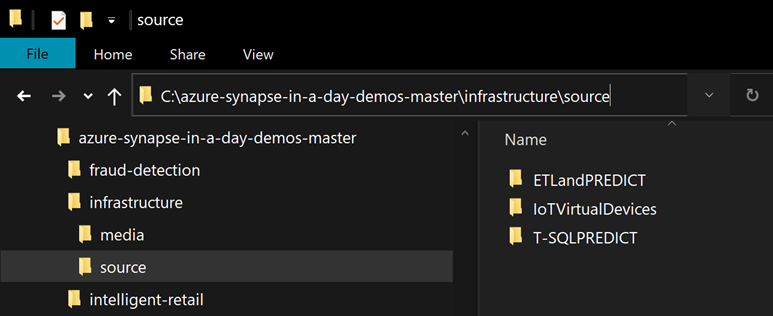

## Exercise 1: Deploy Resources

Time required: 15 minutes

The first step is to deploy and configure the resources. It's easy to do from the Azure Portal.

### Task 1: Create Azure Synapse Analytics workspace

1. Navigate to the Azure portal (<https://portal.azure.com>) to create the Azure Synapse Analytics workspace.

2. In the search menu, type **Synapse**, then select **Azure Synapse Analytics**.

    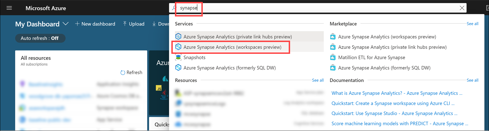

3. Select **Add**.

    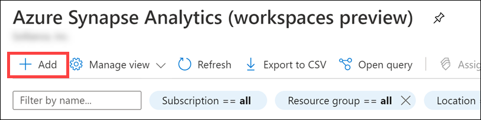

4. In the `Create Synapse workspace` form, enter the values shown in the table below. For the Azure Data Lake Storage Gen2 account name, select **Create new**, enter the account name, then select **OK**.

    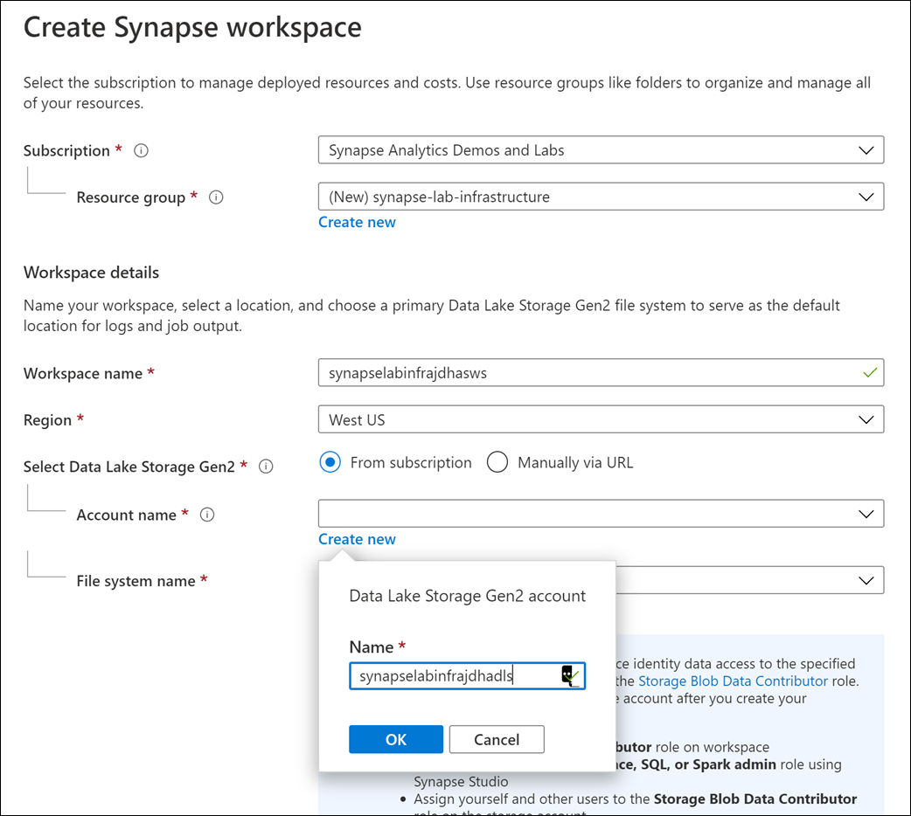

    | Parameters | Settings | Remarks |
    | --- | --- | --- |
    | Subscription | Any | Select the Azure subscription used for this lab. |
    | Resource group | `synapse-lab-infrastructure` | Select **Create new**, then enter the name. |
    | Workspace name | `synapselabinfra` + your initials + `asws` (example: `synapselabinfrajdhasws`) | Lowercase alphanumeric characters only |
    | Region | Select the region closest to you, such as `West US`. | |
    | Select Data Lake Storage Gen2 | From subscription | Default settings |
    | Account name | `synapselabinfra` + your initials + `adls` (example: `synapselabinfrajdhadls`) | Select **Create new** (lowercase alphanumeric characters only) |

5. Select **Create new** for `File system name`, type **datalake** in the name field, then select **OK**.

    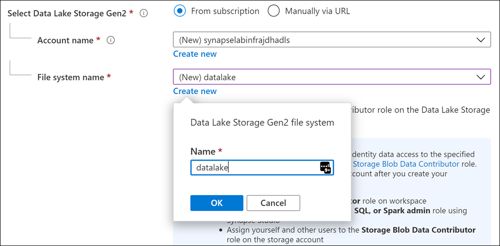

6. Check the `Assign myself the Storage Blob Data Contributor role` checkbox, then select **Next: Security and networking**.

    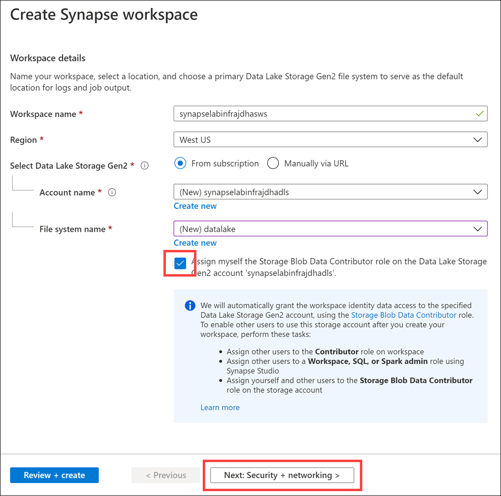

7. Review the settings, then select **Review + create**.

    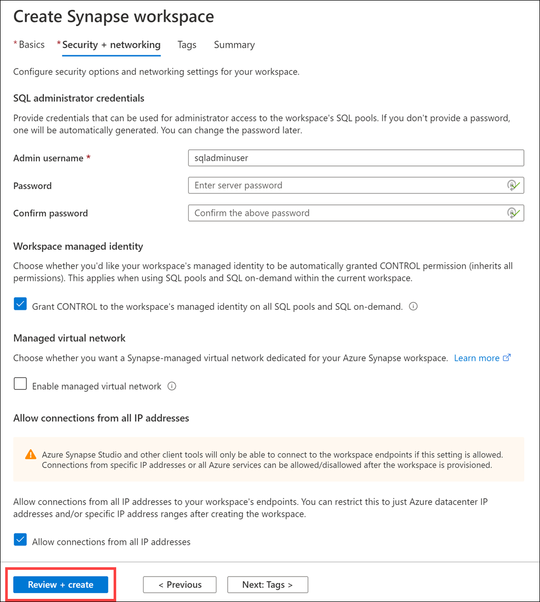

8. Review the settings, then select **Create**. It takes around five minutes to create the workspace.

    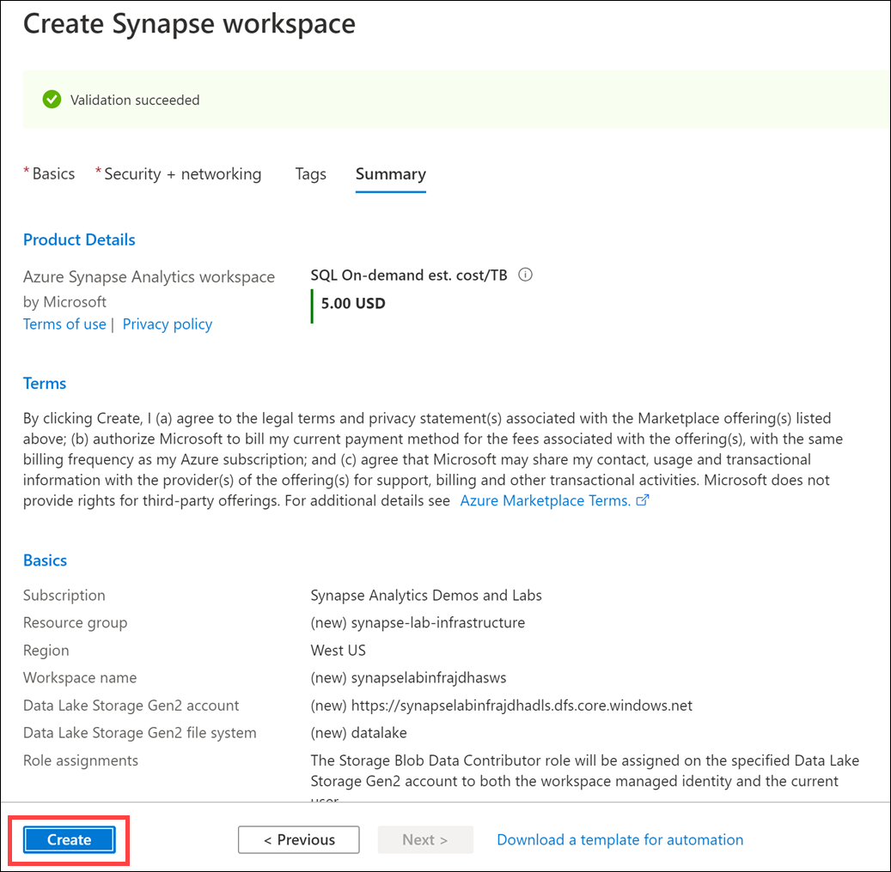

### Task 2: Set up blob data owner

Data access permissions on the data lake must be set separately from the resource's permissions.

1. When the Azure Synapse Analytics workspace deployment completes, navigate to the `synapse-lab-infrastructure` resource group. In the Azure portal, use the top search bar to search for `synapse-lab-infrastructure`, then select the **synapse-lab-infrastructure** resource group in the search results under **Resource Groups**.

    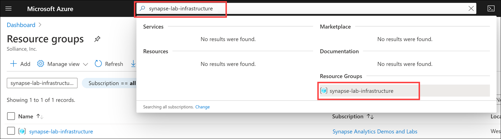

2. Within the resource group, select the storage account you created when you deployed the Azure Synapse Analytics workspace.

    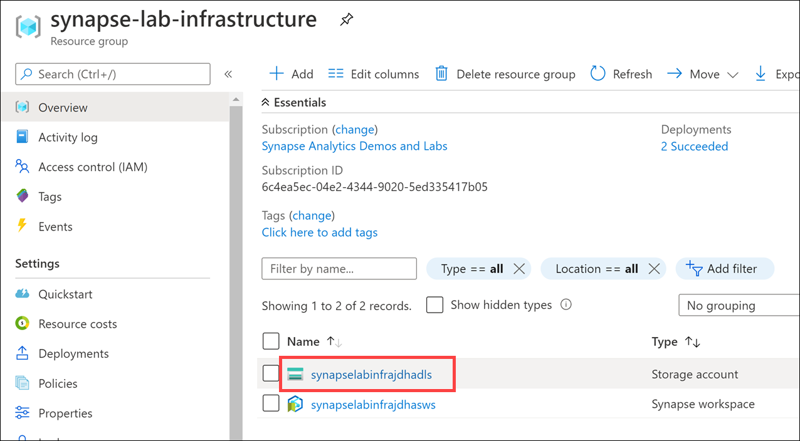

3. Within the storage account, select **Access control (IAM)**. Select **+ Add**, then **Add role assignment**.

    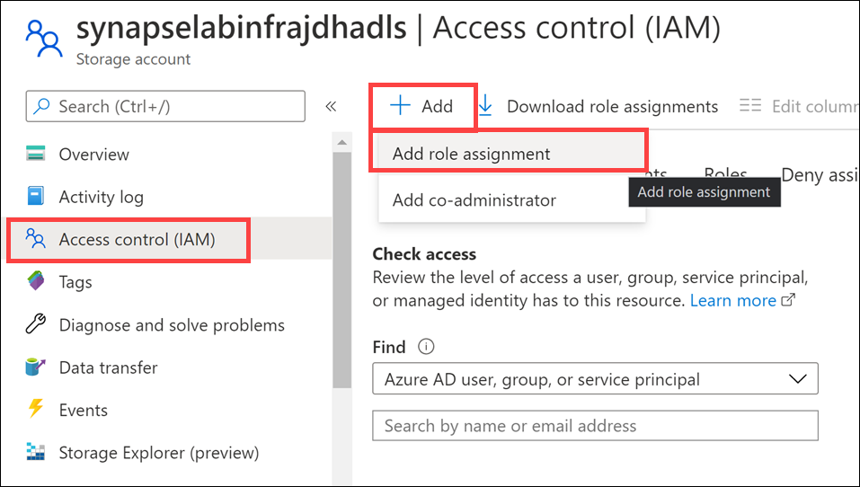

4. Select the **Storage Blob Data Owner** role. Select **Azure AD user, group, or service principal** under assign access to. Search for and select your Azure account, then select **Save**.

    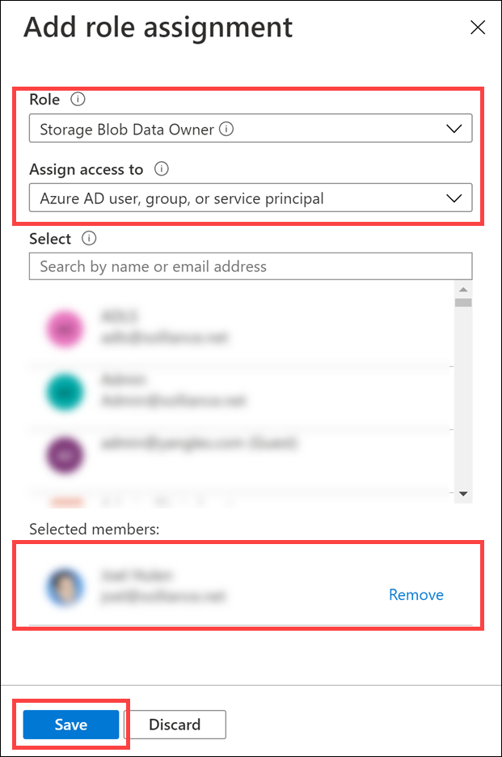

### Task 3: Set up user access administrator

1. Return to the `synapse-lab-infrastructure` resource group and select the Azure Synapse Analytics workspace within.

    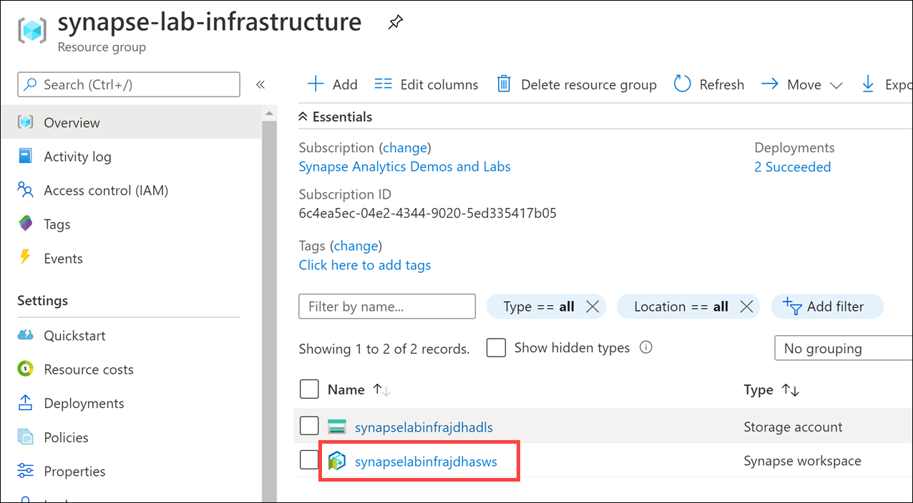

2. Within the Synapse workspace, select **Access control (IAM)**. Select **+ Add**, then **Add role assignment**.

    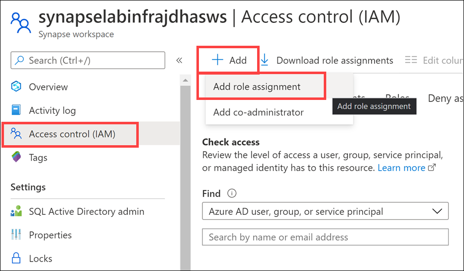

3. Select the **User Access Administrator** role. Select **Azure AD user, group, or service principal** under assign access to. Search for and select your Azure account, then select **Save**.

    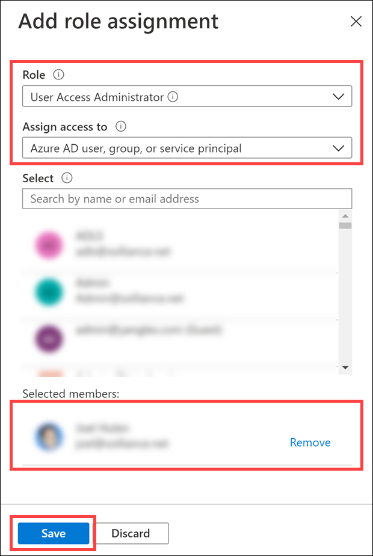

### Task 4: IoT Hub resource creation

1. Navigate to the Azure portal (<https://portal.azure.com>) to create the IoT Hub resource.

2. In the search menu, type **IoT Hub**, then select **IoT Hub**.

    

3. Select **Add**.

    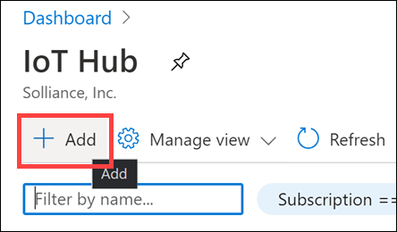

4. In the `Create Synapse workspace` form, enter the values shown in the table below. Select **Review + create**.

    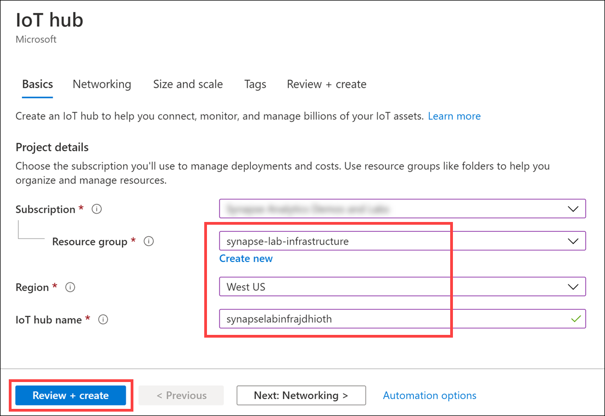

    | Parameters | Settings | Remarks |
    | --- | --- | --- |
    | Subscription | Any | Select the Azure subscription used for this lab. |
    | Resource group | `synapse-lab-infrastructure` | Select existing resource group you have been using for this lab |
    | Region | Select the region closest to you, such as `West US`. | |
    | Workspace name | `synapselabinfra` + your initials + `ioth` (example: `synapselabinfrajdhioth`) | Lowercase alphanumeric characters only |

5. Review the settings, then select **Create**. It takes a few minutes to create the resource.

    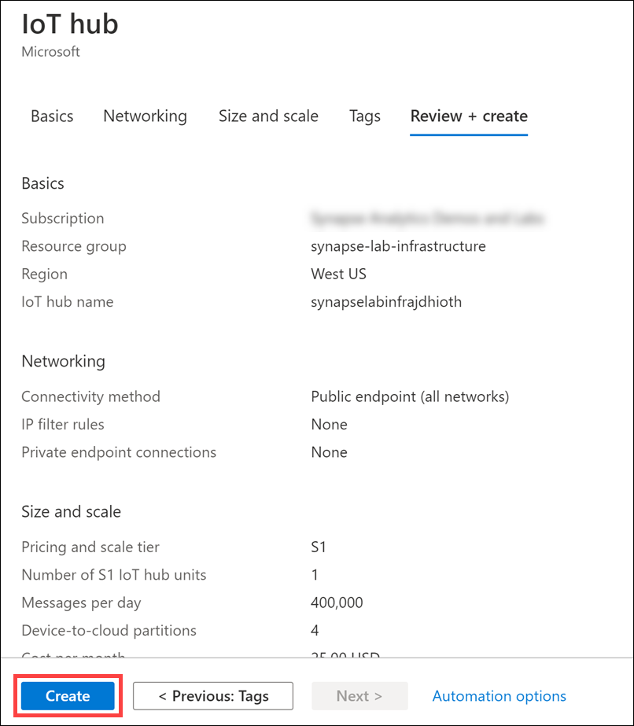

### Task 5: Create and configure Stream Analytics resources

1. Navigate to the Azure portal (<https://portal.azure.com>) to create the IoT Hub resource.

2. In the search menu, type **stream**, then select **Stream Analytics jobs**.

    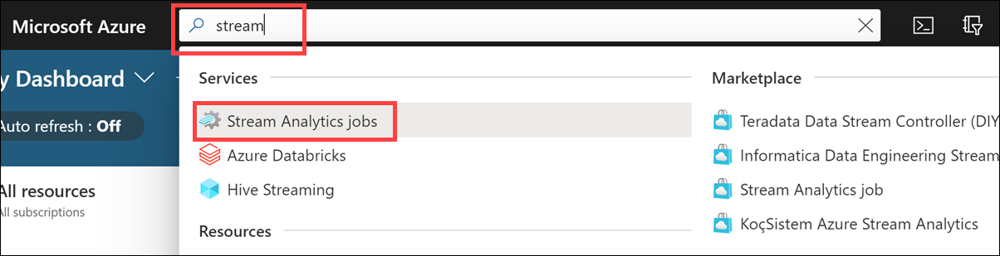

3. Select **Add**.

    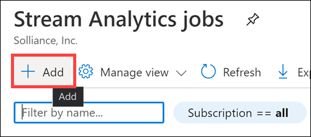

4. In the `New Stream Analytics job` form, enter the values shown in the table below. Select **Create**.

    

    | Parameters | Settings | Remarks |
    | --- | --- | --- |
    | Job name | `synapselabinfra` + your initials + `asa` (example: `synapselabinfrajdhasa`) | Lowercase alphanumeric characters only |
    | Subscription | Any | Select the Azure subscription used for this lab. |
    | Resource group | `synapse-lab-infrastructure` | Select existing resource group you have been using for this lab |
    | Region | Select the region closest to you, such as `West US`. | |
    | Hosting environment | Cloud | |
    | Streaming units | 1 | |

## Exercise 2: Movie data to the data lake using Copy activity

Time required: 30 minutes

In this exercise, you will import a large amount of data into the primary data lake account.

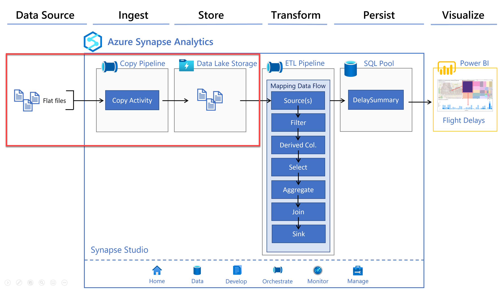

### About Synapse Pipeline

The data integration feature, Synapse Pipeline, is designed with the following concepts:

- **Linked Service**: Contains definitions about the connection, such as the database and server information.
- **Dataset**: Browses the Linked Service and defines table information, for example.
- **Activity**: Browses, for example, a Dataset to define processing such as data movement.
- **Pipeline**: Defines the order and conditions in which Activities are run.
- **Integration Runtime**: Defines the processing infrastructure used by Linked Services and Activities.
- **Trigger**: Defines when and how the Pipeline will run.

### Task 1: Log in to Synapse Studio

Synapse Studio is the web-based interface for working with your Azure Synapse Analytics workspace.

1. Navigate to the Azure portal (<https://portal.azure.com>).

2. In the search menu, type **Synapse**, then select **Azure Synapse Analytics**.

    

3. Select the Synapse Workspace that you created for this lab, or that was provided for you in the lab environment.

4. Select **Open** underneath **Open Synapse Studio** from the Synapse workspace page.

    

    After authenticating your account, you should see the Synapse Studio home page for your workspace.

    

5. If you see the Getting started dialog, select **Close**.

    

### Task 2: Create a Linked Service

1. Select the **Manage** hub, **Linked services**, then select **+ New**.

    

2. Select **Azure Blob Storage**, then select **Continue**.

    

3. Enter each setting described below, then select **Test connection**. When the connection is successful, select **Create**.

    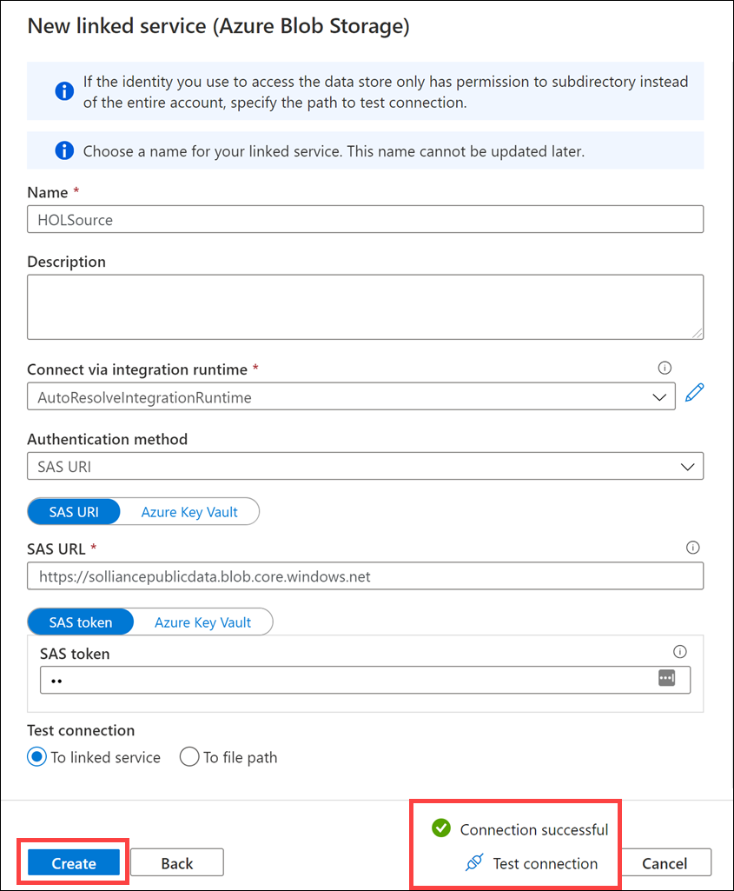

    | Parameters | Settings | Remarks |
    | --- | --- | --- |
    | Name | `HOLSource` | |
    | Description | No entry required | Default settings |
    | Connect via integration runtime | AutoResolveIntegrationRuntime | Default settings |
    | Authentication method | SAS URL | |
    | SAS URL | `https://solliancepublicdata.blob.core.windows.net` | |
    | SAS token| '' | Enter two single quotes |
    | Test connection | To linked service | Default settings |

### Task 3: Create a Copy pipeline

1. Select the **Integrate** hub, select **+**, then select **Pipeline**.

    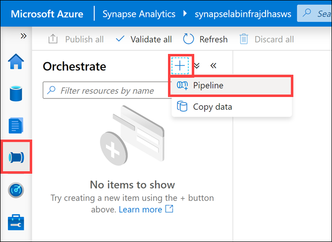

2. For **Name**, enter `ImportData`, then select **Properties** to close the dialog.

    

3. Expand **Move & transform** under the Activities menu. Drag and drop the **Copy data** activity onto the canvas area to the right.

    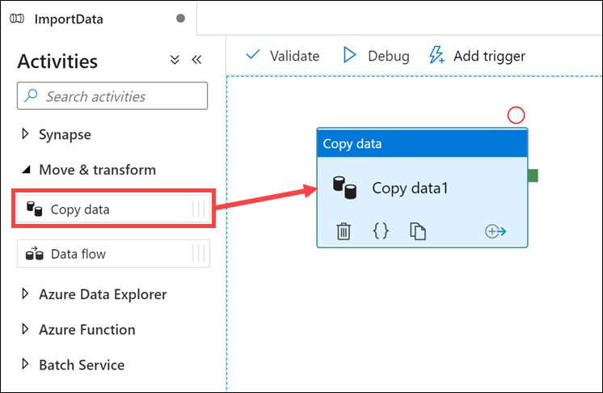

4. Select the **Source** tab, then select **+ New** next to the source dataset.

    

5. Select **Azure Blob Storage**, then select **Continue**.

    

6. Select the **Binary** format, then select **Continue**.

    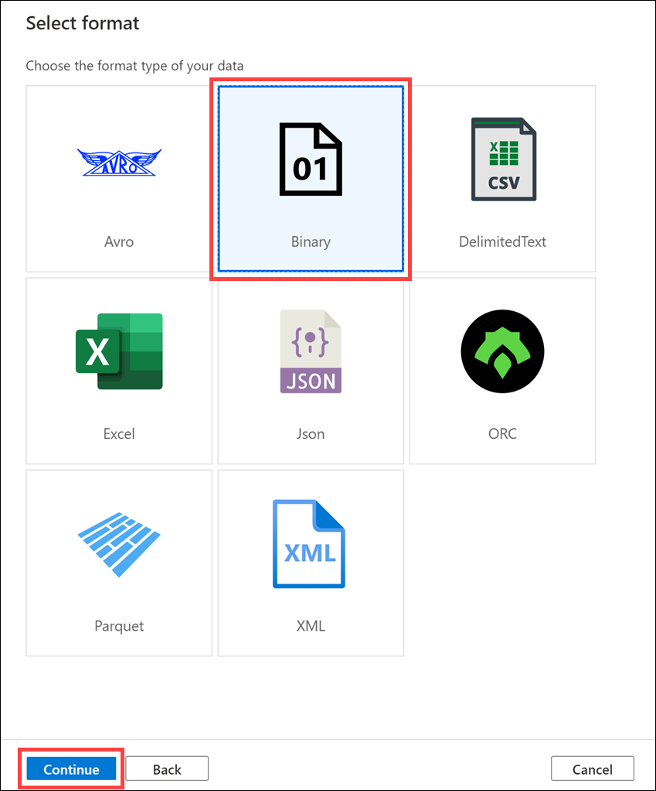

7. Enter each setting as displayed in the table below, and then select **OK**.

    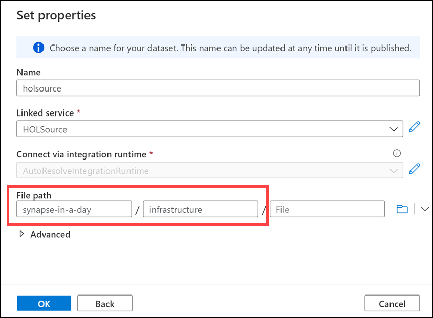

    | Parameters | Settings | Remarks |
    | --- | --- | --- |
    | Name | `holsource` | Be careful not to include extra spaces when copying |
    | Linked service | HOLSource | Select the linked service you created earlier |
    | File path | `synapse-in-a-day/infrastructure` | Enter `synapse-in-a-day` in the first field, and `infrastructure` in the second field. *Note*: you may see an error if you try to browse, due to the lack of list permissions on the entire public data source. To review the contents, select the drop down arrow and select "From specified path" |

8. Select the **Sink** tab, then select **+ New** next to the sink dataset.

    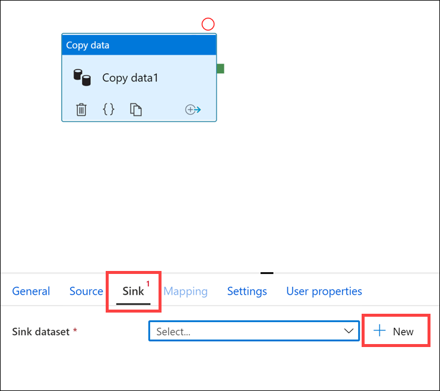

9. Select **Azure Data Lake Storage Gen2**, then select **Continue**.

    

10. Select the **Binary** format, then select **Continue**.

    

11. Enter each setting as displayed in the table below, and then select **OK**.

    

    | Parameters | Settings | Remarks |
    | --- | --- | --- |
    | Name | `holdist` | Be careful not to include extra spaces when copying |
    | Linked service | Select the default storage for your workspace (`<Synapse workspace name>-WorkspaceDefaultStorage`) | |
    | File path | `datalake` | Enter `datalake` in the first field |

12. Select **Publish all**, then select **Publish** in the dialog.

    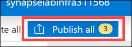

    > ※	For the remainder of the lab, select **Publish** as appropriate to save your work.

13. Select **Add trigger**, then select **Trigger now**.

    

14. Select **OK** to run the trigger.

    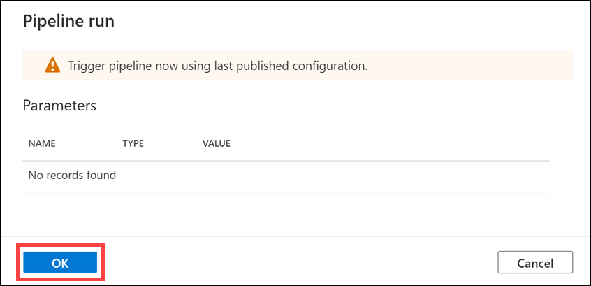

15. Select the **Monitor** hub, then **Pipeline runs**. If the pipeline run status is `Succeeded` after a few minutes, then the pipeline run successfully completed.

    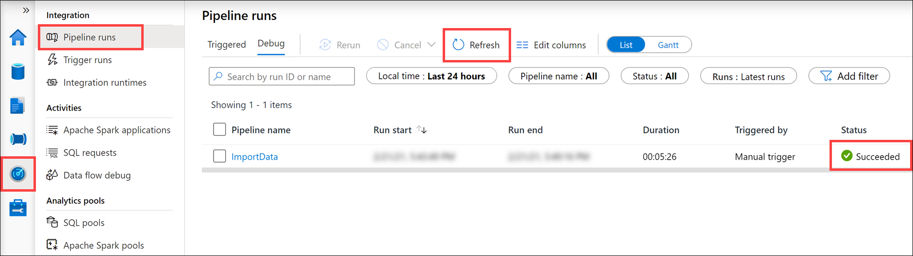

16. Select the **Data** hub, select the **Linked** tab, expand storage accounts, then select **datalake** underneath the primary storage account. You will see the imported data on the right-hand side.

    

### Task 4: Create a SQL Pool

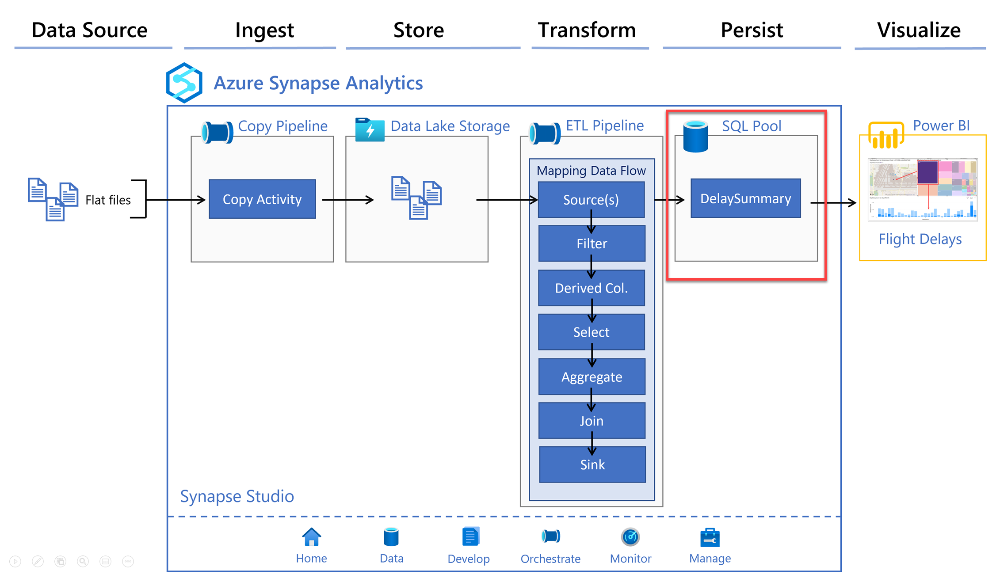

A dedicated SQL Pool is one of the analytic runtimes in Azure Synapse Analytics that help you ingest, transform, model, and analyze your data. It offers T-SQL based compute and storage capabilities. After creating a dedicated SQL pool in your Synapse workspace, data can be loaded, modeled, processed, and delivered for faster analytic insight.

1. Select the **Manage** hub.

    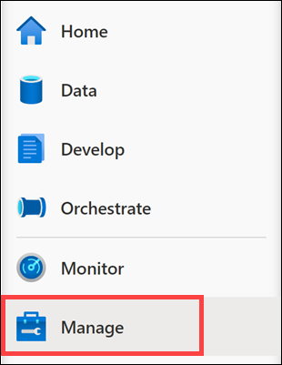

2. Select **SQL pools**, then select **+ New**.

    

3. Enter **aiaddw** for the dedicated SQL pool name, select the **DW100c** performance level, then select **Review + create**.

    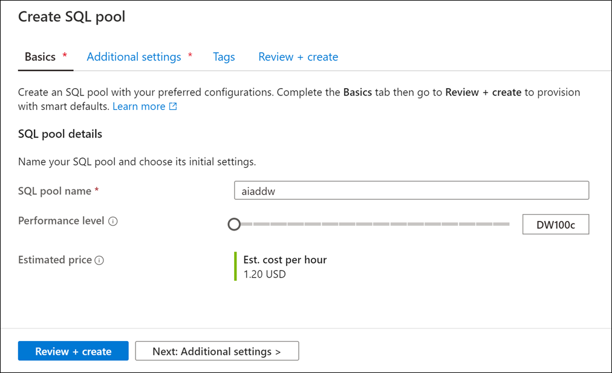

4. Select **Create** in the review blade.

5. Wait for the SQL pool deployment to complete. You may need to periodically select **Refresh** to update the status.

    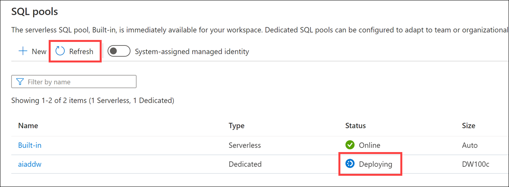

## Lab guide

Now that you have completed the lab setup, continue to the [step-by-step lab guide](README.md).
