# Azure Synapse in a day demos - Intelligent retail

- [Azure Synapse in a day demos - Intelligent retail](#azure-synapse-in-a-day-demos---intelligent-retail)
  - [Pre-requisites](#pre-requisites)
    - [Hosted lab environment](#hosted-lab-environment)
  - [Overview](#overview)
  - [What we will do in the lab](#what-we-will-do-in-the-lab)
    - [Part 1: Data collection](#part-1-data-collection)
    - [Part 2: Data aggregation](#part-2-data-aggregation)
    - [Part 3: Data Analysis](#part-3-data-analysis)
    - [Part 4: Security](#part-4-security)
    - [Part 5: Data visualization](#part-5-data-visualization)
  - [Hands-on lab story description](#hands-on-lab-story-description)
  - [Hands-on environment](#hands-on-environment)
  - [Exercise 1: Security](#exercise-1-security)
    - [Task 1: Enable private endpoint on the data lake](#task-1-enable-private-endpoint-on-the-data-lake)
    - [Task 4: Add the workspace managed identity to database role](#task-4-add-the-workspace-managed-identity-to-database-role)
    - [Task 5: Managed identity](#task-5-managed-identity)
  - [Exercise 2: Data collection](#exercise-2-data-collection)
    - [Task 1: Register an IoT device (for AI camera)](#task-1-register-an-iot-device-for-ai-camera)
    - [Task 2: Save IoT device connection information (for AI camera)](#task-2-save-iot-device-connection-information-for-ai-camera)
    - [Task 3: Register another IoT device (for weight sensor)](#task-3-register-another-iot-device-for-weight-sensor)
    - [Task 4: Save IoT device connection information (for weight sensor)](#task-4-save-iot-device-connection-information-for-weight-sensor)
    - [Task 5: Stream Analytics (for AI cameras) input settings](#task-5-stream-analytics-for-ai-cameras-input-settings)
    - [Task 6: Stream Analytics (for AI cameras) output settings](#task-6-stream-analytics-for-ai-cameras-output-settings)
    - [Task 7: Stream Analytics (for AI cameras) query settings](#task-7-stream-analytics-for-ai-cameras-query-settings)
    - [Task 8: Stream Analytics (for weight sensors) input settings](#task-8-stream-analytics-for-weight-sensors-input-settings)
    - [Task 9: Stream Analytics (for weight sensors) output settings](#task-9-stream-analytics-for-weight-sensors-output-settings)
    - [Task 10: Stream Analytics (for weight sensors) query settings](#task-10-stream-analytics-for-weight-sensors-query-settings)
      - [Additional information: Using reference data in Stream Analytics](#additional-information-using-reference-data-in-stream-analytics)
    - [Task 11: Prepare to send data](#task-11-prepare-to-send-data)
    - [Task 12: Send data](#task-12-send-data)
    - [Task 13: Verify sent data](#task-13-verify-sent-data)
  - [Exercise 3: Data aggregation](#exercise-3-data-aggregation)
    - [Task 1: Create notebook](#task-1-create-notebook)
      - [Apache Spark overview](#apache-spark-overview)
        - [About Spark SQL Analytics connectors](#about-spark-sql-analytics-connectors)
        - [Check job execution status](#check-job-execution-status)
    - [Task 2: Implement processing](#task-2-implement-processing)
      - [File path to be aggregated (JSON format)](#file-path-to-be-aggregated-json-format)
      - [Summary conditions: Number of visitors by gender and age group (per day)](#summary-conditions-number-of-visitors-by-gender-and-age-group-per-day)
      - [Table name of the aggregate data output destination: `t_face_count`](#table-name-of-the-aggregate-data-output-destination-t_face_count)
    - [Task 3: Create a table for the pipeline](#task-3-create-a-table-for-the-pipeline)
    - [Task 4: Enable interactive authoring on the integration runtime](#task-4-enable-interactive-authoring-on-the-integration-runtime)
    - [Task 5: Create a dataset for weight sensor data](#task-5-create-a-dataset-for-weight-sensor-data)
    - [Task 6: Create a dataset for AI camera data](#task-6-create-a-dataset-for-ai-camera-data)
    - [Task 7: Create a dataset for intermediate output](#task-7-create-a-dataset-for-intermediate-output)
    - [Task 8: Create a data flow](#task-8-create-a-data-flow)
    - [Task 9: Create a pipeline](#task-9-create-a-pipeline)
    - [Task 10: Confirm pipeline run](#task-10-confirm-pipeline-run)
  - [Exercise 4: Data analysis](#exercise-4-data-analysis)
    - [Synapse serverless SQL pool overview](#synapse-serverless-sql-pool-overview)
    - [Task 1: Data exploration](#task-1-data-exploration)
    - [Task 2: Data exploration in a variety of formats (CSV format)](#task-2-data-exploration-in-a-variety-of-formats-csv-format)
    - [Task 3: Data exploration in a variety of formats (JSON format)](#task-3-data-exploration-in-a-variety-of-formats-json-format)
    - [Task 4: Data analysis](#task-4-data-analysis)
  - [Exercise 5: Data visualization](#exercise-5-data-visualization)
    - [Task 1: Login to Power BI](#task-1-login-to-power-bi)
    - [Task 2: Create a Power BI workspace](#task-2-create-a-power-bi-workspace)
    - [Task 3: Connect to Power BI from Synapse](#task-3-connect-to-power-bi-from-synapse)
    - [Task 4: Create a Power BI dataset](#task-4-create-a-power-bi-dataset)
    - [Task 5: Challenge - Add visualizations for age groups and genders](#task-5-challenge---add-visualizations-for-age-groups-and-genders)
    - [Task 6: Challenge - Add visualization for changes in the number of times product touched](#task-6-challenge---add-visualization-for-changes-in-the-number-of-times-product-touched)
    - [Task 7: Challenge - Add visualization for visitor attribute analysis](#task-7-challenge---add-visualization-for-visitor-attribute-analysis)

## Pre-requisites

**Please note**: If you are not running this lab in a hosted environment, complete the [lab setup instructions](Setup.md) before continuing.

- [Power BI Pro license](https://powerbi.microsoft.com/power-bi-pro/) (can start a trial version of Pro).

### Hosted lab environment

If you are using a hosted CloudLabs lab environment, you will find your environment details in the email address you provided during registration. You can also find the information by selecting the **Environment Details** tab **(1)** on the landing page for the `Azure Synapse in A Day - Intelligent retail` lab.

Use the buttons **(2)** to copy your username and password when prompted to log in to the Azure portal and Power BI account. The **UniqueId (3)** is referenced throughout the lab guide and is used as part of resource naming for the Azure artifacts. When you need to sign in to the lab VM, use the provided **VM username and password (4)** after connecting to the **VM DNS name (5)** with your remote connection application, such as RDP.


When you need to log in to the lab VM, select the **Virtual Machines** tab **(1)** and check the VM status **(2)**. If the VM is **deallocated**, you must start it by selecting the **Start** button **(3)** under Actions.


## Overview

Azure Synapse Analytics (hereafter Synapse) is an evolution of the Azure SQL Data Warehouse and a data analytics platform with conventional data warehouse functionality in addition to integration of certain functionality related to data analysis, such as data integration, distributed processing, BI, and machine learning.

In the past, each function, from data collection and processing to analysis and visualization, had to be built individually, but if you take advantage of Synapse, you can achieve all of this on the same platform.

In this classroom seminar, you studied Synapse conceptually by learning functional overviews and usage scenarios. With this hands-on training, we hope that you will further deepen your understanding of its features by building a data analytics platform on Synapse following stories as well as embodying actual usage concepts from the distribution industry.

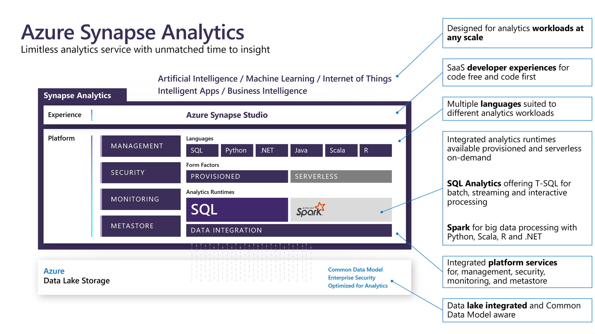

## What we will do in the lab

This hands-on training consists of five parts, and by having you perform all the parts, you will gain a comprehensive understanding of the features of Synapse. An overview of each of the parts is provided below.

### Part 1: Data collection

Using IoT Hub and Stream Analytics, you will collect data from IoT devices, and store it in file format in Data Lake Storage.

### Part 2: Data aggregation

You will process data stored in Data Lake Storage in various formats using data flow to process it for easy handling in subsequent processing. In addition, you will aggregate the processed data with distributed processing using Spark and load it into a data warehouse (SQL pool) for analysis. You will also automate these flows using a pipeline.

### Part 3: Data Analysis

Using SQL on-demand, you will explore and analyze data stored in Data Lake Storage in various formats.
In addition, you will use machine learning models to make demand forecasts from large-scale data.

### Part 4: Security

To use Synapse Analytics securely, you will learn about the network settings and access rights settings.

### Part 5: Data visualization

Using a BI tool (Power BI), you will visualize aggregate data stored in the data warehouse to make it easier for your business to use.

## Hands-on lab story description


In a supermarket where the CTC Smart Shelf is located, real-time links to Synapse of customer behavior in front of the shelf and personal attribute data obtained from the shelf makes individual optimized marketing and real-time, multi-faceted analysis possible. In addition, by associating weather data and other open data linked externally with a variety of data obtained from the store and analyzing it in a machine learning model, you can also forecast demand.

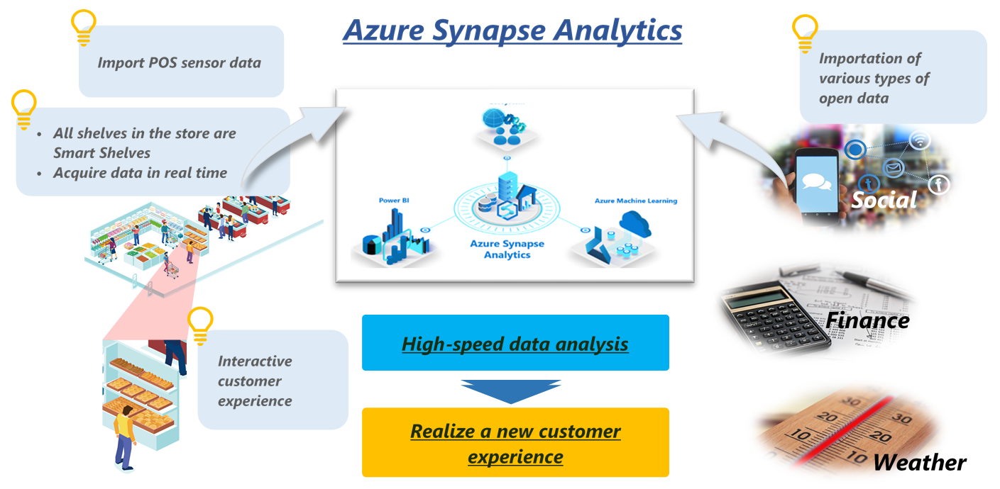

![A smart shelf is a next-generation display case equipped with an AI camera and a weight sensor on the shelf itself. The AI camera acquires customer attributes, such as age, gender, and length of stay (age and gender are estimated by Cognitive Service Face API). The weight sensor acquires customer behavior, such as picking up and returning goods to the shelf. Based on this information, analysis of the behavior and attributes of customers that pick up and return home with products (= customers who make purchases) is performed, making next-generation in-store analysis possible. Based on customer information and sales information, information is distributed interactively to the display and electronic shelf tags mounted on the shelf to enable promotions, such as dynamic pricing and personalized marketing.](media/story-smart-shelf-description.png "What is CTC Smart Shelf?")

## Hands-on environment

The following is a diagram of the data analytics infrastructure that you will build in this hands-on training:

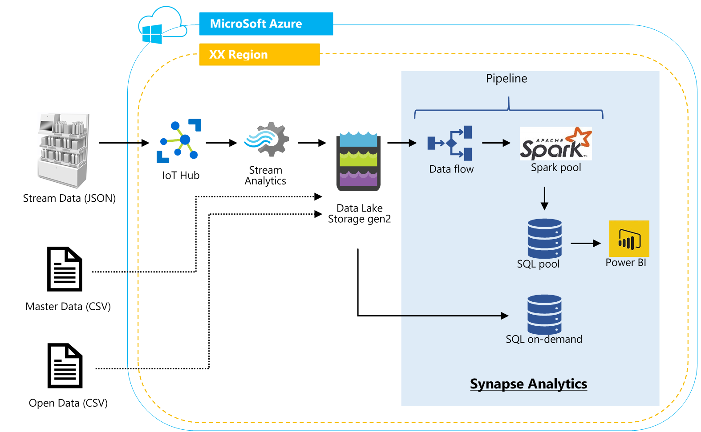

## Exercise 1: Security

Time required: 10 minutes

### Task 1: Enable private endpoint on the data lake

Managed private endpoint uses a private IP address from within the Synapse workspace's Managed Virtual Network to connect to an Azure resource or your own private link service. Connections using managed private endpoints provide access to Azure resources or private link services.

When you created the Synapse workspace during the lab setup, you enabled the managed virtual network (VNet) option. If you are using a hosted lab environment, the Synapse workspace was provisioned with a VNet for you. This setting allows the workspace to be network-isolated and to be linked from the VNet privately to the SQL pool, Spark pool, and other Azure services, such as ADLS Gen2 and Azure Cosmos DB.

The use of private links protects traffic from the risk of data breaches because it passes through Microsoft's backbone network.

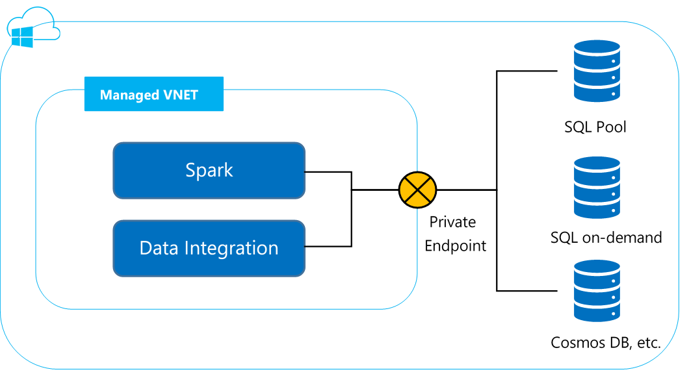

When you create datasets with the ADLS Gen2 account's Synapse linked service later in this lab, you will not be able to connect to the service unless you configure a managed endpoint.

In this task, you create a new managed private endpoint for the ADLS Gen2 account.

1. Navigate to the Azure portal (<https://portal.azure.com>).

2. In the search menu, type **Synapse**, then select **Azure Synapse Analytics**.

    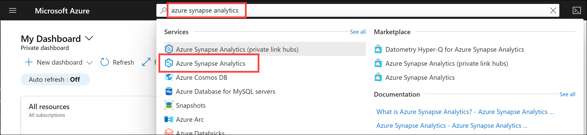

3. Select the **Overview** blade in the left-hand menu, then select **Open** underneath **Open Synapse Studio** to navigate to Synapse Studio for this workspace.

    

4. If you see the Getting started dialog, select **Close**.

    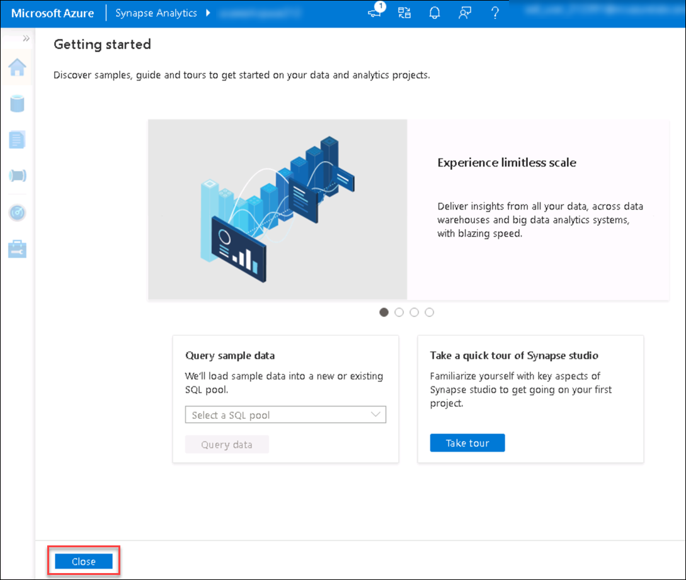

5. In Synapse Studio, select the **Manage hub**.

    

6. Select **Managed private endpoints** on the left-hand menu, then select **+ New**.

    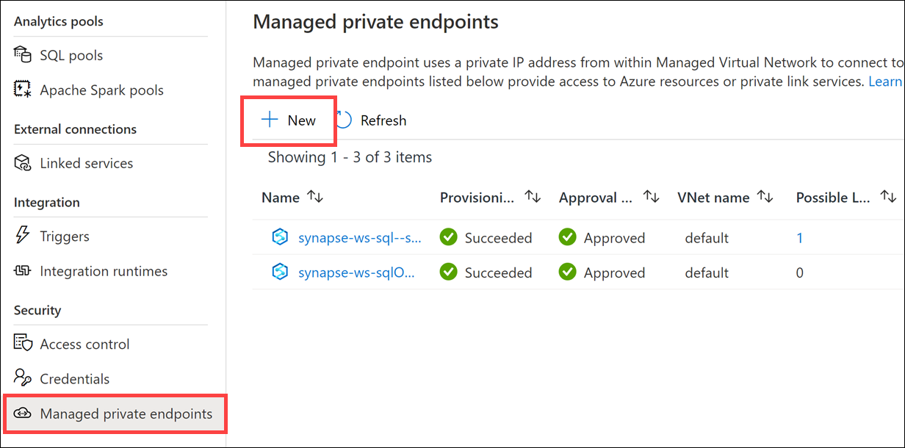

7. Select **Azure Data Lake Storage Gen2**, then select **Continue**.

    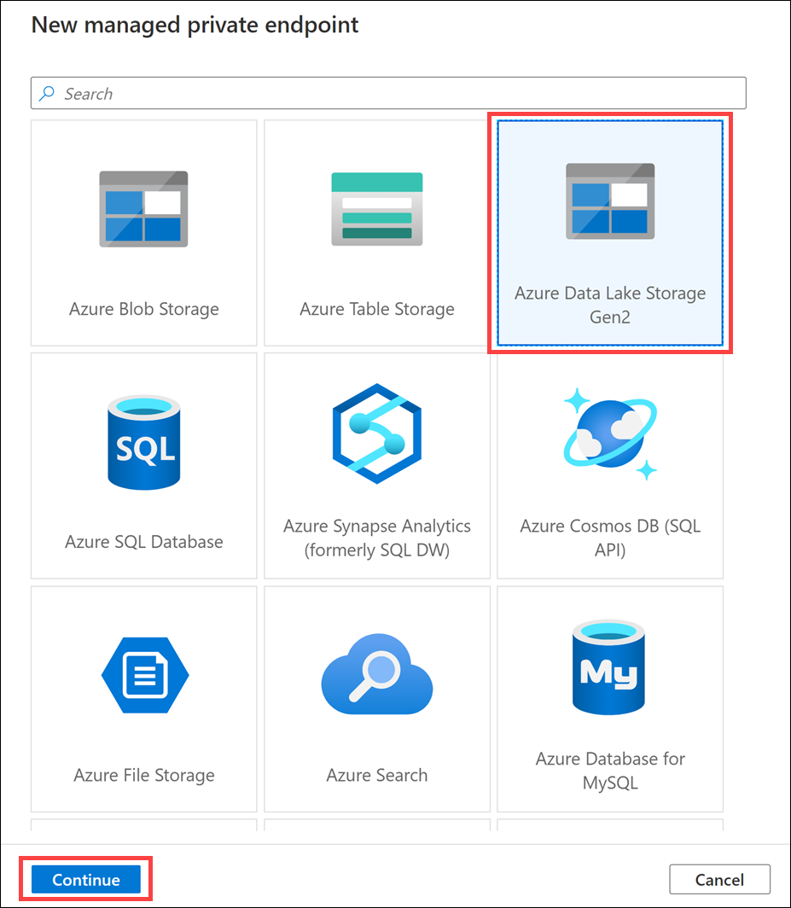

8. On the new managed private endpoint form, enter **`data-lake`** for the name. Select the ADLS Gen2 primary account for the Synapse workspace (ex. `synapselabretail` + unique id), then select **Create**.

    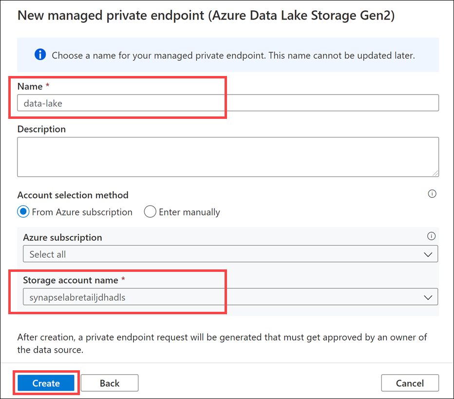

9. While you are in the Manage hub, select **SQL pools** on the left-hand menu. If the dedicated SQL pool (`SqlPool`) is paused, hover over it and select **Resume**.

    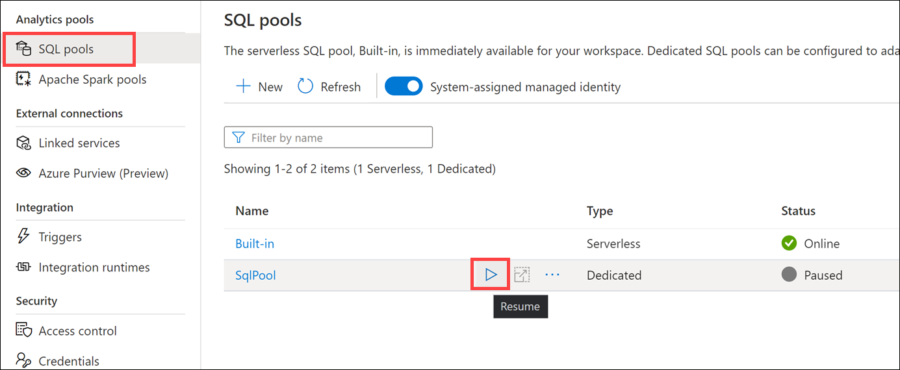

10. Return to the `synapse-lab-retail` resource group used for this lab, and select the ADLS Gen2 primary account for the Synapse workspace (ex. `synapselabretail` + unique id) within.

    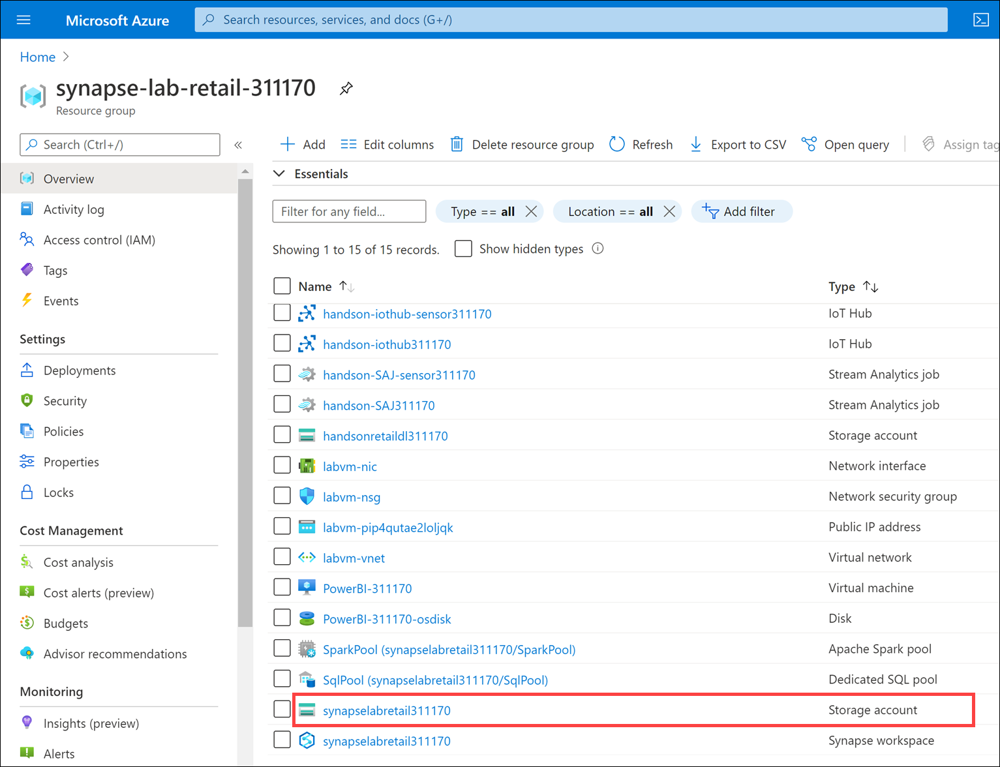

11. Select **Networking** on the left-hand menu **(1)**, then select the **Private endpoint connections** tab **(2)**. You should see the new private endpoint connection in a Pending status. Before you can use it, you must approve the request. **Check** the pending request **(3)**, then select **Approve (4)**.

    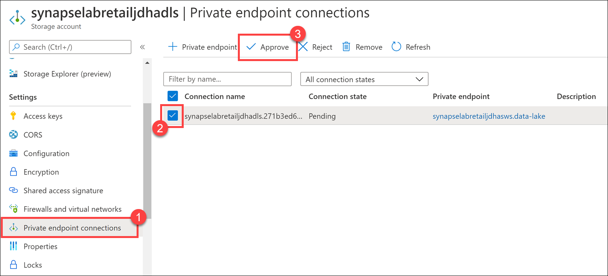

12. Enter a description for the approval, such as "Synapse data lake", then select **Yes** to complete the approval.

    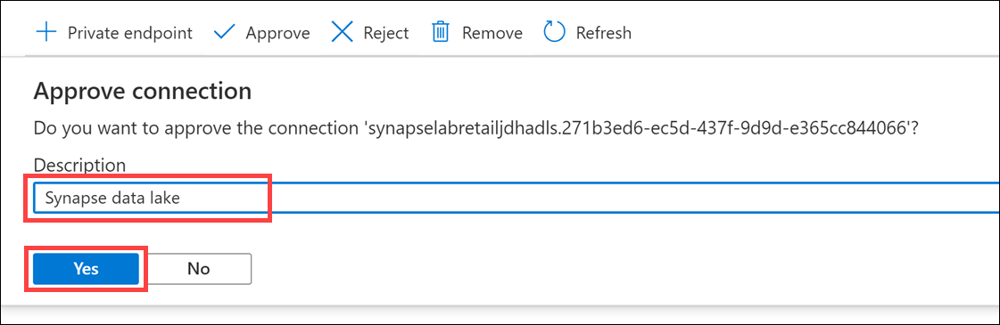

13. Return to Synapse studio and select the **Manage hub**.

    

14. Select **Managed private endpoints** on the left-hand menu. You should see the new **data-lake** private endpoint. It will take about 1-2 minutes for the approval status to refresh. Select the **Refresh** button periodically until the approval status shows as Approved.

    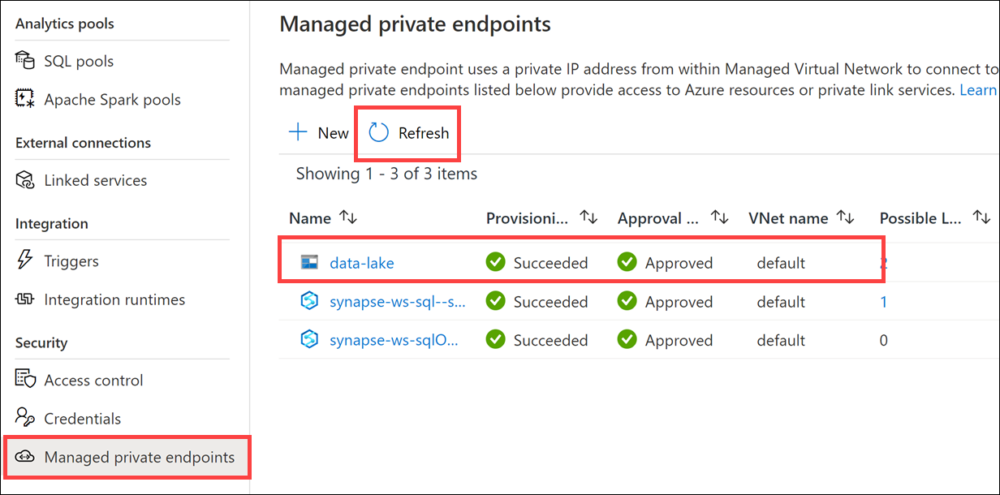

### Task 4: Add the workspace managed identity to database role

Later on in this lab, you will create a data pipeline that includes a copy activity which copies data into the dedicated SQL pool. This will fail unless you add the managed identity account to the `db_owner` database role.

1. Navigate to the **Data hub**.

    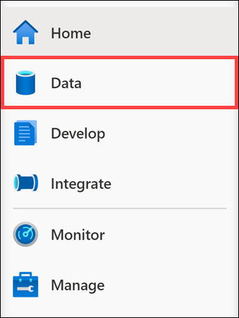

2. Select the **Workspace** tab **(1)**, expand Databases and right-click on **SqlPool (2)**. Select **New SQL script (3)**, then **Empty script (4)**.

    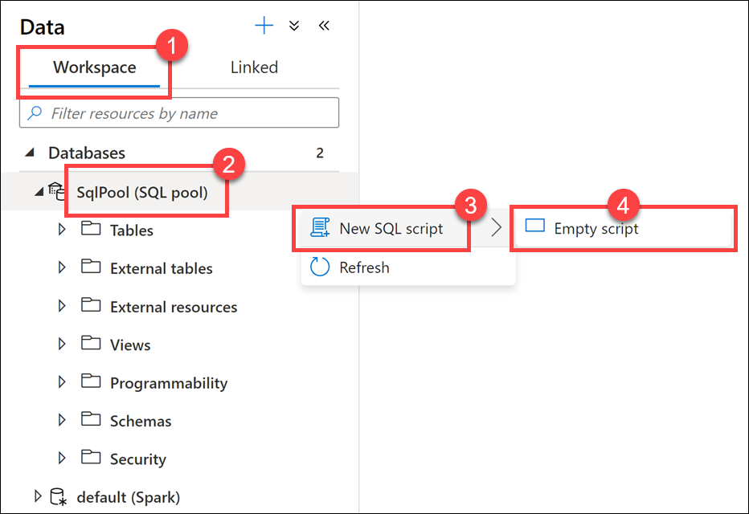

3. Paste the following script and **Run** it to create a new user for your workspace's managed identity, and to add it to the `db_owner` role. **Replace** `YOUR_SYNAPSE_WORKSPACE_NAME` with the name of your Synapse Analytics workspace. You can find this value at the top of Synapse Studio, as shown in the screenshot below.

    ```sql
    CREATE USER [YOUR_SYNAPSE_WORKSPACE_NAME] FROM EXTERNAL PROVIDER;
    EXEC sp_addrolemember N'db_owner', N'YOUR_SYNAPSE_WORKSPACE_NAME'
    ```

    The screenshot below shows where to find the Synapse workspace name.

    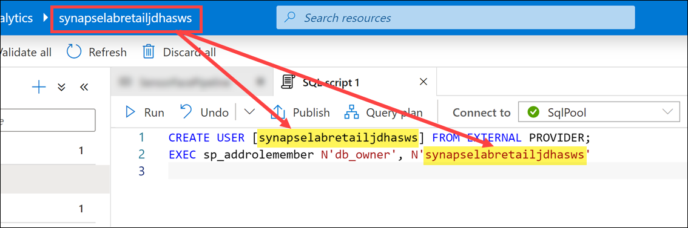

    **Note**: If you receive an error after running the script, `User, group, or role 'synapselabretail#####' already exists in the current database.`, you can ignore the error and continue. This may happen if you are running the lab in a hosted environment.

    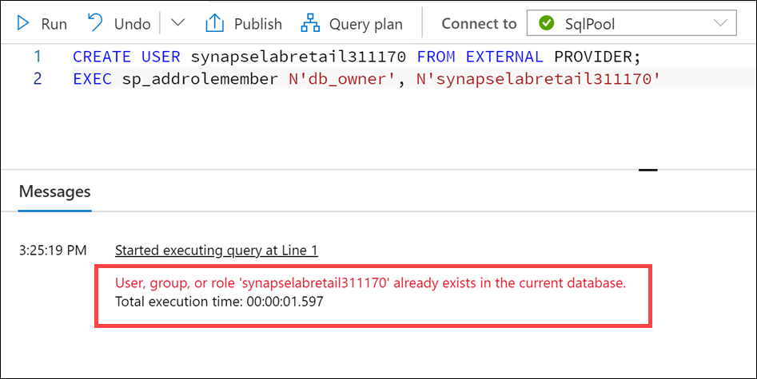

### Task 5: Managed identity

When accessing other services in the Azure Synapse workspace, authentication is now possible using a system allocated ID. This allows authentication in conjunction with Azure AD without using the credentials issued within each service (such as a Data Lake Storage access key).

1. Return to the `synapse-lab-retail` resource group and select the Azure Synapse Analytics workspace within.

    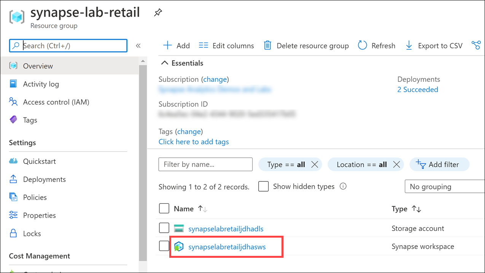

2. On the **Overview** blade, observe the **Managed Identity object ID** value.

    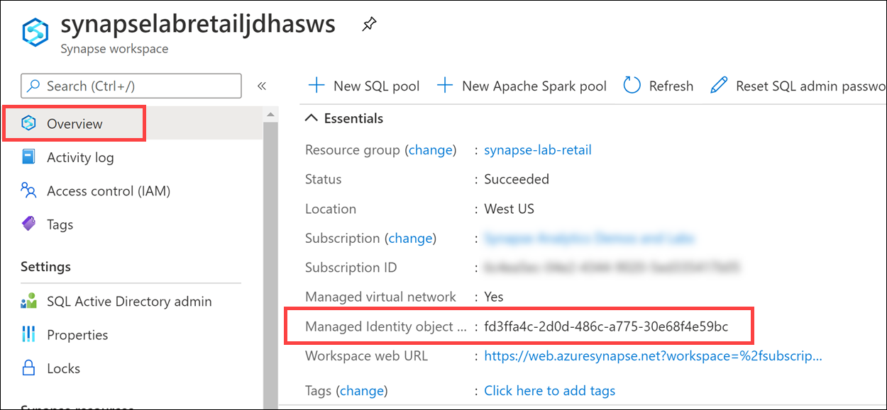

3. Return to Synapse Studio, then select the **Manage hub**.

    

4. Select **Linked services** in the left-hand menu, then select **+ New**.

    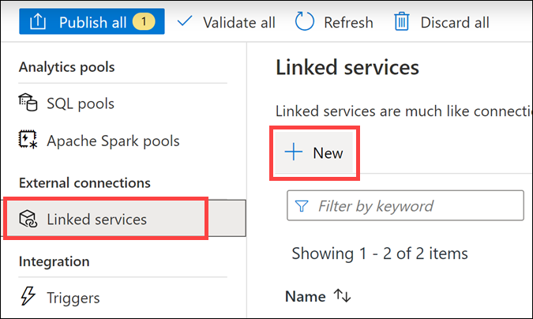

5. Select **Azure Data Lake Storage Gen2**, then **Continue**.

    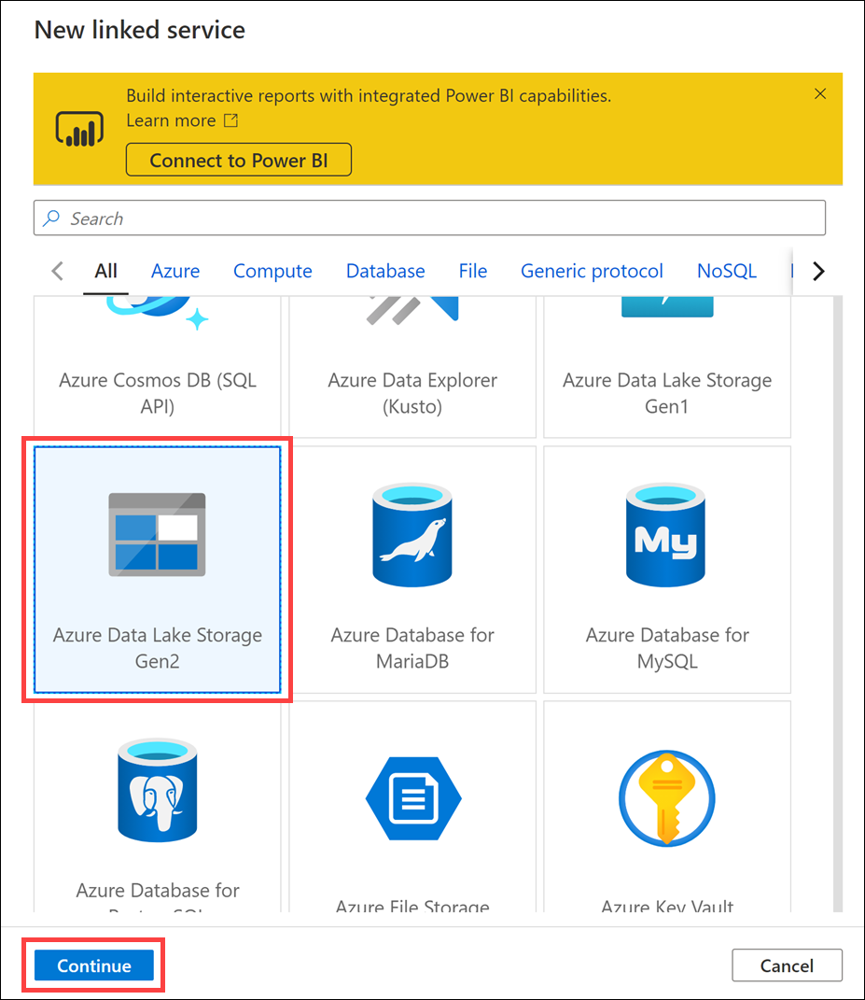

6. On the new linked service form, select **Managed Identity** for the authentication method, select the ADLS Gen2 primary account for the Synapse workspace (ex. `synapselabretail` + unique id). You will see the `data-lake` **Managed private endpoint** selected with the **Approved** status, and the Managed identity name and object ID values displayed below **(3)**.

    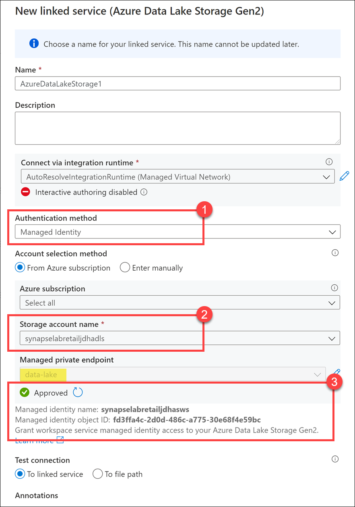

7. Select **Create** to finish creating the new linked service.

## Exercise 2: Data collection

Time required: 20 minutes

In data collection, you will collect and process stream data flowing from IoT devices in real time and store it in the data lake.

You will learn:

- **Data Lake Storage construction**: Build a data lake to store collected data.

- **IoT Hub construction**: Build a gateway to connect devices in Azure end-to-end and enable secure two-way communication.

- **Stream Analytics construction**: Build workload to analyze and process streaming data flowing through IoT Hub in real time.

- **Send streaming data from IoT devices**: Using IoT Hub client, implement processing to send messages from a device to IoT Hub.

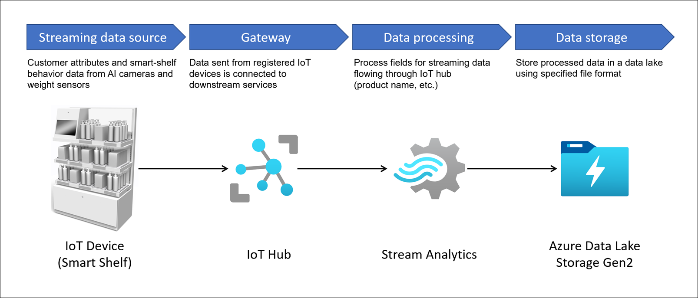

### Task 1: Register an IoT device (for AI camera)

1. Navigate to the `synapse-lab-retail` resource group. In the Azure portal, use the top search bar to search for `synapse-lab-retail`, then select the **synapse-lab-retail** resource group in the search results under **Resource Groups**.

    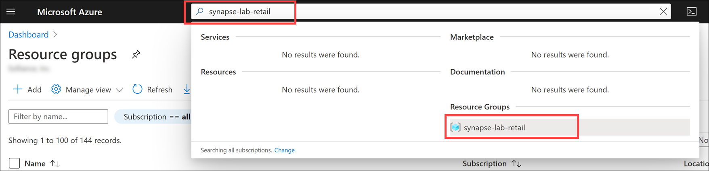

2. Within the resource group, select the **`handson-iothub + <unique suffix>`** IoT Hub account.

    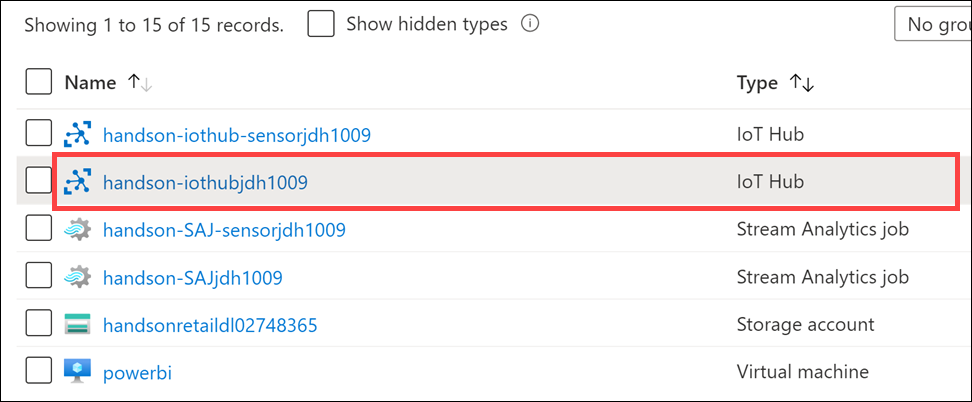

3. Select **IoT devices** on the left-hand menu, then select **+ New**.

    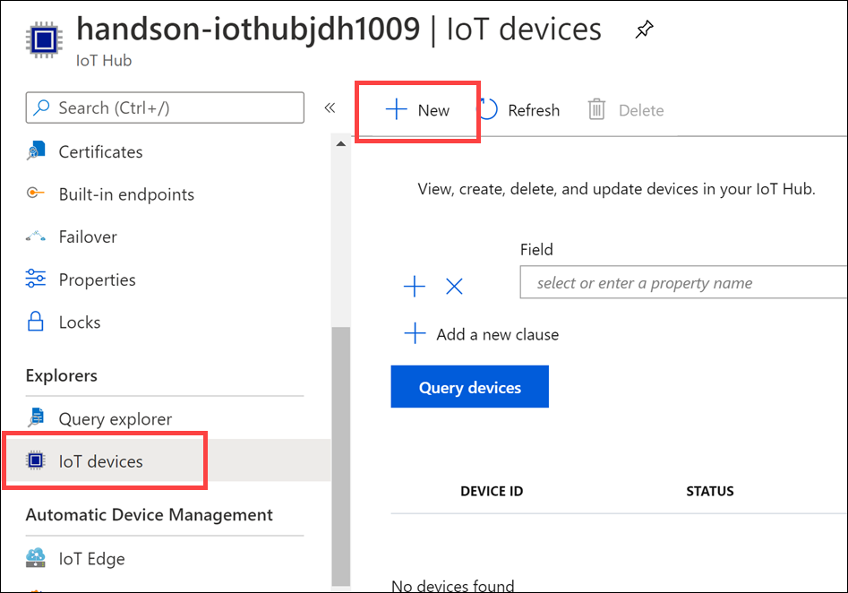

4. In the **Create a device** form, complete the following:

   | Field                          | Value                                              |
   | ------------------------------ | ------------------------------------------         |
   | Device ID                   | _enter `TestDevice`_              |
   | Authentication type                 | _select `Symmetric key`_                      |
   | Auto-generate keys           | _check the box_      |
   | Connect this device to an IoT hub | _select `Enable`_             |

   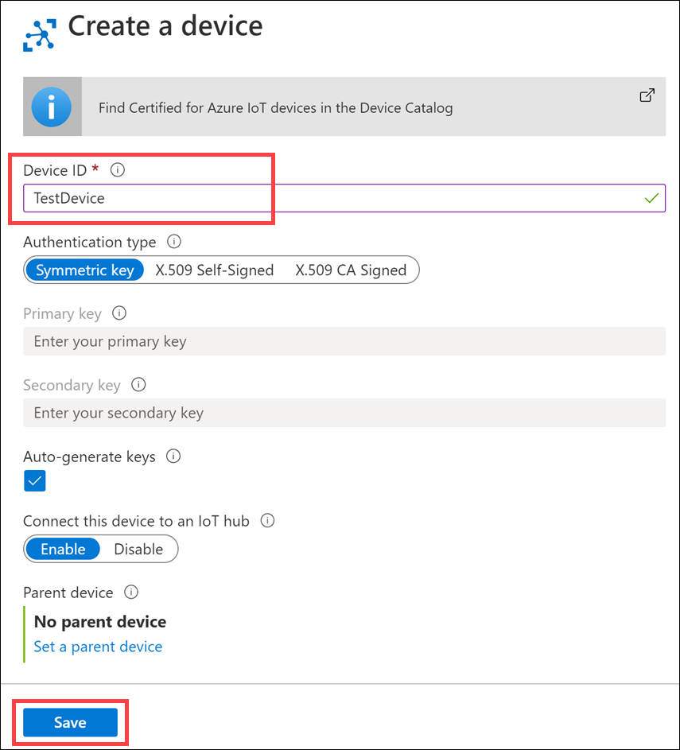

5. Select **Save**.

### Task 2: Save IoT device connection information (for AI camera)

1. Select the **TestDevice** that you just added.

    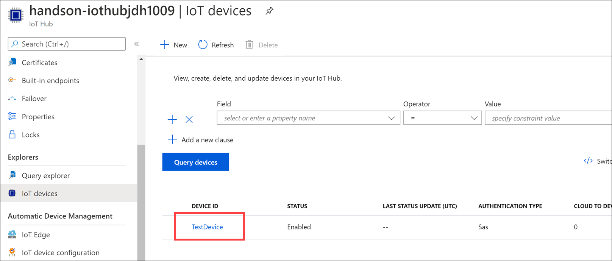

2. Copy the **Primary Connection String** and save it to a text editor, such as Notepad. This connection string is used to send stream data from IoT devices in subsequent work.

    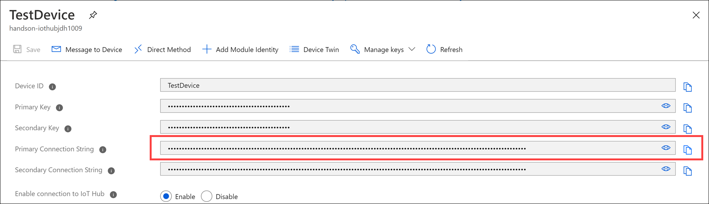

### Task 3: Register another IoT device (for weight sensor)

1. Navigate to the `synapse-lab-retail` resource group. In the Azure portal, use the top search bar to search for `synapse-lab-retail`, then select the **synapse-lab-retail** resource group in the search results under **Resource Groups**.

    

2. Within the resource group, select the **`handson-iothub-sensor + <unique suffix>`** IoT Hub account (notice there are two IoT Hub accounts - this one contains the word **sensor**).

    

3. Select **IoT devices** on the left-hand menu, then select **+ New**.

    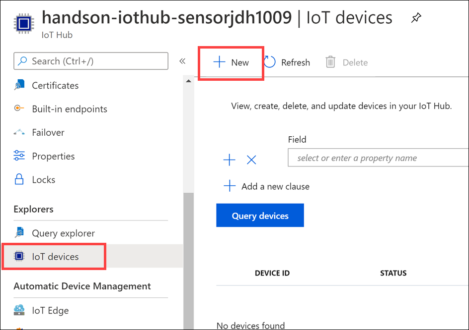

4. In the **Create a device** form, complete the following:

   | Field                          | Value                                              |
   | ------------------------------ | ------------------------------------------         |
   | Device ID                   | _enter `TestDevice`_              |
   | Authentication type                 | _select `Symmetric key`_                      |
   | Auto-generate keys           | _check the box_      |
   | Connect this device to an IoT hub | _select `Enable`_             |

   

5. Select **Save**.

### Task 4: Save IoT device connection information (for weight sensor)

1. Select the **TestDevice** that you just added.

    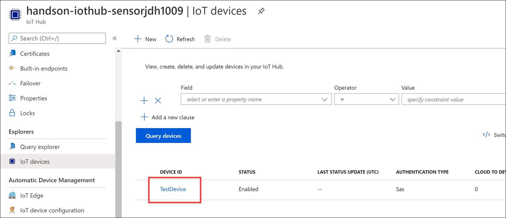

2. Copy the **Primary Connection String** and save it to a text editor, such as Notepad. This connection string is used to send stream data from IoT devices in subsequent work.

    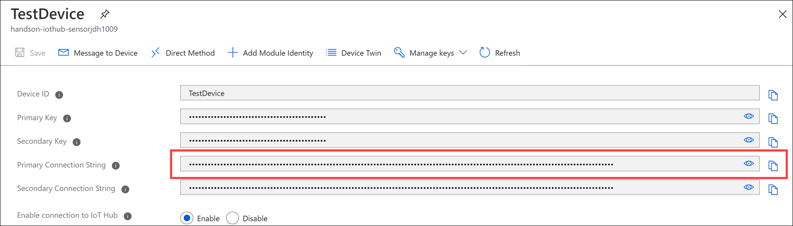

> **What is device registration?**
>
> Issue device IDs and connection keys by registering devices in IoT Hub. Using the issued IDs and keys enables secure communication between devices and the IoT Hub.

### Task 5: Stream Analytics (for AI cameras) input settings

1. Navigate to the `synapse-lab-retail` resource group. In the Azure portal, use the top search bar to search for `synapse-lab-retail`, then select the **synapse-lab-retail** resource group in the search results under **Resource Groups**.

    

2. Within the resource group, select the **`handson-SAJ + <unique suffix>`** Stream Analytics job.

    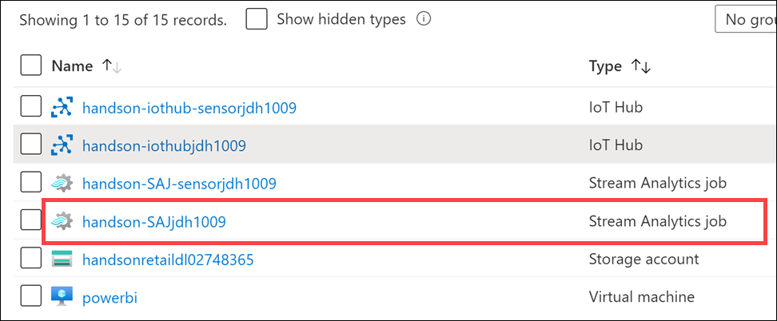

3. Select **Inputs** on the left-hand menu, select **+ Add stream input**, then select **IoT Hub** from the list.

    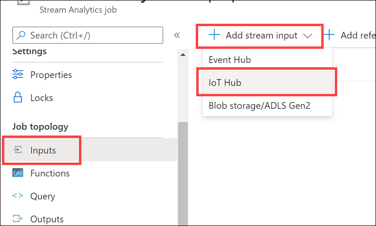

4. In the **IoT Hub** form, complete the following:

   | Field                          | Value                                              |
   | ------------------------------ | ------------------------------------------         |
   | Input alias                   | _enter `input`_              |
   | IoT Hub                 | _select `handson-iothub + <unique suffix>`_                      |
   | Endpoint           | _select `Messaging`_      |
   | Shared access policy name | _select `iothubowner`_             |
   | Consumer group | _select `handson-cg` (this was created for you by the ARM template)_ |
   | Event serialization format | _select `JSON`_ |
   | Encoding | _select `UTF-8`_ |
   | Event compression type | _select `None`_ |

   

5. Select **Save**.

### Task 6: Stream Analytics (for AI cameras) output settings

1. Select **Outputs** on the left-hand menu, select **+ Add**, then select **Blob storage/ADLS Gen2** from the list.

    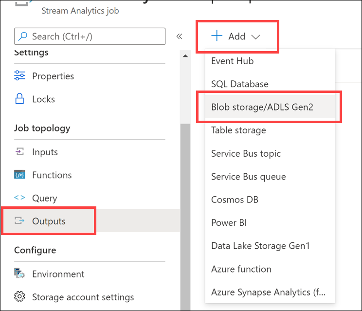

2. In the **Blob storage/ADLS Gen2** form, complete the following:

   | Field                          | Value                                              |
   | ------------------------------ | ------------------------------------------         |
   | Input alias                   | _enter `output`_              |
   | Storage account                 | _select `handsonretaildl + <unique suffix>`_                      |
   | Container           | _select `Use existing`, then select `shelfdata`_      |
   | Path pattern | _enter `tran/face/{datetime:yyyy}/{datetime:MM}/{datetime:dd}`_             |
   | Event serialization format | _select `JSON`_ |
   | Encoding | _select `UTF-8`_ |
   | Format | _select `Line separated`_ |
   | Minimum rows | _enter `100`_ |
   | Maximum time | _enter `1 minute`_ |
   | Authentication mode | _select `Connection string`_ |

   

   > **Minimum rows and maximum time**
   >
   > Must be specified when Parquet is selected in Event serialization format.
   >
   > **Minimum rows**: Minimum number of rows per batch. A new file is created for each batch.
   >
   > **Maximum time**: After a set amount of time and even if the minimum row count requirements are not met, the batch is written to the output.

3. Select **Save**.

### Task 7: Stream Analytics (for AI cameras) query settings

1. Select **Query** on the left-hand menu.

2. Enter the following query, then select **Save query**:

    ```sql
    SELECT
    face_id, date_time, age, gender
    INTO
    [output]
    FROM
    [input] TIMESTAMP BY date_time
    ```

    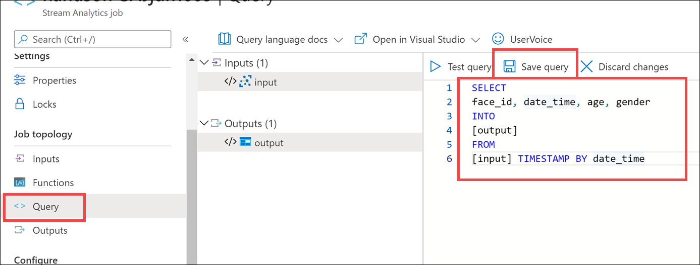

3. Select **Overview** on the left-hand menu, then select **Start**.

    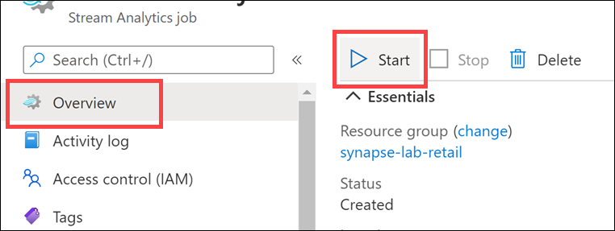

4. Select **Now** for the job output start time, then select **Start**.

    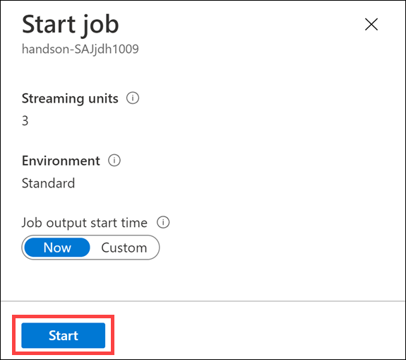

### Task 8: Stream Analytics (for weight sensors) input settings

1. Navigate to the `synapse-lab-retail` resource group. In the Azure portal, use the top search bar to search for `synapse-lab-retail`, then select the **synapse-lab-retail** resource group in the search results under **Resource Groups**.

    

2. Within the resource group, select the **`handson-SAJ-sensor + <unique suffix>`** Stream Analytics job.

    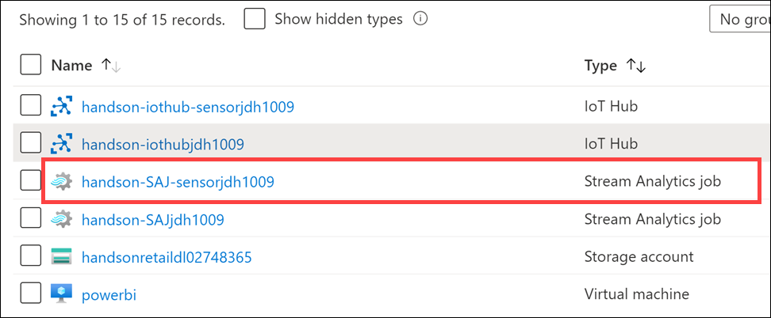

3. Select **Inputs** on the left-hand menu, select **+ Add stream input**, then select **IoT Hub** from the list.

    

4. In the **IoT Hub** form, complete the following:

   | Field                          | Value                                              |
   | ------------------------------ | ------------------------------------------         |
   | Input alias                   | _enter `input`_              |
   | IoT Hub                 | _select `handson-iothub-sensor + <unique suffix>`_                      |
   | Endpoint           | _select `Messaging`_      |
   | Shared access policy name | _select `iothubowner`_             |
   | Consumer group | _select `handson-cg` (this was created for you by the ARM template)_ |
   | Event serialization format | _select `JSON`_ |
   | Encoding | _select `UTF-8`_ |
   | Event compression type | _select `None`_ |

   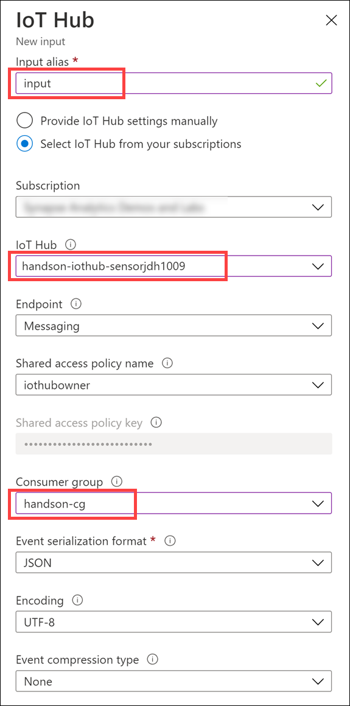

5. Select **Save**.

6. Select **+ Add reference input**.

    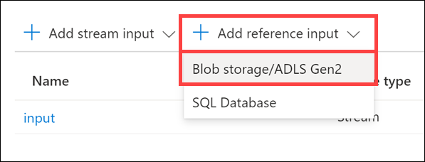

7. In the **IoT Hub** form, complete the following:

   | Field                          | Value                                              |
   | ------------------------------ | ------------------------------------------         |
   | Input alias                   | _enter `rf-m-item`_              |
   | Storage account                 | _select `synapselabretail` + unique id (example: `synapselabretail311170`) This is the ADLS Gen2 account created along with the Synapse Analytics workspace_                      |
   | Container           | _select `Use existing`, then select **`sampledata`**_      |
   | Path pattern | _enter `master/m_item/m_item.csv`_             |
   | Event serialization format | _select `CSV`_ |
   | Delimiter | _select `comma (,)`_ |
   | Encoding | _select `UTF-8`_ |

   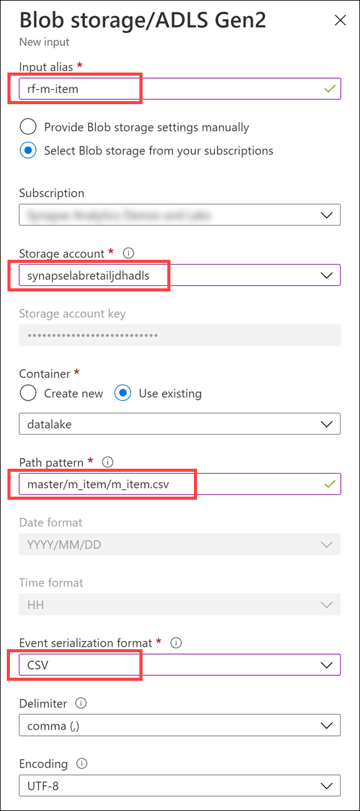

8. Select **Save**.

### Task 9: Stream Analytics (for weight sensors) output settings

1. Select **Outputs** on the left-hand menu, select **+ Add**, then select **Blob storage/ADLS Gen2** from the list.

    

2. In the **Blob storage/ADLS Gen2** form, complete the following:

   | Field                          | Value                                              |
   | ------------------------------ | ------------------------------------------         |
   | Input alias                   | _enter `output`_              |
   | Storage account                 | _select `handsonretaildl + <unique suffix>`_                      |
   | Container           | _select `Use existing`, then select `shelfdata`_      |
   | Path pattern | _enter `tran/sensor/{datetime:yyyy}/{datetime:MM}/{datetime:dd}`_             |
   | Event serialization format | _select `JSON`_ |
   | Encoding | _select `UTF-8`_ |
   | Format | _select `Line separated`_ |
   | Minimum rows | _enter `100`_ |
   | Maximum time | _enter `1 minute`_ |
   | Authentication mode | _select `Connection string`_ |

   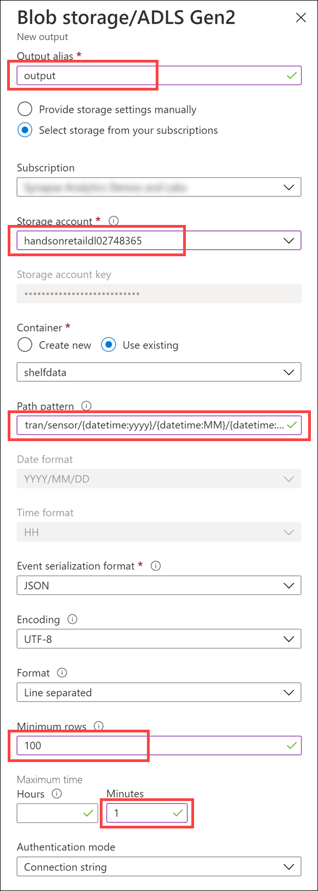

3. Select **Save**.

### Task 10: Stream Analytics (for weight sensors) query settings

1. Select **Query** on the left-hand menu.

2. Enter the following query, then select **Save query**:

    ```sql
    SELECT
      [input].face_id
    , [input].shelf_id
    , [input].sensor_no
    , [input].date_time
    , [input].sensor_weight
    , [input].diff_weight
    , [rf-m-item].item_genre
    , [rf-m-item].item_name
    , [rf-m-item].item_price
    INTO
        [output]
    FROM
        [input] TIMESTAMP BY date_time
    JOIN
        [rf-m-item]
        ON [input].shelf_id = [rf-m-item].shelf_id
        AND [input].sensor_no = [rf-m-item].sensor_no
    ```

    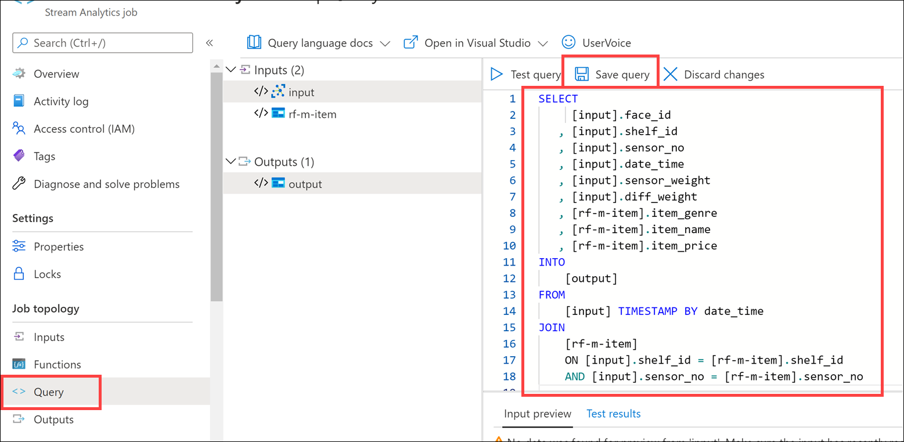

3. Select **Overview** on the left-hand menu, then select **Start**.

    

4. Select **Now** for the job output start time, then select **Start**.

    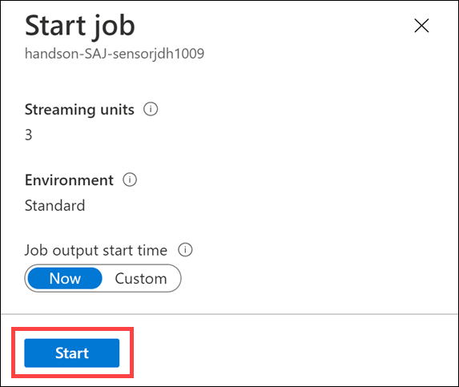

#### Additional information: Using reference data in Stream Analytics

Browse data stored in a SQL Database or Blob storage (including Azure Data Lake Storage Gen2) with Stream Analytics.

Imagine a use case where static or infrequently modified data is stored as reference data, which is combined with associated stream data from IoT devices.

The concept of this use is expressed in this hands-on training, as follows.

> ※ Direct output of Stream Analytics jobs at up to 200 MB/s to Azure Synapse dedicated SQL pools is now possible due to new Synapse features. In this scenario, you will output to the data lake.

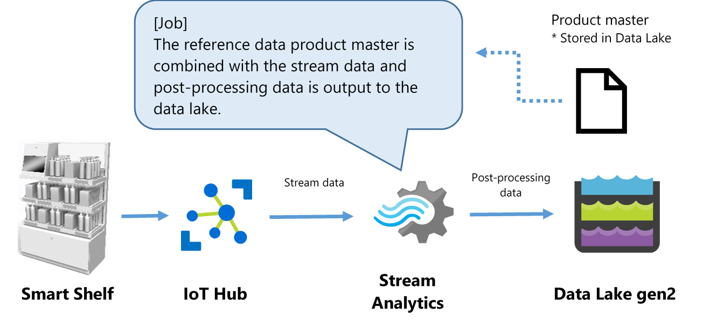

**Stream data (weight sensor)**

| face_id | shelf_id | sensor_no | date_time | sensor_weight | diff_weight |
| --- | --- | --- | --- | --- | --- |
| XXX | **01** | **02** | XXX | XXX | XXX |

**Product master**

| shelf_id | sensor_no | item_genre | item_name | item_price |
| --- | --- | --- | --- | --- |
| **01** | **02** | Produce | Apple | 100 |

**Post-processing data** ※ *Combines stream data and product master with shelf_id and sensor_no as the keys*

| face_id | shelf_id | sensor_no | date_time | sensor_weight | diff_weight | item_genre | item_name | item_price |
| --- | --- | --- | --- | --- | --- | --- | --- | --- |
| XXX | **01** | **02** | XXX |	XXX | XXX | Produce | Apple | 100 |

### Task 11: Prepare to send data

1. Log in to your lab VM.

2. Open Windows Explorer and navigate to **`C:\handson\program\`**.

3. Open **SendFaceData.js** in Notepad and replace the `connectionString` value between the single quotes (`'REPLACE-WITH-YOUR-CONNECTION-STRING'`) on **line 7** with the IoT device connection string that you copied in Task 2 (for AI camera).

    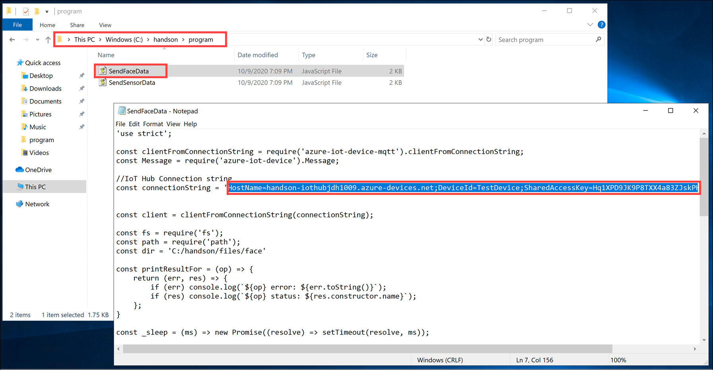

4. **Save** the file.

5. Open **SendSensorData.js** in Notepad and replace the `connectionString` value between the single quotes (`'REPLACE-WITH-YOUR-CONNECTION-STRING'`) on **line 7** with the IoT device connection string that you copied in Task 4 (for weight sensor).

    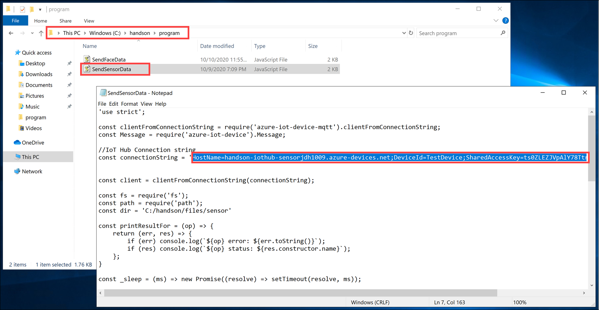

6. **Save** the file.

> **Connecting from an IoT device**
>
> Install IoT Hub Client (SDK) on the IoT device. Specify the connection string issued to the device when the device ID is registered via IoT Hub.
>
> 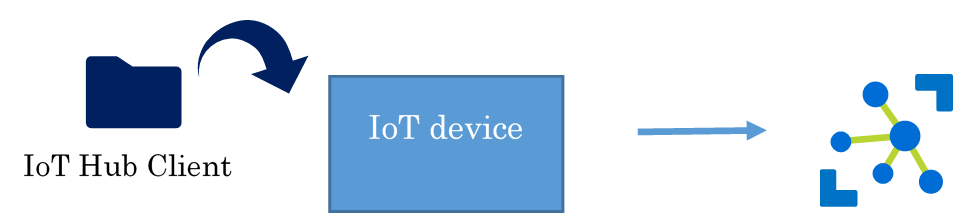

### Task 12: Send data

1. On your lab VM, open the **Command Prompt**. You can do this by clicking Start and entering `cmd` to find and select the Command Prompt app.

    

2. In the Command Prompt, execute `cd C:\handson\program` to change directories.

3. Install the required `azure-iot-device-mqtt` and `azure-iot-device` Node.js modules by executing the following command:

    ```cmd
    npm install
    ```

4. Send AI camera data by running the following command at the command prompt:

    ```cmd
    node SendFaceData.js
    ```

    In a few moments, the simulated IoT device will start sending telemetry to IoT Hub:

    

5. Allow the simulator to continue to run in the background. Open a **new Command Prompt** window.

6. In the new Command Prompt, execute `cd C:\handson\program` to change directories.

7. Send weight sensor data by running the following command at the command prompt:

    ```cmd
    node SendSensorData.js
    ```

    Just as happened in the other command prompt, the simulated IoT device will start sending telemetry to IoT Hub:

    

8. Allow the simulator to continue to run in the background while you continue the following steps.

### Task 13: Verify sent data

To verify that the IoT Hub devices are successfully retrieving the data, and that the Stream Analytics jobs are retrieving, processing, and writing the data to storage, perform the following steps:

1. Navigate to the `synapse-lab-retail` resource group. In the Azure portal, use the top search bar to search for `synapse-lab-retail`, then select the **synapse-lab-retail** resource group in the search results under **Resource Groups**.

    

2. Within the resource group, select the ADLS Gen2 account you created in Task 2, named **`handsonretaildl` + `<unique suffix>`**.

    

3. Select **Storage Explorer (preview)** in the left-hand menu **(1)**, expand Containers and select **shelfdata (2)**, then open the **tran** folder **(3)**. Verify that you see the **`face`** and **`sensor`** folders **(4)**. These are created by the two Stream Analytics jobs. If you don't see both folders, try refreshing the list after about a minute.

    

4. Confirm that a JSON file has been created in the following folders in the data lake:

    - AI camera data: `shelfdata/tran/face/YYYY/MM//DD/`
    - Weight sensor data: `shelfdata/tran/sensor/YYYY/MM//DD/`

    

    > ※ YYYY/MM/DD contains the current date.

## Exercise 3: Data aggregation

Time required: 40 minutes

In the data aggregation, after data collected in the data lake in various formats is processed with an ETL designed in the GUI, you will ingest it at high speed with distributed processing using Apache Spark and process it to the point where you create a data mart.

In this exercise, you will learn:

- **Apache Spark implementation**: Create a Synapse notebook within Synapse Studio, and implement data aggregation processing using Apache Spark.

- **Data flow construction**: Visually build an ETL pipeline in a code-free way in Synapse Studio to make subsequent processing of various data format files stored in the data lake easier.

- **Pipeline construction**: Build a data pipeline to periodically run a flow from data extraction, conversion, and loading to aggregation.

The diagram below shows the Synapse Studio elements that help us build the data pipeline:


### Task 1: Create notebook

1. Return to the `synapse-lab-retail` resource group and select the Azure Synapse Analytics workspace within.

    

2. Select the **Overview** blade in the left-hand menu, then select **Open** underneath **Open Synapse Studio** to navigate to Synapse Studio for this workspace.

    

3. In Synapse Studio, navigate to the **Data hub** in the left-hand menu.

    

4. Select the **Linked** tab **(1)**, expand `Azure Data Lake Storage Gen2`, expand the primary storage account, then select the **sampledata** container **(2)**. Navigate to **`tran\sensor\2020\04\01` (3)**, right-click on the JSON file **(4)**, select **New notebook (5)**, then select **Load to DataFrame (6)**.

    

5. In the new notebook, notice that Cell 1 is automatically populated with Python code that loads the JSON file into a new DataFrame, then displays the first 10 rows. Select **Run all** to execute the notebook.

    

    > Please note that it takes several minutes to execute the notebook for the first time. This is because the Spark pool needs to start and allocate resources.

    You should see an output similar to the following:

    

6. Hover below the cell and select **{} Add code** to add a new cell.

    

7. Execute the following code to load the DataFrame into a temporary table:

    ```python
    df = df.select("face_id","shelf_id","sensor_no","item_genre","item_name","date_time","sensor_weight","diff_weight")
    df.registerTempTable( "be_df_table" )
    ```

    > You can execute **Ctrl+Enter** to run the cell, or **Shift+Enter** to run the cell and create a new one below.

8. Execute the following in a new cell to aggregate data stored in the temporary view:

    ```python
    df = spark.sql("""
        SELECT
        SUBSTRING(date_time, 1, 10) as date
        ,shelf_id
        ,count(*) as count
        FROM be_df_table
        GROUP BY SUBSTRING(date_time, 1, 10), shelf_id
        ORDER BY SUBSTRING(date_time, 1, 10), shelf_id
        """
                )            
    df.registerTempTable( "af_df_table" )
    ```

9. Execute the following in a new cell to set the cell language to SQL and view the aggregation results:

    ```python
    %%sql
    SELECT * FROM af_df_table limit 5
    ```

    Your output should look similar to the following:

    

10. Execute the following in a new cell to write the aggregated data to the dedicated SQL pool, using the Spark SQL Analytics connector:

    ```scala
    %%spark
    val s_df = spark.sql("SELECT * FROM af_df_table")
    s_df.write.
        sqlanalytics("SqlPool.dbo.t_shelf_count", Constants.INTERNAL)
    ```

    > Spark SQL Analytics connector is only available in Scala, so we switch to Scala with `%%spark`.

11. After the cell finishes executing, navigate to the **Data hub**.

    

12. Select the **Workspace** tab **(1)**, expand **SqlPool** under Databases **(2)**, then expand the Tables list. If you do not see the `t_shelf_count` table, refresh the list. **Right-click** on the **`t_shelf_count`** table **(3)**, select **New SQL script (4)**, then **Select TOP 100 rows (5)**.

    

    You should see an output that looks similar to the following:

    

#### Apache Spark overview

Apache Spark is a distributed processing framework for high-speed processing of large-scale data. In contrast, with a similar distributed processing framework, Hadoop, which must frequently access the disk for IO, Spark is in-memory processing that saves data to the memory, so the IO overhead is smaller, and the overall execution speed is improved.

Spark on Synapse can be developed in Scala, Python, .NET, and SQL.


##### About Spark SQL Analytics connectors

Typically, when using JDBC, the data is transferred serially.
The risk of bottlenecks exists, but the import/export between the serverless Spark pool and dedicated SQL pool using PolyBase enables data to be transferred efficiently.

In addition, because authentication between systems uses a security token provided by Azure AD, it is not necessary to specify the authentication information in the program code.

##### Check job execution status

When you execute processing on the Synapse notebook, you can check the execution status and execution results on cell-by-cell basis.

Expand the job execution pane under the cell after execution completes to view the list of job executions:


You can check more details by selecting **View in monitoring**, and you can also check the Spark execution log.

> Select Synapse Studio > Monitor > Activities > Apache Spark applications to open the same screen.


### Task 2: Implement processing

By aggregating personal attributes of visitors acquired by AI cameras installed in a certain supermarket, you would like to investigate the number of visitors by gender and age.

Create a notebook (`face_count`) and implement the aggregation process for the reference below. When finished, run all cells to ensure that they are successful.

> The table created (`t_face_count`) will be used in data visualization in a later exercise.

#### File path to be aggregated (JSON format)

`abfss://sampledata@synapsehandson.dfs.core.windows.net/tran/face/2020/04/01/`

Sample data (data items: `face_id`, `date_time`, `age`, and `gender`):

```json
{"face_id":"051a09cb-822b-4baf-9cf6-dbdbc66c01e3","date_time":"2020-04-01T14:34:10.0000000","age":"70","gender":"female"}
{"face_id":"109f5625-0b2c-48a1-abb0-35f2c6d36ed6","date_time":"2020-04-01T14:34:05.0000000","age":"60","gender":"female"}
{"face_id":"1e21ac27-81fc-4456-bb09-cf9fa41f9e43","date_time":"2020-04-01T14:33:39.0000000","age":"40","gender":"female"}
```

#### Summary conditions: Number of visitors by gender and age group (per day)

- Use the GROUP BY function to aggregate with `date_time`, `gender`, and `age`.

    > In order to aggregate per day, date_time is converted to a format using the following SUBSTRING function: `⇒ SUBSTRING (date_time, 1, 10)`

- Use the COUNT function to count the number of records aggregated by `date`, `gender`, and `age`.
- Use the ORDER BY function to sort `date`, `gender`, and `age` in ascending order.

#### Table name of the aggregate data output destination: `t_face_count`

Sample data (data items: `date`, `gender`, `age`, and `count`):

| date | gender | age | count |
| --- | --- | --- | --- |
| 2020/04/01 | female | 10 | 7 |
| 2020/04/01 | female | 20 | 8 |
| 2020/04/01 | female | 30 | 14 |

1. Navigate to the **Develop hub**.

    

2. Select **+**, then select **Notebook**.

    

3. Set the notebook name to **item_count** under the Properties.

    

4. Select **{} Add code** to add a new cell to the notebook.

5. Paste the following into the cell. Replace **`YOUR_DATA_LAKE_NAME`** with the name of the primary ADLS Gen2 account for your Synapse workspace (ex. `synapselabretail` + unique id):

    ```python
    file_path = 'abfss://sampledata@YOUR_DATA_LAKE_NAME.dfs.core.windows.net/out/join/'
    ```

    > Running the notebook at this point will result in an error. Please Publish without running, after adding the remaining cells.

6. Add the following to a new cell to load the file to a new Spark DataFrame and store the data in a new Spark temporary view:

    ```python
    df = spark.read.load(file_path, format='parquet')
    df = df.select("face_id","shelf_id","sensor_no","item_genre","item_name","date_time","sensor_weight","diff_weight","age","gender")
    df.registerTempTable( "be_df_table" )
    ```

7. Add the following to a new cell to aggregate the data stored in the temporary view:

    ```python
    grp_df = spark.sql("""
        SELECT
        SUBSTRING(date_time, 1, 10) AS date
        ,gender
        ,age
        ,item_genre
        ,item_name
        ,count(*) as item_count
        FROM be_df_table
        GROUP BY SUBSTRING(date_time, 1, 10), gender, age, item_genre, item_name
        ORDER BY SUBSTRING(date_time, 1, 10), gender, age, item_genre, item_name
        """
                )
    ```

8. Add the following to a new cell to output to the data lake in Parquet format. Replace **`YOUR_DATA_LAKE_NAME`** with the name of the primary ADLS Gen2 account for your Synapse workspace, which is the same value you added to Cell 1:

    ```python
    output_path = "abfss://sampledata@YOUR_DATA_LAKE_NAME.dfs.core.windows.net/out/item_count/"
    grp_df.write.mode("overwrite").parquet(output_path)
    ```

    Your completed notebook should look similar to the following:

    

9. Select **Publish all**, then **Publish** to save your notebook.

    

### Task 3: Create a table for the pipeline

1. Navigate to the **Data hub**.

    

2. Select the **Workspace** tab **(1)**, expand Databases and right-click on **SqlPool (2)**. Select **New SQL script (3)**, then **Empty script (4)**.

    

3. Paste the following script and **Run** it to create a new `t_item_count` table:

    ```sql
    CREATE TABLE [dbo].[t_item_count]
    (
        [date] [nvarchar](4000)  NULL,
        [gender] [nvarchar](4000)  NULL,
        [age] [nvarchar](4000)  NULL,
        [item_genre] [nvarchar](4000)  NULL,
        [item_name] [nvarchar](4000)  NULL,
        [item_count] [bigint]  NULL
    )
    ```

### Task 4: Enable interactive authoring on the integration runtime

The interactive authoring capability is used during authoring for functionalities like testing the connection, browsing and previewing data, and importing a schema inside a managed Virtual Network.

1. Navigate to the **Manage hub**.

    

2. Select **Integration runtimes** in the left-hand menu, then select the **AutoResolveIntegrationRuntime**.

    

3. Select **Enable** next to `Interactive authoring`, then **Apply**.

    

    > It takes about 1 to 2 minutes to turn on interactive authoring.

### Task 5: Create a dataset for weight sensor data

1. Navigate to the **Data hub**.

    

2. Select **+**, then **Integration dataset**.

    

3. Select **Azure Data Lake Storage Gen2**, then select **Continue**.

    

4. Select **Json** on the format selection screen, then select **Continue**.

    

5. In the dataset properties form, complete the following:

   | Field                          | Value                                              |
   | ------------------------------ | ------------------------------------------         |
   | Name | _enter `input_sensor`_ |
   | Linked service | _select `AzureDataLakeStorage1` (This is the linked service that you created at the beginning of the lab)_ |
   | File path | _enter `sampledata` for the file system, then enter `tran/sensor/2020/04/01` for the directory_ |
   | Import schema | _select `From connection/store`_ |

   

6. Select **OK**.

7. After the dataset creation completes, open it and select **Test connection** to verify that the connection is successful. You may also choose to preview the data here.

    

### Task 6: Create a dataset for AI camera data

1. Navigate to the **Data hub**.

    

2. Select **+**, then **Integration dataset**.

    

3. Select **Azure Data Lake Storage Gen2**, then select **Continue**.

    

4. Select **Json** on the format selection screen, then select **Continue**.

    

5. In the dataset properties form, complete the following:

   | Field                          | Value                                              |
   | ------------------------------ | ------------------------------------------         |
   | Name | _enter `input_face`_ |
   | Linked service | _select `AzureDataLakeStorage1` (This is the linked service that you created at the beginning of the lab)_ |
   | File path | _enter `sampledata` for the file system, then enter `tran/face/2020/04/01` for the directory_ |
   | Import schema | _select `From connection/store`_ |

   

6. Select **OK**.

### Task 7: Create a dataset for intermediate output

1. Navigate to the **Data hub**.

    

2. Select the **Linked** tab **(1)**, expand Azure Data Lake Storage Gen2, expand the linked service for the primary storage account, then select **sampledata (2)**. Select **+ New folder**.

    

3. Enter **`out`** for the new folder name, then select **Create**.

    

4. Open the new `out` folder, then select **+ New folder** to create a sub-folder.

    

5. Enter **`join`** for the new folder name, then select **Create**.

    

6. Select **+ New folder** again to create a new folder under the `out` folder.

    

7. Enter **`item_count`** for the new folder name, then select **Create**.

    

8. Select **+**, then **Integration dataset**.

    

9. Select **Azure Data Lake Storage Gen2**, then select **Continue**.

    

10. Select **Parquet** on the format selection screen, then select **Continue**.

    

11. In the dataset properties form, complete the following:

   | Field                          | Value                                              |
   | ------------------------------ | ------------------------------------------         |
   | Name | _enter `output_data`_ |
   | Linked service | _select `AzureDataLakeStorage1` (This is the linked service that you created at the beginning of the lab)_ |
   | File path | _enter `sampledata` for the file system, then enter `out/join` for the directory_ |
   | Import schema | _select `From connection/store`_ |

   

11. Select **OK**.

12. Select **Publish all**, then **Publish** to save all of your datasets.

    

### Task 8: Create a data flow

1. Navigate to the **Develop hub**.

    

2. Select **+**, then **Data flow**.

    

3. Enter **JoinSensorFace** for the name under Properties, then select the **Properties** button to hide the pane.

    

4. Select **Add Source** on the data flow canvas.

    

5. In the **Source settings** form, complete the following:

   | Field                          | Value                                              |
   | ------------------------------ | ------------------------------------------         |
   | Output stream name | _enter `sensor`_ |
   | Source type | _select `Dataset`_ |
   | Options | _uncheck all_ |
   | Sampling | _select `Disable`_ |

   

6. Turn on **Data flow debug** at the top of the data flow screen, then select **OK** in the dialog that appears.

    > It will take about 3-4 minutes for the debug to turn on.

    

    **Tip:** Handling schema errors:

    When the fields in the input data (Source) frequently change, the data flow's built-in generic data conversion logic enables you to ingest errors flexibly. Select Allow Schema drift in Options when adding a Source or Sink, to import and write all fields sent and received in addition to the column and type defined in the Data flow in advance.

    Moreover, when you select Infer drifted column types in Options, the data type of columns not defined in advance (errors) will be assumed automatically.

    

    **Tip:** Concept of partitioning:

    In Data flow, Optimize allows you to set partitioning. The default Use current partitioning is recommended in most cases, and the native partitioning scheme is used for data flows running on Apache Spark. As an exception, if you want to output data to a single file in the data lake, select Single partition.

    You can also select Set Partitioning to select the best partition from `PartitionType`. For more information about each partition, see the following URL: <https://docs.microsoft.com/azure/data-factory/concepts-data-flow-overview>.

    

7. After the data flow debugger turns on, select the **Data preview** tab to ensure that you can see the source sensor data.

    

8. Select **Add Source** on the data flow design canvas to add another data source.

    

9. In the **Source settings** form, complete the following:

    | Field                          | Value                                              |
    | ------------------------------ | ------------------------------------------         |
    | Output stream name | _enter `sensor`_ |
    | Source type | _select `Dataset`_ |
    | Options | _uncheck all_ |
    | Sampling | _select `Disable`_ |

    

10. Select the **Data preview** tab to ensure that you can see the source face data.

    

11. On the data flow canvas, select **+** on the lower-right corner of `sensor`, then select **Join** from the context menu.

    

12. In the **Join settings** form, complete the following:

    | Field                          | Value                                              |
    | ------------------------------ | ------------------------------------------         |
    | Output stream name | _enter `JoinData`_ |
    | Left stream | _select `sensor`_ |
    | Right stream | _select `face`_ |
    | Join type | _select `Left outer`_ |
    | Join conditions | _Left: sensor's column: `face_id` `==` Right: face's column: `face_id`_ |

    

13. Select the **Data preview** tab to verify the data merge.

    

14. On the data flow canvas, select **+** on the lower-right corner of `JoinData`, then select **Select** from the context menu.

    

15. In the **Select settings** form, complete the following:

    | Field                          | Value                                              |
    | ------------------------------ | ------------------------------------------         |
    | Output stream name | _enter `SelectColumn`_ |
    | Incoming stream | _select `JoinData`_ |
    | Skip duplicate input columns | _checked_ |
    | Skip duplicate output columns | _checked_ |
    | Auto mapping | _off_ |
    | Input columns | _all checked_ |

    

16. Select the **Data preview** tab to verify the data merge.

    

17. On the data flow canvas, select **+** on the lower-right corner of `SelectColumn`, then select **Sink** from the context menu.

    

18. In the **Sink** form, complete the following:

    | Field                          | Value                                              |
    | ------------------------------ | ------------------------------------------         |
    | Output stream name | _enter `OutputData`_ |
    | Incoming stream | _select `SelectColumn`_ |
    | Sink type | _select `Dataset`_ |
    | Dataset | _select `output_data`_ |
    | Allow schema drift | _checked_ |
    | Validate schema | _unchecked_ |

    

19. Select the **Settings** tab. In the **Settings** form, complete the following:

    | Field                          | Value                                              |
    | ------------------------------ | ------------------------------------------         |
    | Clear the folder | _unchecked_ |
    | File name option | _select `Pattern`_ |
    | Pattern | _enter `sensor_face_join[n].parquet`_ |

    > The `[n]` token gets replaced with the partition number.

    

20. Select the **Mapping** tab. In the **Mapping** form, complete the following:

    | Field                          | Value                                              |
    | ------------------------------ | ------------------------------------------         |
    | Skip duplicate input columns | _unchecked_ |
    | Skip duplicate output columns | _unchecked_ |
    | Auto mapping | _on_ |

    

    The completed data flow should look like the following:

    

21. Select **Publish all**, then **Publish** to save your data flow.

    

### Task 9: Create a pipeline

1. Navigate to the **Integrate hub**.

    

2. Select **+**, then select **Pipeline**.

    

3. Set the pipeline name to **SensorFacePipeline** in the Properties settings, then select the **Properties** button to hide the pane.

    

4. Expand **Move & transform** in the Activities list, then drag the **Data flow** activity onto the design canvas.

    

5. In the `Adding data flow` form, select **Use existing data flow**, then select the **JoinSensorFace** data flow. Select **OK**.

    

6. Expand **Synapse** in the Activities list, then drag the **Notebook** activity to the right of the data flow activity.

    

7. Select the Notebook activity, then set the Name to **ItemCount**.

    

8. Select the **Settings** tab, then set the Notebook to **item_count**.

    

9. On the pipeline canvas, draw a green arrow from the `JoinSensorFace` activity to the `ItemCount` activity. This configures the notebook activity as a successor to the data flow activity.

    

10. Expand **Move & transform** in the Activities list, then drag the **Copy data** activity to the right of the notebook activity.

    

11. Select the copy data activity, then set the Name to **CopyData**.

    

12. Select the **Source** tab, then select **+ New** next to the source dataset.

    

13. Select **Azure Data Lake Storage Gen2**, then select **Continue**.

    

14. Select **Parquet** on the format selection screen, then select **Continue**.

    

15. In the dataset properties form, complete the following:

    | Field                          | Value                                              |
    | ------------------------------ | ------------------------------------------         |
    | Name | _enter `input_item_count`_ |
    | Linked service | _select `AzureDataLakeStorage1` (This is the linked service that you created at the beginning of the lab)_ |
    | File path | _enter `sampledata` for the file system, then enter `out/item_count` for the directory_ |
    | Import schema | _select `From connection/store`_ |

    

    > The `sampledata/out/item_count` files will be created by the `item_count` notebook.

16. Select **OK**.

17. With the new `input_item_count` source dataset selected, configure the following settings in the **Source** tab:

    | Field                          | Value                                              |
    | ------------------------------ | ------------------------------------------         |
    | File path type | _select `Wildcard file path`_ |
    | Wildcard paths | _enter `out/item_count` for the wildcard folder path, then enter `*.*` for the wildcard file name_ |

    

18. Select the **Sink** tab, then select **+ New** next to the sink dataset.

    

19. Select **Azure Synapse dedicated SQL pool**, then select **Continue**.

    

20. In the dataset properties form, complete the following:

    | Field                          | Value                                              |
    | ------------------------------ | ------------------------------------------         |
    | Name | _enter `output_item_count`_ |
    | Azure Synapse dedicated SQL pool | _select `SqlPool`_ |
    | Table name | _select `dbo.t_item_count`_ |
    | Import schema | _select `From connection/store`_ |

    

21. Select **OK**.

22. Verify that `output_item_count` is the selected sink dataset, then set the `Copy method` to **Bulk insert** and paste the following SQL script into the **Pre-copy script** field:

    ```sql
    TRUNCATE TABLE [dbo].[t_item_count]
    ```

    

    > If we wanted to use PolyBase instead, we would be required to perform some additional steps since we are using VNet service endpoints. Namely, we would need to execute a PowerShell script to assign an identity to Azure Active Directory for the Synapse workspace. Reference: <https://docs.microsoft.com/azure/azure-sql/database/vnet-service-endpoint-rule-overview#impact-of-using-vnet-service-endpoints-with-azure-storage>

23. On the pipeline canvas, draw a green arrow from the `ItemCount` notebook activity to the `CopyData` activity. This configures the copy data activity as a successor to the notebook activity.

    

24. Select **Publish all** in the top-left corner of Synapse Studio.

    

25. Make sure the new pipeline and two new datasets are included, then select **Publish**.

    

26. Select **Add trigger**, then **Trigger now** above the pipeline canvas.

    

27. Run the pipeline by selecting **OK**.

    > It will take about 10 minutes to complete the pipeline run.

    

### Task 10: Confirm pipeline run

1. Navigate to the **Monitor hub**.

    

2. Select **Pipeline runs**. Verify that the status of the `SensorFacePipeline` is running (In progress). You may need to refresh the list to see the pipeline.

    > Data created by running the pipeline will be used in the data visualization exercise.

    

3. Select the **SensorFacePipeline** name to view the status details.

    

4. You can view the status of each pipeline activity in this view.

    

5. Hover over the **JoinSensorFace** activity (if it is completed), then select the **Output** icon.

    

6. You can view the output details in JSON format.

    

7. Hover over the **JoinSensorFace** activity, then select the **Data flow details** icon.

    

8. Select each activity to view its details, including the run time and number of processes for each operation. In the screenshot below, we have selected the **OutputData** activity, and see the data mapping details, data statistics, and partition information.

    

## Exercise 4: Data analysis

Time required: 15 minutes

### Synapse serverless SQL pool overview

It is possible to run queries directly on-demand for data in any format in the data lake. As shown in the following table, there are differences between serverless (on-demand) SQL pools and dedicated SQL pools:

| Feature | Synapse dedicated SQL pools | Synapse serverless SQL pools |
| --- | --- | --- |
| Connections | Yes | Yes |
| Resource classes and concurrency | Yes | No |
| Transactions | Yes | No |
| User-defined schemas | Yes | Yes |
| Table distribution | Yes | No |
| Table indexes | Yes |No |
| Table partitions | Yes | No |
| Statistics | Yes | Yes |
| CTAS | Yes | No |
| External tables | Yes | Yes |
| CETAS | Yes | Yes |

As an example, dedicated SQL pools are used for boilerplate analysis in day-to-day work, whereas serverless SQL pools are used for on-the-fly analysis.


### Task 1: Data exploration

1. Navigate to the **Data hub**.

    

2. Select the **Linked** tab **(1)**, expand the Azure Data Lake Storage Gen2 group, then expand the primary storage account for the workspace. Select the **sampledata** container **(2)**, then navigate to the **`tran/face/parquet`** folder **(3)**. Right-click on the **`face_data.snappy.parquet`** file **(4)**, select **New SQL script (5)**, then select **Select TOP 100 rows**.

    

3. **Run** the script and verify that you can view the file results.

    

4. **Copy the data lake account name** and save it to Notepad or similar text editor. You will use it in additional scripts below.

    

    When you run a SQL script on a serverless SQL pool, you can load the file data from the data lake and other sources and handle the data as if stored in a database.

    

    > **Explore multiple files**
    >
    > By using a wildcard (*) for the file path specified by OPENROWSET, you can query multiple files that meet the criteria.
    >
    > Example: `https: //<storage name>.dfs.core.windows.net/<file system name>/tran/join/2020/*/*`

### Task 2: Data exploration in a variety of formats (CSV format)

Serverless SQL pools let you run queries for various data file formats, including CSV.

1. Replace the script with the following to query a CSV file. **Replace** `YOUR_ADLS_ACCOUNT_NAME` with the name of your workspace's primary data lake account that you copied in the previous step.

    ```sql
    SELECT *
    FROM OPENROWSET
    (
        BULK 'abfss://sampledata@YOUR_ADLS_ACCOUNT_NAME.dfs.core.windows.net/master/m_item/m_item.csv'
        , FORMAT = 'CSV'
        , FIELDTERMINATOR =','
        , ROWTERMINATOR = '\n'
        , FIRSTROW=2
    )
    WITH
    (
        shelf_id VARCHAR(100),
        sensor_no VARCHAR(100),
        item_genre VARCHAR(100),
        item_name VARCHAR(100),
        item_price INT
    ) AS [r]
    ```

2. **Run** the script and verify that you can view the file results.

    

### Task 3: Data exploration in a variety of formats (JSON format)

1. Replace the script with the following to query a JSON file. **Replace** `YOUR_ADLS_ACCOUNT_NAME` with the name of your workspace's primary data lake account that you copied in the previous step.

    ```sql
    WITH SENSOR AS(SELECT 
        JSON_VALUE(jsonContent, '$.face_id') AS face_id,
        JSON_VALUE(jsonContent, '$.shelf_id') AS shelf_id,
        JSON_VALUE(jsonContent, '$.sensor_no') AS sensor_no,
        JSON_VALUE(jsonContent, '$.item_genre') AS item_genre,
        JSON_VALUE(jsonContent, '$.item_name') AS item_name,
        JSON_VALUE(jsonContent, '$.date_time') AS date_time,
        JSON_VALUE(jsonContent, '$.sensor_weight') AS sensor_weight,
        JSON_VALUE(jsonContent, '$.diff_weight') AS diff_weight
    FROM 
        OPENROWSET(
            BULK 'abfss://sampledata@YOUR_ADLS_ACCOUNT_NAME.dfs.core.windows.net/tran/sensor/*/*/*/*.json',
            FORMAT='CSV',
            FIELDTERMINATOR ='0x0b',
            FIELDQUOTE = '0x0b'
        )
        WITH (
            jsonContent varchar(300)
        ) AS [r]
    )
    SELECT TOP 10 * FROM SENSOR;
    ```

2. **Run** the script and verify that you can view the file results.

    

### Task 4: Data analysis

1. Replace the script with the following to analyze products popular with thirty-year-olds. **Replace** `YOUR_ADLS_ACCOUNT_NAME` with the name of your workspace's primary data lake account that you copied in the previous step.

    ```sql
    WITH SENSOR as (SELECT 
        JSON_VALUE(jsonContent, '$.face_id') AS face_id,
        JSON_VALUE(jsonContent, '$.shelf_id') AS shelf_id,
        JSON_VALUE(jsonContent, '$.sensor_no') AS sensor_no,
        JSON_VALUE(jsonContent, '$.item_genre') AS item_genre,
        JSON_VALUE(jsonContent, '$.item_name') AS item_name,
        JSON_VALUE(jsonContent, '$.date_time') AS date_time,
        JSON_VALUE(jsonContent, '$.sensor_weight') AS sensor_weight,
        JSON_VALUE(jsonContent, '$.diff_weight') AS diff_weight
    FROM 
        OPENROWSET(
            BULK 'abfss://sampledata@YOUR_ADLS_ACCOUNT_NAME.dfs.core.windows.net/tran/sensor/*/*/*/*.json',
            FORMAT='CSV',
            FIELDTERMINATOR ='0x0b',
            FIELDQUOTE = '0x0b'
        )
        WITH (
            jsonContent varchar(300)
        ) AS [r]
    ),
    FACE as (SELECT 
        JSON_VALUE(jsonContent, '$.face_id') AS face_id,
        JSON_VALUE(jsonContent, '$.shelf_id') AS shelf_id,
        JSON_VALUE(jsonContent, '$.age') AS age,
        JSON_VALUE(jsonContent, '$.gender') AS gender
    FROM 
        OPENROWSET(
            BULK 'https://YOUR_ADLS_ACCOUNT_NAME.dfs.core.windows.net/sampledata/tran/face/2020/04/01/',
            FORMAT='CSV',
            FIELDTERMINATOR ='0x0b',
            FIELDQUOTE = '0x0b'
        )
        WITH (
            jsonContent varchar(200)
        ) AS [r]
    )
    SELECT 
        top 5 f.age,
        s.item_name,
        count(*) as count
    FROM 
        SENSOR s
    JOIN FACE f ON s.face_id = f.face_id
    WHERE
        f.age = 30
    GROUP BY
        f.age, s.item_name
    ORDER BY
        f.age,count DESC
    ```

2. **Run** the script then select the **Chart** view in the query results.

    

3. In the Chart visualization form, set the **Chart type** to `Bar`, **Category column** to `item_name`, then **Legend (series) columns** to `count`.

    

## Exercise 5: Data visualization

Time required: 15 minutes

### Task 1: Login to Power BI

1. In a new browser tab, navigate to <https://powerbi.microsoft.com/>.

2. Sign in with the same account used to sign in to Azure by selecting the **Sign in** link on the upper-right corner.

### Task 2: Create a Power BI workspace

1. Select **Workspaces**, then select **Create a workspace**.

    

2. Set the name to **SynapseRetail** + `<unique id>` (where `<unique id>` is the unique id provided to you for your hosted environment, or your initials), then select **Save**.

    

### Task 3: Connect to Power BI from Synapse

1. Switch back to Synapse Studio, then navigate to the **Manage hub**.

    

2. Select **Linked services** on the left-hand menu, then select **+ New**.

    

3. Select **Power BI**, then select **Continue**.

    

4. In the dataset properties form, complete the following:

    | Field                          | Value                                              |
    | ------------------------------ | ------------------------------------------         |
    | Name | _enter `handson_powerbi`_ |
    | Workspace name | _select `SynapseRetail` + `<unique id>` (the name of the workspace you created)_ |

    

5. Select **Create**.

### Task 4: Create a Power BI dataset

1. Navigate to the **Develop hub**.

    

2. Expand the `Power BI` group, then expand **SynapseRetail**. Select **Power BI datasets**, then select **+ New Power BI dataset**.

    

3. If you see a dialog stating you need to install Power BI Desktop, select **Start** to continue.

    

4. Under "Select a data source", select **SqlPool**, then select **Continue**.

    

5. Select **Download** to save `SynapseRetailSqlPool.pbids` to a local folder.

    

6. Open the downloaded **.pbids** file.

    

7. After Power BI Desktop launches, you will be prompted to enter credentials for the dataset. Select **Microsoft account** in the left-hand menu, then click **Sign in** and enter your credentials you are using for this lab.

    

8. After signing in, click **Connect**.

    

9. In the Navigator, check **t_item_count** and **t_shelf_count**, then click **Load**.

    

10. Select **Import**, then click **OK**.

    

11. After the data retrieval is complete, select **File**, then **Save as...**. Set the file name to **`sample1`**, then click **Save** to save the `.pbix` file locally.

    

12. Click **Publish**. If you are prompted to sign in, enter your email address and click **Sign in**. Use your same account you are using for this lab.

    

    > If the following error occurs, sign out and sign in again: "Only users with Power BI Pro licenses can publish to this workspace."

13. Select the **SynapseRetail** Power BI workspace, then click **Select**.

    

14. Return to Synapse Studio, then select **Refresh** and verify that the **`sample1`** dataset appears in the Power BI datasets list.

    

15. Expand **Power BI reports** in the left-hand menu, then select the **sample1** report.

    

16. Create a visualization to show the ratio of men to women who stand in front of shelves. Select the **Pie chart** visualization. Expand `t_item_count`, then drag `gender` to **Legend** and `item_count` to **Values**.

    

17. With the pie chart selected, select the **Format** tab and configure the following:

    | Field                          | Value                                              |
    | ------------------------------ | ------------------------------------------         |
    | Title text | _enter `Gender Ratio`_ |
    | Font color | _select `White`_ |
    | Background color | _select `Navy blue`_ |
    | Alignment | _select `Center`_ |
    | Text size | _select `22 pt`_ |

    

### Task 5: Challenge - Add visualizations for age groups and genders

Referring to the steps in the previous task, add two new chart visualizations to your report that show the ratio of the number of people who stand in front of the shelf by age and gender.

1. Create two new visualizations with the following characteristics:

   - **Field:** `t_item_count` table:
     - `age`
     - `gender`
     - `item_count`
   - **Visualization:** Donut chart
   - **Title:**
     - `Ratio by Age Group (Male)`
     - `Ratio by Age Group (Female)`

2. Adjust the chart format and colors as preferred.

3. Use the **Filters** pane on each chart to filter on only males or females, respectively.

When you are done, your charts should look similar to the following:


### Task 6: Challenge - Add visualization for changes in the number of times product touched

Add a new visualization to show the changes in the number of times the product has been picked up per timeframe.

1. Create one new visualization with the following characteristics:

   - **Field:** `t_shelf_count` table:
     - `date`
     - `count`
     - `shelf_id`
   - **Visualization:** Line chart
   - **Title:** `Changes in Number Times Product Touched`

2. Adjust the chart format and colors as preferred.

When you are done, your chart should look similar to the following:


### Task 7: Challenge - Add visualization for visitor attribute analysis

Add a new table chart visualization to dhow the personal attributes (age and gender) of the number of times the product was touched.

1. Create one new visualization with the following characteristics:

   - **Field:** `t_item_count` table:
     - `item_genre`
     - `item_name`
     - `age`
     - `gender`
     - `item_count`
   - **Visualization:** Table
   - **Title:** `Visitor Attribute Analysis (by Product)`

2. Adjust the chart format and colors as preferred.

3. In "Values" on the Field tab, double-click the table item name to edit it. Edit the field names as follows:

    | Field                          | Rename to |
    | ------------------------------ | ------------------------------------------         |
    | `item_genre` | `Genre` |
    | `item_name` | `Name` |
    | `age` | `Age` |
    | `gender` | `Gender` |
    | `item_count` | `Times Touched` |

4. Click the name of the table item on the chart to change the sort key. Example: Select the number of times touched to sort in order of the number of times touched.

5. Select **Save** to save changes to your report.

    

When you are done, your chart should look similar to the following:


