# Azure Synapse in a day demos - Intelligent retail

- [Azure Synapse in a day demos - Intelligent retail](#azure-synapse-in-a-day-demos---intelligent-retail)
  - [Pre-requisites](#pre-requisites)
  - [Exercise 1: Environment setup](#exercise-1-environment-setup)
    - [Task 1: Create an Azure Synapse workspace](#task-1-create-an-azure-synapse-workspace)
    - [Task 2: Set up blob data owner](#task-2-set-up-blob-data-owner)
    - [Task 3: Set up user access administrator](#task-3-set-up-user-access-administrator)
    - [Task 4: Create a SQL pool](#task-4-create-a-sql-pool)
    - [Task 5: Create an Apache Spark pool](#task-5-create-an-apache-spark-pool)
    - [Task 6: Prepare a Virtual Machine to run data generator and Power BI Desktop](#task-6-prepare-a-virtual-machine-to-run-data-generator-and-power-bi-desktop)
    - [Task 7: Download lab files](#task-7-download-lab-files)
    - [Task 8: Install Azure Storage Explorer and upload lab files](#task-8-install-azure-storage-explorer-and-upload-lab-files)
  - [Exercise 2: Deploy resources for the data collection step](#exercise-2-deploy-resources-for-the-data-collection-step)
    - [Task 1: Deploy ARM template](#task-1-deploy-arm-template)
    - [Task 2: Create Azure Data Lake Storage Gen2 account](#task-2-create-azure-data-lake-storage-gen2-account)
  - [Lab guide](#lab-guide)

## Pre-requisites

To complete this lab, you must meet the following pre-requisites:

1. Microsoft Azure subscription must be pay-as-you-go or MSDN.

    a. Trial subscriptions will not work.

2. [Power BI Pro license](https://powerbi.microsoft.com/power-bi-pro/) (can start a trial version of Pro).

## Exercise 1: Environment setup

Time required: 40 minutes

To perform this hands-on training, you will prepare the following items in this exercise:

- Create an Azure Synapse workspace
- Create a SQL pool
- Create an Apache Spark pool
- Create an Azure VM
  - Install Power BI Desktop
  - Install Node.js
- Download lab files

### Task 1: Create an Azure Synapse workspace

1. Navigate to the Azure portal (<https://portal.azure.com>) to create the Azure Synapse Analytics workspace.

2. In the search menu, type **Synapse**, then select **Azure Synapse Analytics**.

    

3. Select **Add**.

    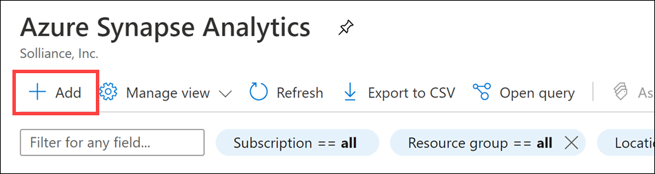

4. In the `Create Synapse workspace` form, enter the values shown in the table below. For the Azure Data Lake Storage Gen2 account name, select **Create new**, enter the account name, then select **OK**.

    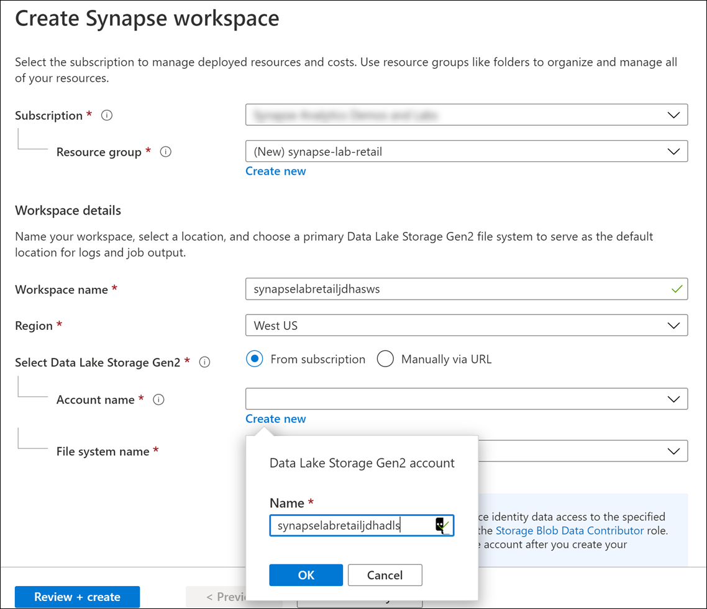

    | Parameters | Settings | Remarks |
    | --- | --- | --- |
    | Subscription | Any | Select the Azure subscription used for this lab. |
    | Resource group | `synapse-lab-retail` | Select **Create new**, then enter the name. |
    | Workspace name | `synapselabretail` + your initials + `asws` (example: `synapselabretailjdhasws`) | Lowercase alphanumeric characters only |
    | Region | Select the region closest to you, such as `West US`. | |
    | Select Data Lake Storage Gen2 | From subscription | Default settings |
    | Account name | `synapselabretail` + your initials + `adls` (example: `synapselabretailjdhadls`) | Select **Create new** (lowercase alphanumeric characters only) |

5. Select **Create new** for `File system name`, type **datalake** in the name field, then select **OK**.

    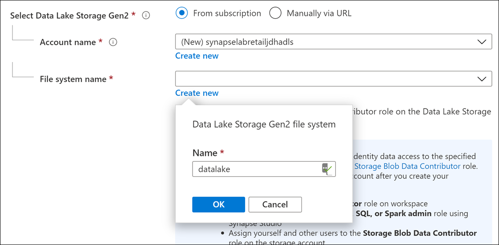

6. Check the `Assign myself the Storage Blob Data Contributor role` checkbox, then select **Next: Security**.

    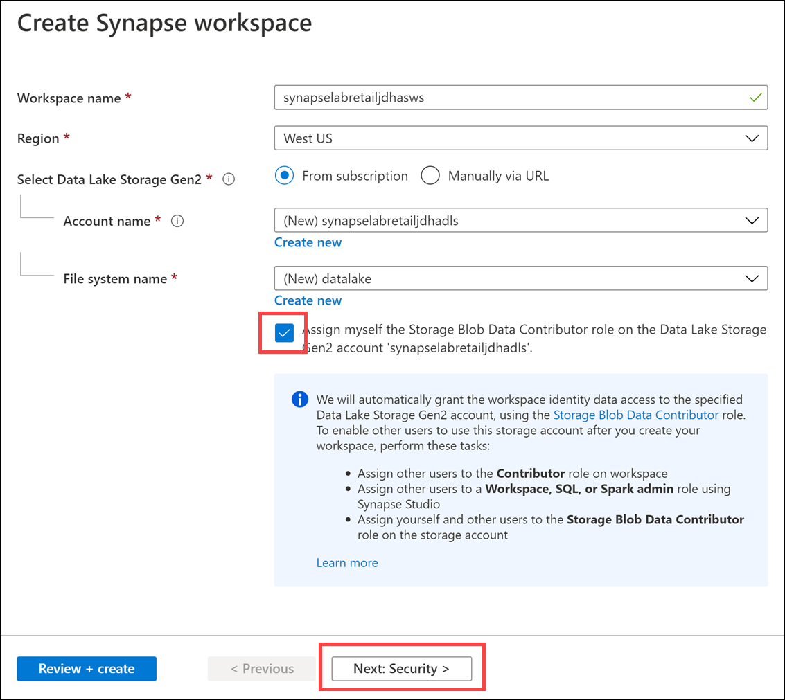

    > **Role of storage in Synapse workspace**
    >
    > Azure Data Lake Storage Gen2 (ADLS Gen2) selected when creating the Synapse workspace is considered the workspace's primary storage account, and it is used to store backing data files for Synapse SQL Serverless (SQL on-demand) and Spark tables, as well as Spark job execution logs.
    >
    > You can also access files in storage from SQL on-demand and Apache Spark directly for processing.

7. In the `Security` form, enter the values shown in the table below, then select **Next: Networking**.

    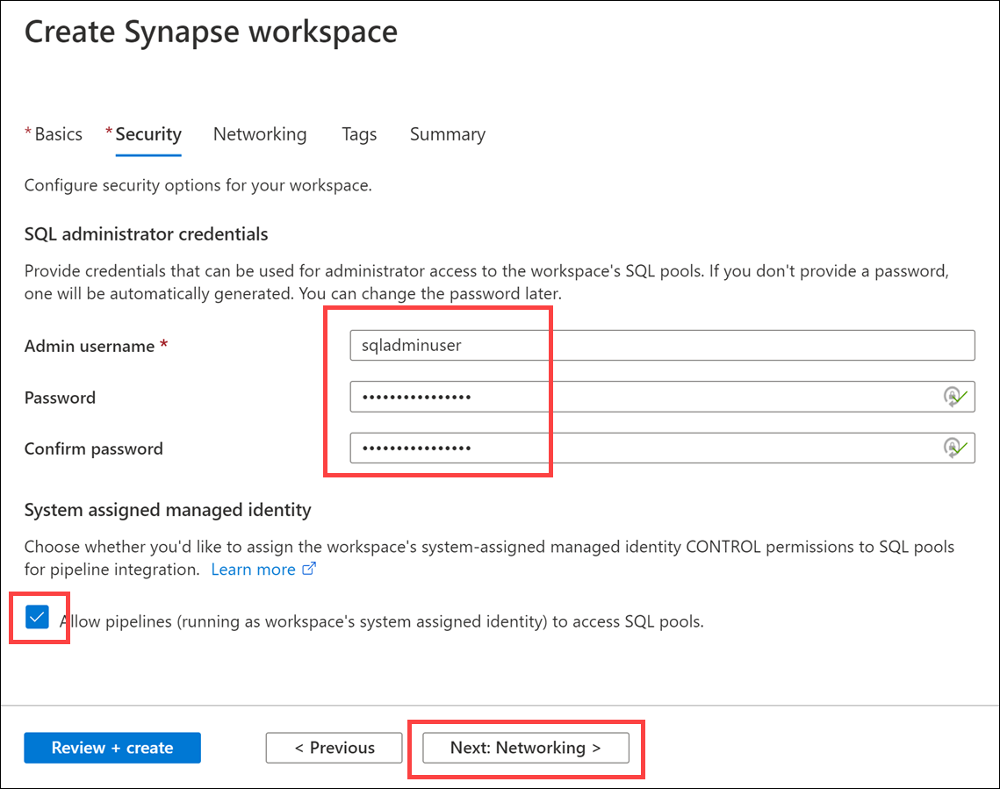

    | Parameters | Settings | Remarks |
    | --- | --- | --- |
    | Admin username | Any | Select the Azure subscription used for this lab. |
    | Password | `handson_P@ssw0rd` | Enter the password. |
    | Confirm password | `handson_P@ssw0rd` | Re-enter the same password. |
    | System assigned managed identity | Check the box (On) | Allow pipelines running as the workspace's system assigned identity to access SQL pools. |

8. In the `Networking` form, enter the values shown in the table below, then select **Review + create**.

    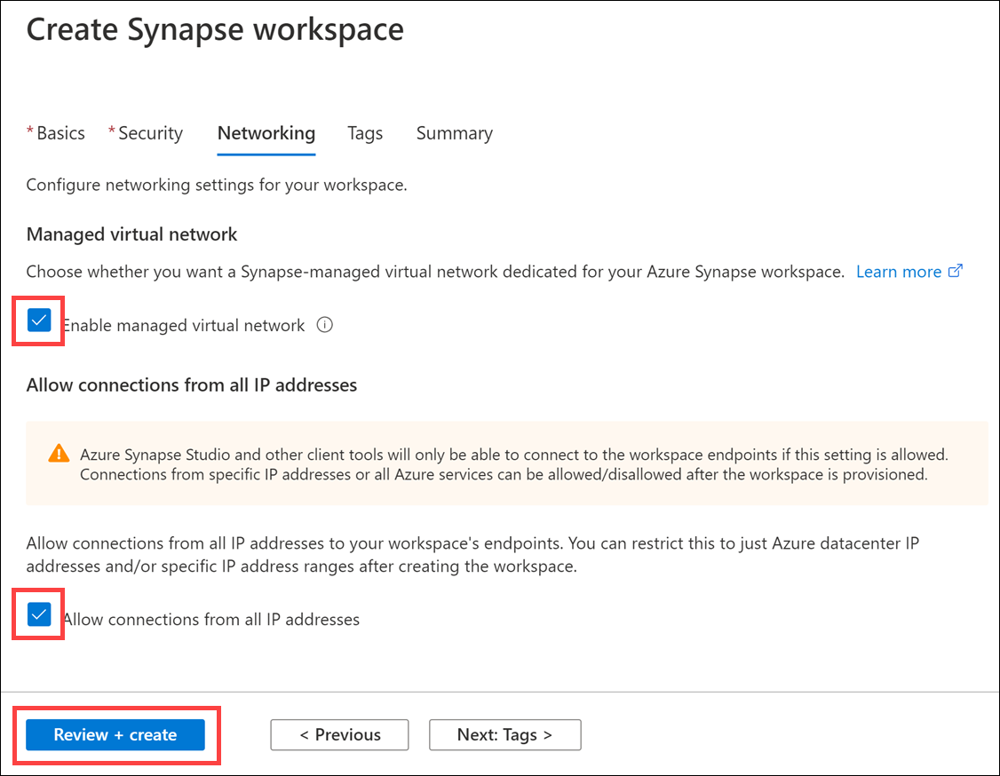

    | Parameters | Settings |
    | --- | --- |
    | Enable managed virtual network | Check the box (On) |
    | Allow connections from all IP addresses | Check the box (On) |

9. Review the settings, then select **Create**. It takes around five minutes to create the workspace.

    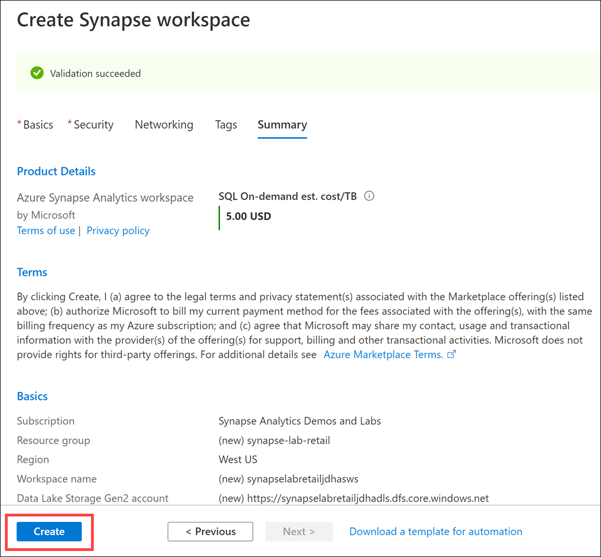

### Task 2: Set up blob data owner

Data access permissions on the data lake must be set separately from the resource's permissions.

1. When the Azure Synapse Analytics workspace deployment completes, navigate to the `synapse-lab-retail` resource group. In the Azure portal, use the top search bar to search for `synapse-lab-retail`, then select the **synapse-lab-retail** resource group in the search results under **Resource Groups**.

    

2. Within the resource group, select the storage account you created when you deployed the Azure Synapse Analytics workspace.

    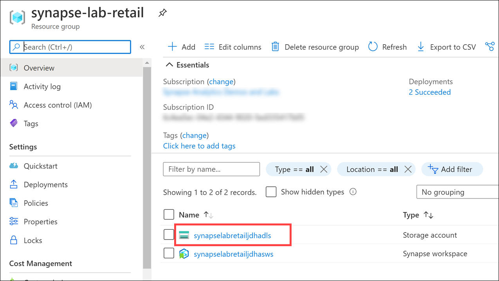

3. Within the storage account, select **Access control (IAM)**. Select **+ Add**, then **Add role assignment**.

    

4. Select the **Storage Blob Data Owner** role. Select **Azure AD user, group, or service principal** under assign access to. Search for and select your Azure account, then select **Save**.

    

### Task 3: Set up user access administrator

1. Return to the `synapse-lab-infrastructure` resource group and select the Azure Synapse Analytics workspace within.

    

2. Within the Synapse workspace, select **Access control (IAM)**. Select **+ Add**, then **Add role assignment**.

    

3. Select the **User Access Administrator** role. Select **User, group, or service principal** under assign access to. Search for and select your Azure account, then select **Save**.

    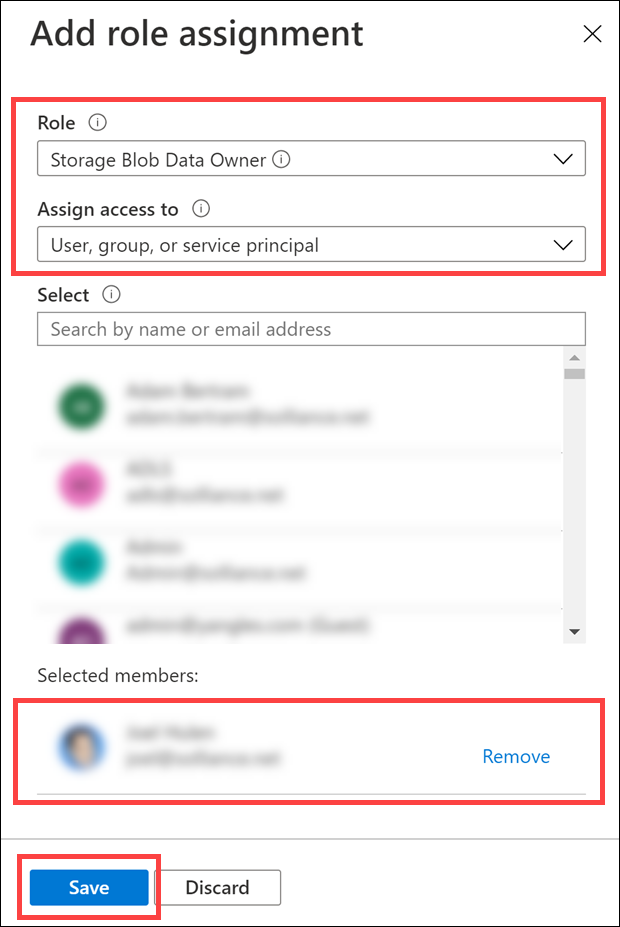

### Task 4: Create a SQL pool

1. Return to the `synapse-lab-retail` resource group and select the Azure Synapse Analytics workspace within.

    

2. Select **SQL pools** in the left-hand menu, then select **+ New**.

    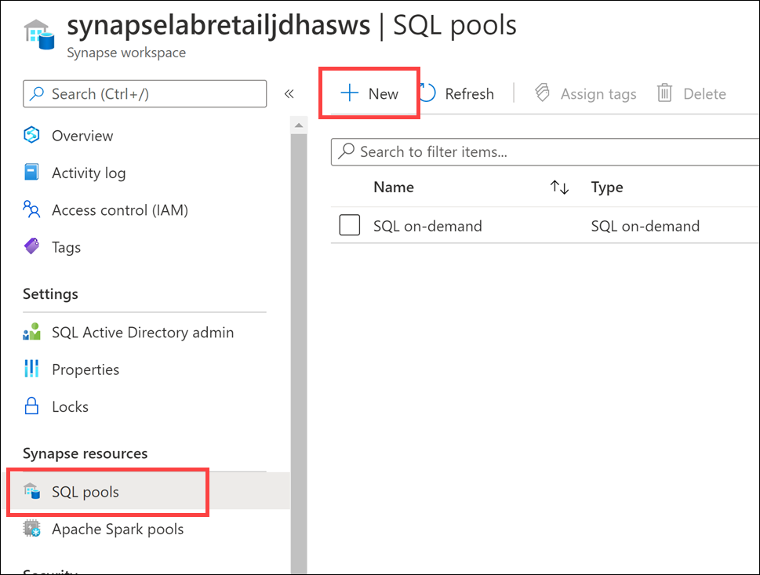

3. Enter **`SqlPool`** for the name and set the performance level to **DW100c**. Select **Review + create**.

    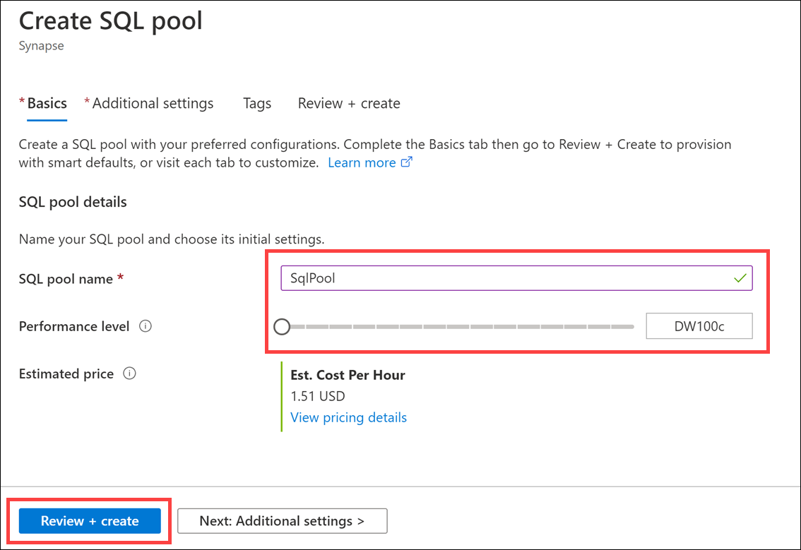

4. Confirm the settings, then select **Create**.

    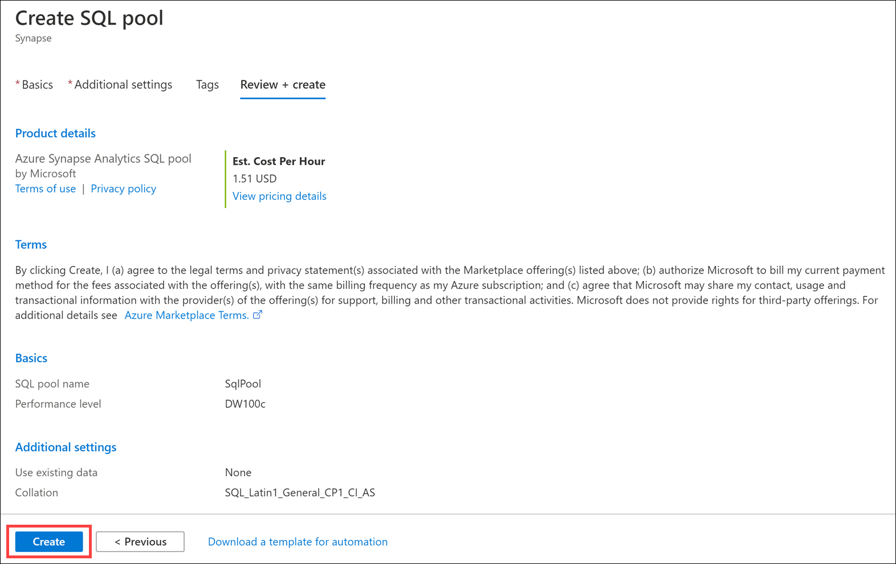

### Task 5: Create an Apache Spark pool

1. Return to the `synapse-lab-retail` resource group and select the Azure Synapse Analytics workspace within.

    

2. Select **Apache Spark pools** on the left-hand menu, then select **+ New**.

    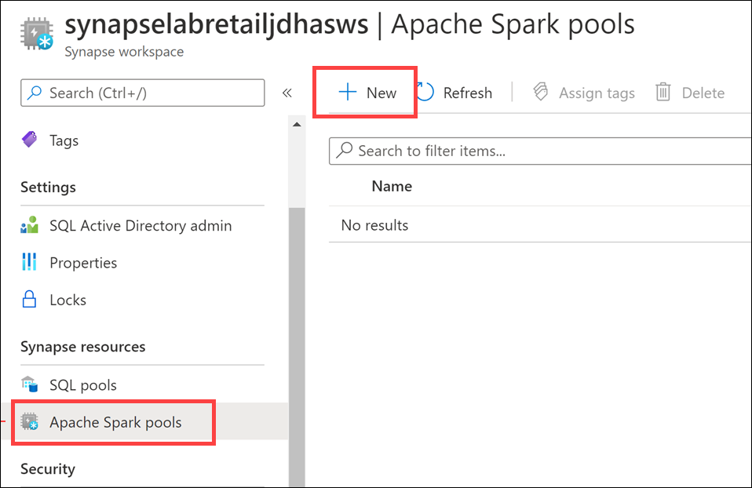

3. Enter **`SparkPool`** for the name, select the **Small (4 vCPU / 32 GB)** node size, and enable **Autoscale**. Set the number of nodes to a minimum of **3** and a maximum of **10**. Select **Review + create**.

    

4. Confirm the settings, then select **Create**.

    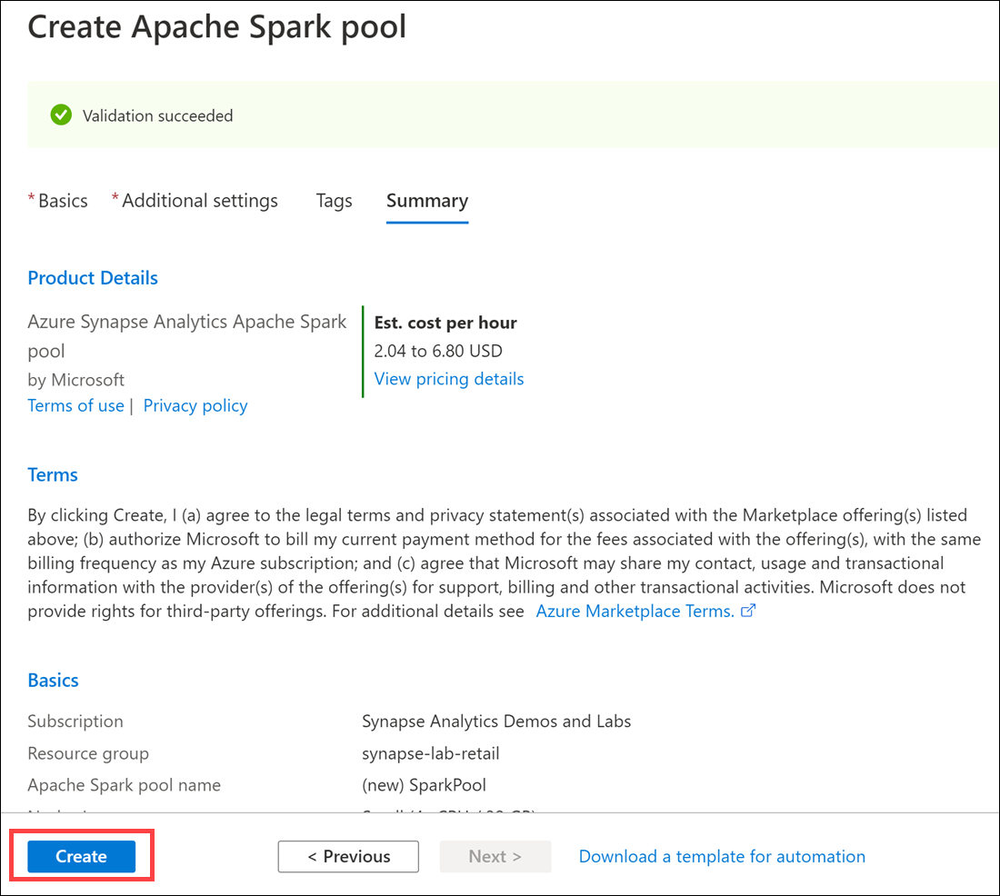

### Task 6: Prepare a Virtual Machine to run data generator and Power BI Desktop

To proceed with the steps described in this hands-on training, you need to install Node.js for the data generator, and need to use the Power BI Desktop app for Windows 10. In this step, you will create a virtual machine running Windows 10, install Node.js, then install Power BI.

1. In the [Azure portal](https://portal.azure.com), type in "virtual machines" in the top search menu and then select **Virtual machines** from the results.

    

2. Select **+ Add** on the Virtual machines page and then select the **Virtual machine** option.

3. In the **Basics** tab, complete the following:

   | Field                          | Value                                              |
   | ------------------------------ | ------------------------------------------         |
   | Subscription                   | _select the appropriate subscription_              |
   | Resource group                 | _select `synapse-lab-retail`_                      |
   | Virtual machine name           | _`powerbi` (or unique name if not available)_      |
   | Region                         | _select the resource group's location_             |
   | Availability options           | _select `No infrastructure redundancy required`_   |
   | Image                          | _select `Windows 10 Pro, Version 1809 - Gen1`_     |
   | Azure Spot instance            | _select `No`_                                      |
   | Size                           | _select `Standard_D2s_v3`_                         |
   | Username                       | _select `powerbiuser`_                             |
   | Password                       | _enter a password you will remember_               |
   | Public inbound ports           | _select `Allow selected ports`_                    |
   | Select inbound ports           | _select `RDP (3389)`_                              |
   | Licensing                      | _select the option to confirm that you have an  eligible Windows 10 license with multi-tenant hosting rights._ |

   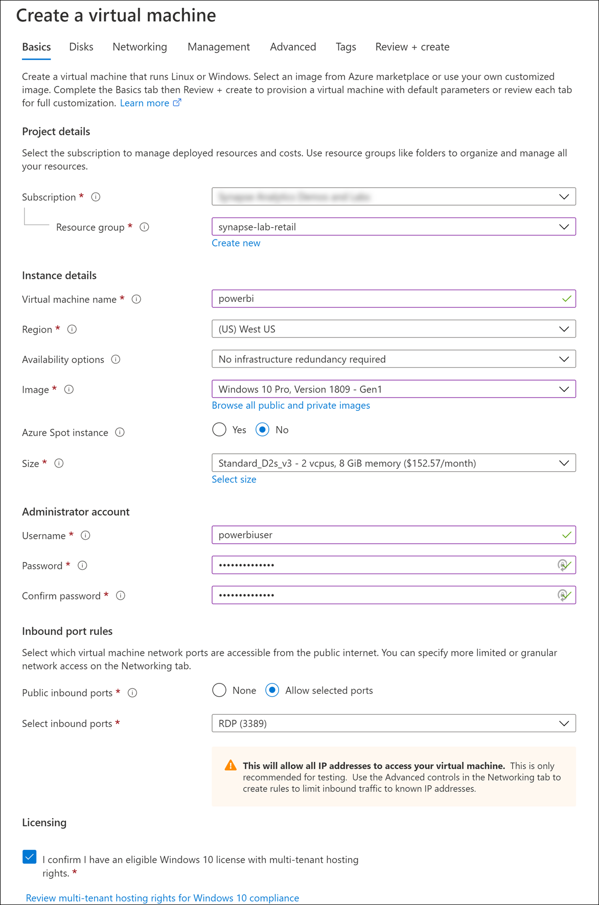

4. Select **Review + create**. On the review screen, select **Create**. After the deployment completes, select **Go to resource** to go to the virtual machine.

    

5. Select **Connect** from the actions menu and choose **RDP**.

    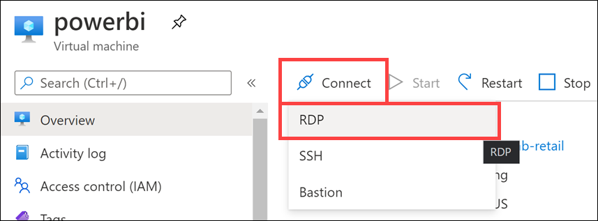

6. On the **Connect** tab, select **Download RDP File**.

    

7. Open the RDP file and select **Connect** to access the virtual machine. When prompted for credentials, enter `powerbiuser` for the username and the password you chose. Select the option to allow the security certificate when prompted.

    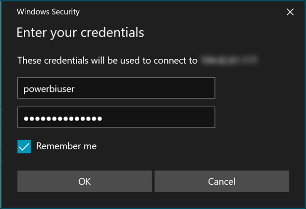

8. From the following URL, go to the Power BI Desktop download site and select **Download free**: Power BI Desktop: <https://powerbi.microsoft.com/desktop/>

    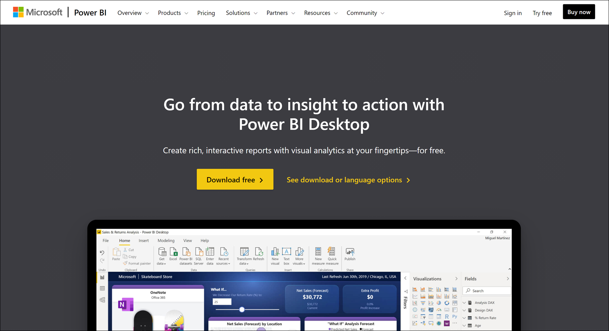

9. Install the software from the Microsoft store.

    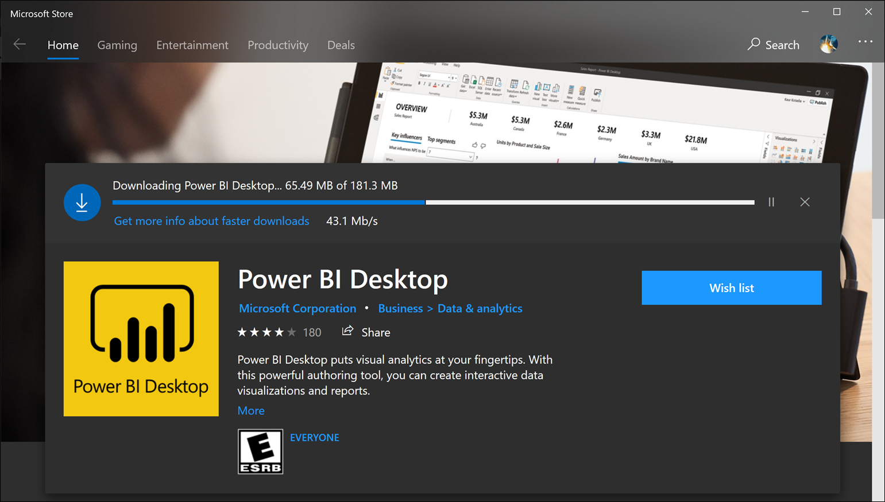

10. Navigate to <https://nodejs.org/en/download/>.

11. Select the **LTS** tab, then select the **64-bit** _Windows Installer (.msi)_ version. Download and run the installer.

    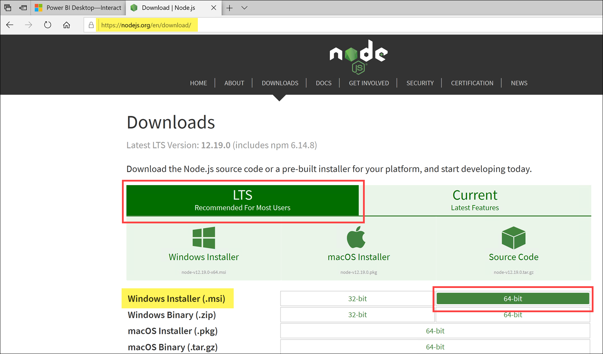

12. Select all default options in the install dialog. When prompted whether to automatically install the necessary tools for Native Modules, **Check the box** next to `Automatically install the necessary tools...`.

    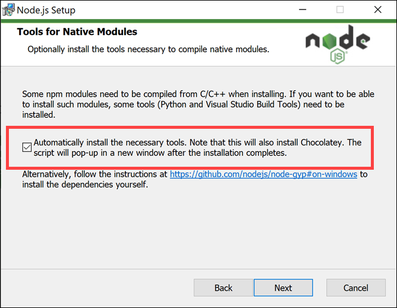

13. When the installation is completed, a Command Prompt window will appear to install the additional tools for Node.js. When you see this, press any key to continue.

    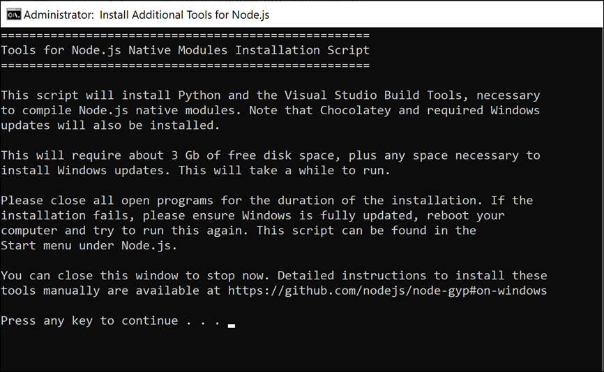

    > After pressing a key for this and the prompt that follows, let the install process continue to run in the background in PowerShell. You may continue with the lab steps that follow.

### Task 7: Download lab files

1. From your lab VM, navigate to <https://solliancepublicdata.blob.core.windows.net/synapse-in-a-day/retail/handson.zip> to download the ZIP file for this lab.

2. Navigate to the folder to which you downloaded the file. Right-click on the `handson.zip` file, then select **Extract All...**.

    

3. Change the destination folder path to **`C:\handson`**, then click **Extract**.

    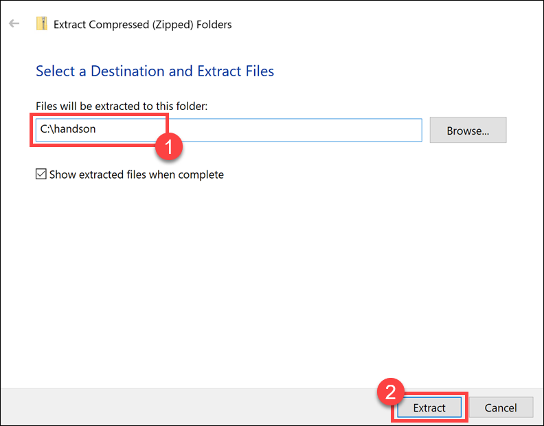

4. You should see three folders in the `C:\handson` directory after extracting the files.

    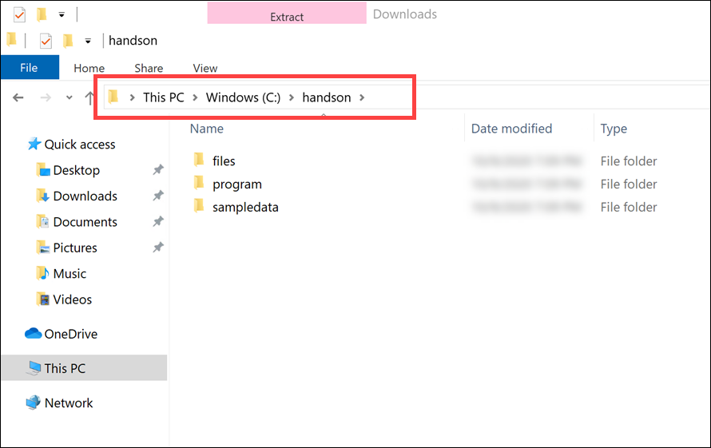

### Task 8: Install Azure Storage Explorer and upload lab files

There are files you need to upload to the primary ADLS Gen2 account for your Synapse workspace. To do this, you will use Azure Storage Explorer. If you already have Azure Storage Explorer installed, you can skip ahead to step 10 below.

1. Navigate to <https://aka.ms/portalfx/downloadstorageexplorer>.

2. Select **Download now**.

    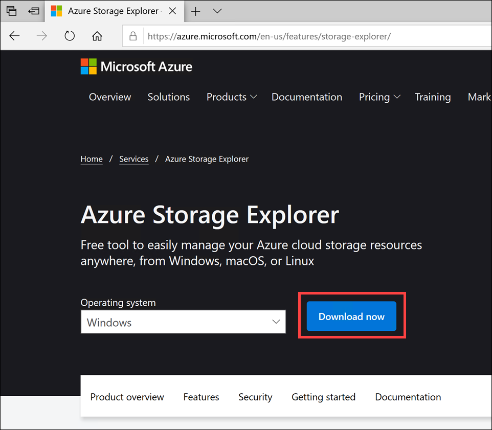

3. When prompted, run the installer.

4. Select **Install for me only (recommended)**.

    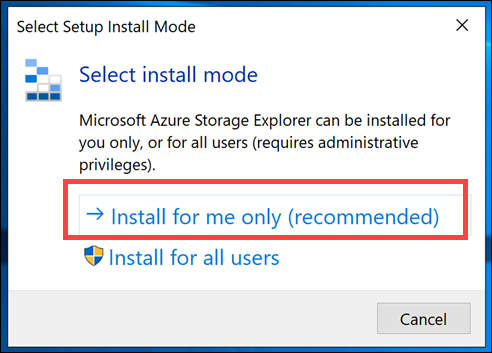

5. Complete the install, choosing the default options.

6. When the install completes, select **Launch Microsoft Azure Storage Explorer**, then click **Finish**.

    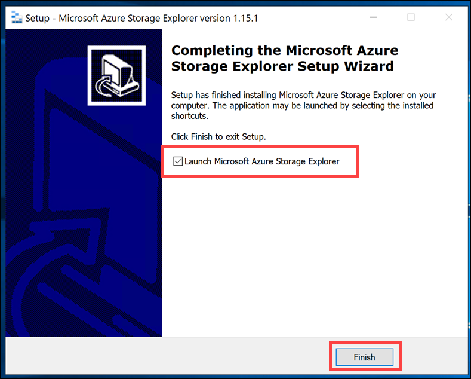

7. When Azure Storage Explorer launches for the first time, you will be prompted to connect to Azure Storage. Select **Add an Azure Account**, then click **Next**.

    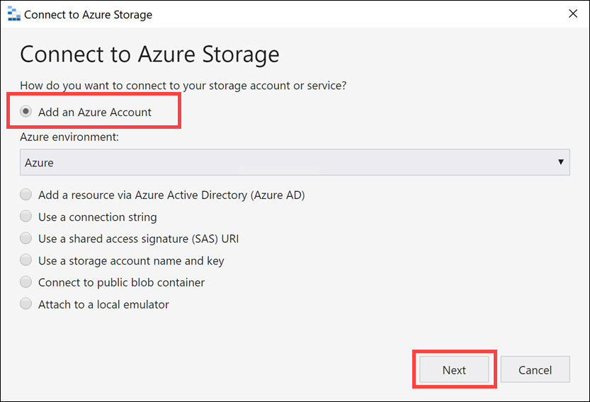

8. Sign into the Azure account you are using for the lab, when prompted.

9. After signing into your account, select all your Azure subscriptions, then click **Apply**.

    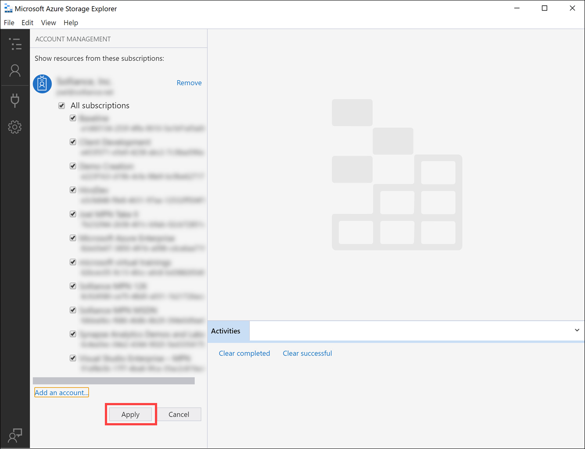

10. Expand the Azure subscription you are using for this lab, then expand **Storage Accounts**. Locate and expand the primary ADLS Gen2 account you created when you provisioned your Synapse Analytics workspace. It will be named `synapselabretail` + your initials + `adls` (example: `synapselabretailjdhadls`). Right-click **Blob Containers** for the account, then select **Create Blob Container**.

    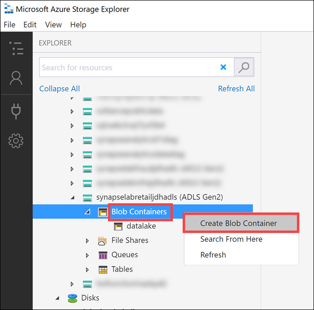

11. Type **`sampledata`** for the container name, then hit Enter.

    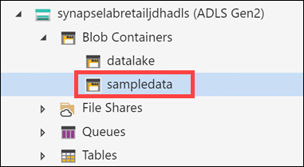

12. Open Windows Explorer and navigate to **`C:\handson\sampledata`**. Select all three folders and drag them into the **sampledata** container to upload them.

    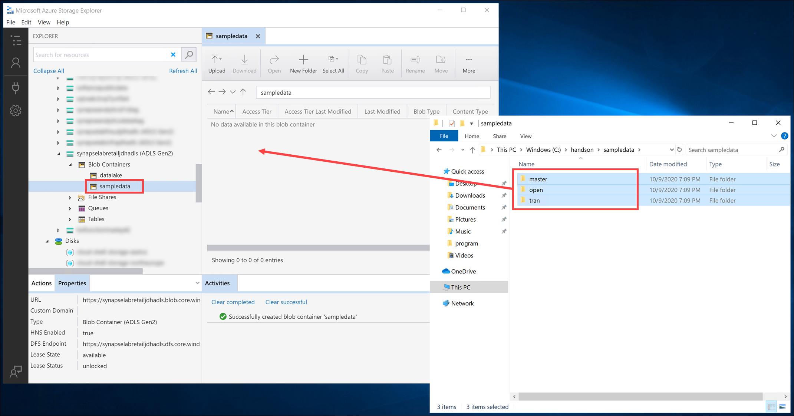

13. After about 1 minute, you should see that all three folders successfully uploaded, along with 406 items, to the `sampledata` container.

    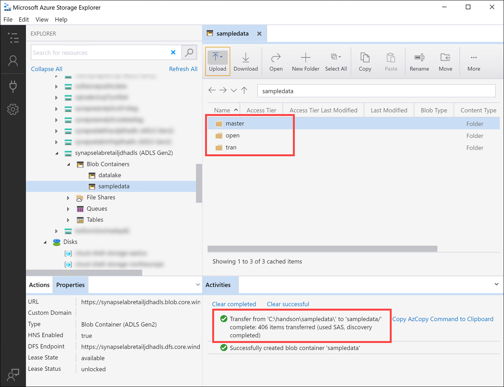

## Exercise 2: Deploy resources for the data collection step

Time required: 20 minutes

### Task 1: Deploy ARM template

The ARM template deploys the following resources:

- Two IoT Hubs
- Two Stream Analytics jobs

1. Navigate to the Azure portal (<https://portal.azure.com>).

2. In the search menu, type **template deployment**, then select **Deploy a custom template**.

    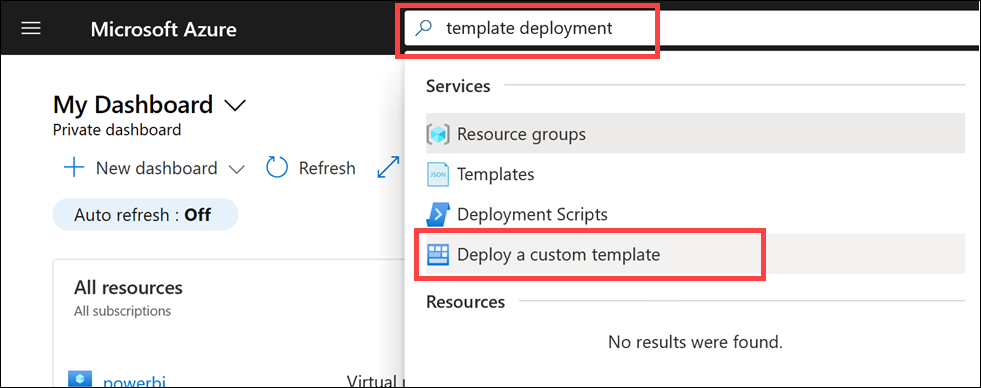

3. Select **Build your own template in the editor**.

    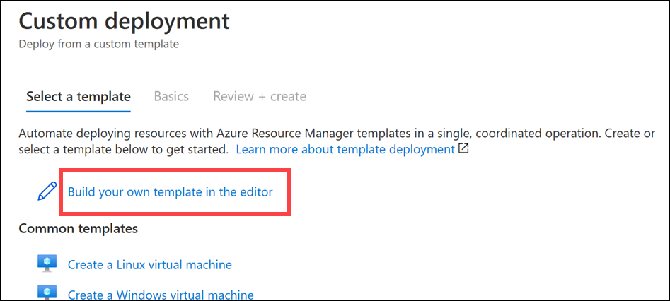

4. **Replace** the contents of the template with the following:

    ```json
    {
        "$schema": "https://schema.management.azure.com/schemas/2015-01-01/deploymentTemplate.json#",
        "contentVersion": "1.0.0.0",
        "parameters": {
            "UniqueSuffix": {
                "type": "String",
                "metadata": {
                    "description": "Suffix added to all resource names to make them unique. Enter between 4 and 8 characters"
                }
            },
            "Region": {
                "type": "string",
                "defaultValue": "[resourceGroup().location]",
                "metadata": {
                    "description": "Location for the IoT Hub and Stream Analytics services."
                }
            }
        },
        "variables": {
            "name_suffix": "[take(toLower(parameters('UniqueSuffix')), 8)]",
            "CameraIotHubName": "[concat('handson-iothub', variables('name_suffix'))]",
            "SensorIotHubName": "[concat('handson-iothub-sensor', variables('name_suffix'))]",
            "CameraSAJName": "[concat('handson-SAJ', variables('name_suffix'))]",
            "SensorSAJName": "[concat('handson-SAJ-sensor', variables('name_suffix'))]",
            "CameraCGName": "[concat('handson-iothub', variables('name_suffix'), '/events/handson-cg')]",
            "SensorCGName": "[concat('handson-iothub-sensor', variables('name_suffix'), '/events/handson-cg')]"
        },
        "resources": [
            {
                "type": "Microsoft.Devices/IotHubs",
                "apiVersion": "2020-03-01",
                "name": "[variables('CameraIotHubName')]",
                "location": "[parameters('Region')]",
                "sku": {
                    "name": "S1",
                    "tier": "Standard",
                    "capacity": 1
                },
                "properties": {
                    "ipFilterRules": [],
                    "eventHubEndpoints": {
                        "events": {
                            "retentionTimeInDays": 1,
                            "partitionCount": 4
                        }
                    },
                    "routing": {
                        "endpoints": {
                            "serviceBusQueues": [],
                            "serviceBusTopics": [],
                            "eventHubs": [],
                            "storageContainers": []
                        },
                        "routes": [],
                        "fallbackRoute": {
                            "name": "$fallback",
                            "source": "DeviceMessages",
                            "condition": "true",
                            "endpointNames": [
                                "events"
                            ],
                            "isEnabled": true
                        }
                    },
                    "messagingEndpoints": {
                        "fileNotifications": {
                            "lockDurationAsIso8601": "PT1M",
                            "ttlAsIso8601": "PT1H",
                            "maxDeliveryCount": 10
                        }
                    },
                    "enableFileUploadNotifications": false,
                    "cloudToDevice": {
                        "maxDeliveryCount": 10,
                        "defaultTtlAsIso8601": "PT1H",
                        "feedback": {
                            "lockDurationAsIso8601": "PT1M",
                            "ttlAsIso8601": "PT1H",
                            "maxDeliveryCount": 10
                        }
                    },
                    "features": "None"
                }
            },
            {
                "type": "Microsoft.Devices/iotHubs/eventhubEndpoints/ConsumerGroups",
                "apiVersion": "2018-04-01",
                "name": "[variables('CameraCGName')]",
                "dependsOn": [
                    "[resourceId('Microsoft.Devices/IotHubs', variables('CameraIotHubName'))]"
                ]
            },
            {
                "type": "Microsoft.Devices/IotHubs",
                "apiVersion": "2020-03-01",
                "name": "[variables('SensorIotHubName')]",
                "location": "[parameters('Region')]",
                "sku": {
                    "name": "S1",
                    "tier": "Standard",
                    "capacity": 1
                },
                "properties": {
                    "ipFilterRules": [],
                    "eventHubEndpoints": {
                        "events": {
                            "retentionTimeInDays": 1,
                            "partitionCount": 4
                        }
                    },
                    "routing": {
                        "endpoints": {
                            "serviceBusQueues": [],
                            "serviceBusTopics": [],
                            "eventHubs": [],
                            "storageContainers": []
                        },
                        "routes": [],
                        "fallbackRoute": {
                            "name": "$fallback",
                            "source": "DeviceMessages",
                            "condition": "true",
                            "endpointNames": [
                                "events"
                            ],
                            "isEnabled": true
                        }
                    },
                    "messagingEndpoints": {
                        "fileNotifications": {
                            "lockDurationAsIso8601": "PT1M",
                            "ttlAsIso8601": "PT1H",
                            "maxDeliveryCount": 10
                        }
                    },
                    "enableFileUploadNotifications": false,
                    "cloudToDevice": {
                        "maxDeliveryCount": 10,
                        "defaultTtlAsIso8601": "PT1H",
                        "feedback": {
                            "lockDurationAsIso8601": "PT1M",
                            "ttlAsIso8601": "PT1H",
                            "maxDeliveryCount": 10
                        }
                    },
                    "features": "None"
                }
            },
            {
                "type": "Microsoft.Devices/iotHubs/eventhubEndpoints/ConsumerGroups",
                "apiVersion": "2018-04-01",
                "name": "[variables('SensorCGName')]",
                "dependsOn": [
                    "[resourceId('Microsoft.Devices/IotHubs', variables('SensorIotHubName'))]"
                ]
            },
            {
                "type": "Microsoft.StreamAnalytics/streamingjobs",
                "apiVersion": "2016-03-01",
                "name": "[variables('CameraSAJName')]",
                "location": "[parameters('Region')]",
                "properties": {
                    "sku": {
                        "name": "Standard"
                    },
                    "eventsOutOfOrderPolicy": "Adjust",
                    "outputErrorPolicy": "Stop",
                    "eventsOutOfOrderMaxDelayInSeconds": 0,
                    "eventsLateArrivalMaxDelayInSeconds": 5,
                    "dataLocale": "en-US",
                    "compatibilityLevel": "1.1"
                }
            },
                    {
                "type": "Microsoft.StreamAnalytics/streamingjobs",
                "apiVersion": "2016-03-01",
                "name": "[variables('SensorSAJName')]",
                "location": "[parameters('Region')]",
                "properties": {
                    "sku": {
                        "name": "Standard"
                    },
                    "eventsOutOfOrderPolicy": "Adjust",
                    "outputErrorPolicy": "Stop",
                    "eventsOutOfOrderMaxDelayInSeconds": 0,
                    "eventsLateArrivalMaxDelayInSeconds": 5,
                    "dataLocale": "en-US",
                    "compatibilityLevel": "1.1"
                }
            }
        ]
    }
    ```

5. Select **Save** to save the ARM template.

    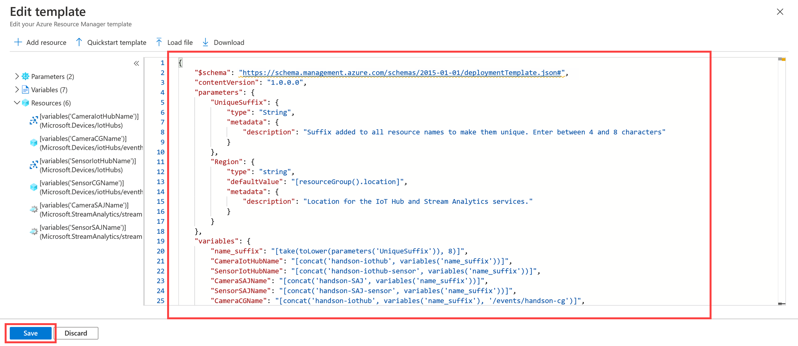

6. In the **Basics** tab, complete the following:

    | Field                          | Value                                              |
    | ------------------------------ | ------------------------------------------         |
    | Subscription                   | _select the appropriate subscription_              |
    | Resource group                 | _select `synapse-lab-retail`_                      |
    | Unique Suffix                  | _enter a random value between 4 and 8 letters and numbers with no spaces. This is used to append to the end of the Azure resources to ensure uniqueness._      |
    | Region                         | _leave unchanged_             |

    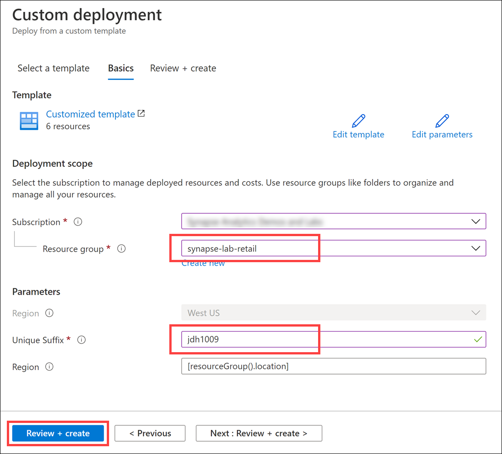

7. Select **Review + create**.

8. Select **Create** on the Review + create tab.

    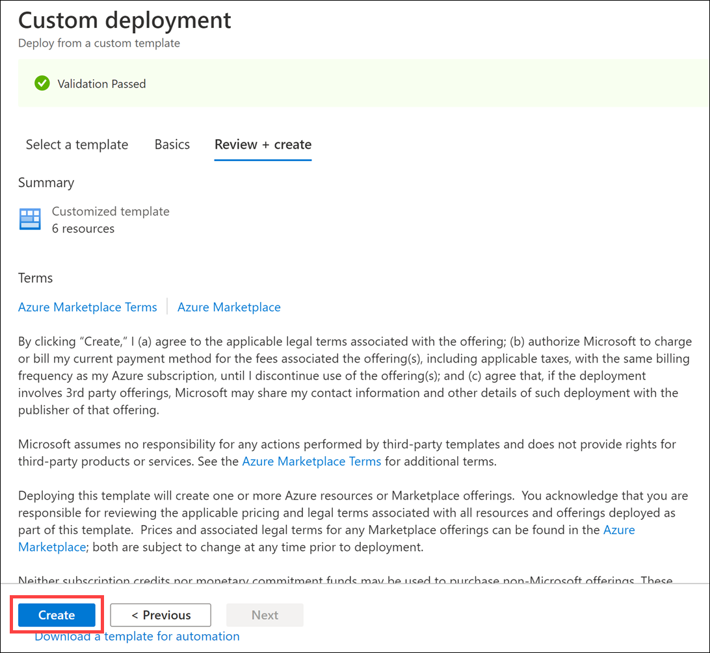

### Task 2: Create Azure Data Lake Storage Gen2 account

1. In the search menu, type **storage**, then select **Storage accounts**.

    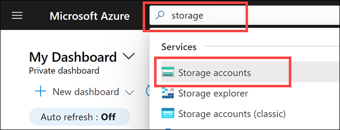

2. In the Storage accounts blade, select **+ Add**.

    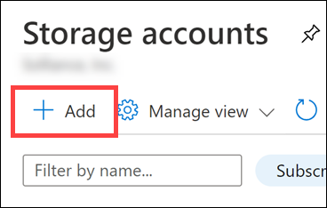

3. In the **Basics** tab, complete the following:

   | Field                          | Value                                              |
   | ------------------------------ | ------------------------------------------         |
   | Subscription                   | _select the appropriate subscription_              |
   | Resource group                 | _select `synapse-lab-retail`_                      |
   | Storage account name           | _`handsonretaildl` + `<unique suffix>` (make the name unique)_      |
   | Location                       | _select the resource group's location_             |
   | Performance           | _select `Standard`_   |
   | Account kind                          | _select `StorageV2 (general purpose v2)`_     |
   | Replication            | _select `Read-access geo-redundant storage (RA-GRS)`_                                      |
   | Blob access tier (default)                           | _select `Hot`_                         |

   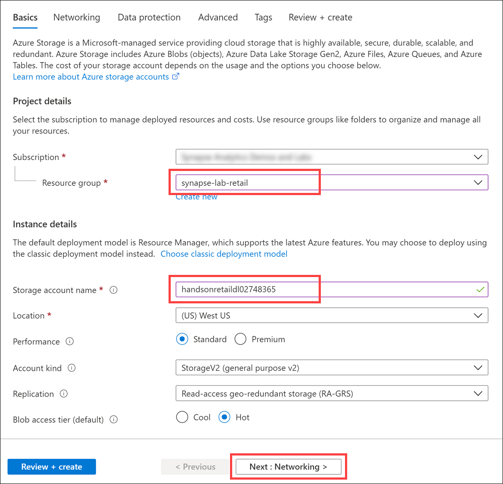

4. Select **Next: Networking >**.

5. Keep default settings. Select **Next: Data protection >**.

6. Keep default settings. Select **Next: Advanced >**.

7. Scroll down and select **Enabled** next to **Hierarchical namespace**, then select **Review + create**.

    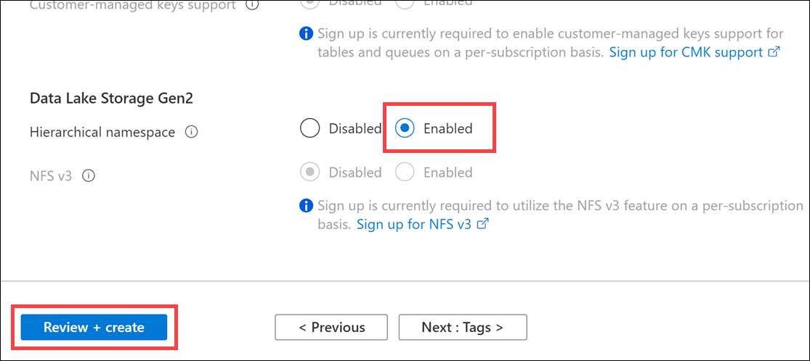

8. Select **Create** on the review screen.

9. Wait for the deployment to complete, then select **Go to resource**.

    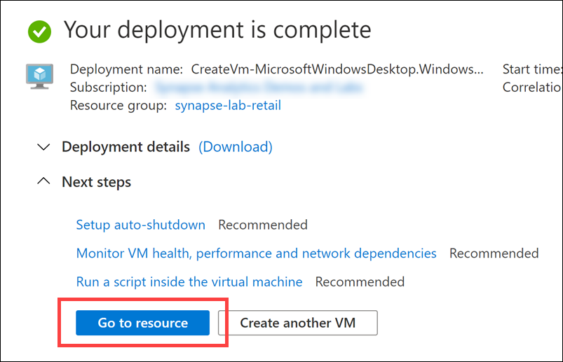

10. Select **Containers** on the overview blade of your new storage account.

    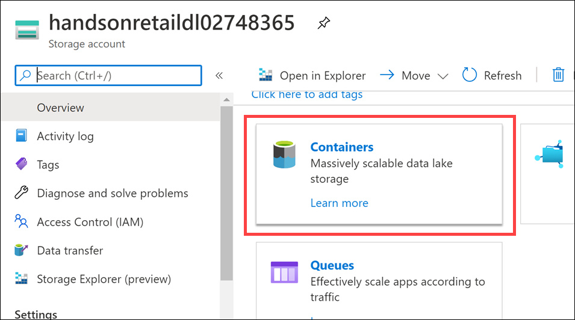

11. Select **+ Container** to add a new container. Enter **`shelfdata`** for the container name and set the public access level to **Private**. Select **Create** to create the container.

    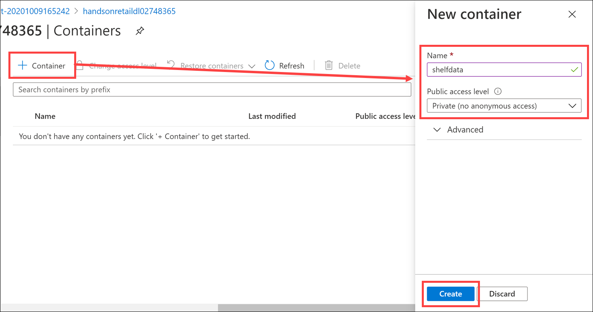

> **What is Azure Data Lake Storage Gen2?**
>
> Azure Data Lake Storage Gen2 is an inexpensive data lake storage made available by adding an HDFS interface to Azure Blob Storage. Throughput in gigabits and large-scale petabyte data usage are available, making it extremely cost-effective.

## Lab guide

Now that you have completed the lab setup, continue to the [step-by-step lab guide](README.md).
